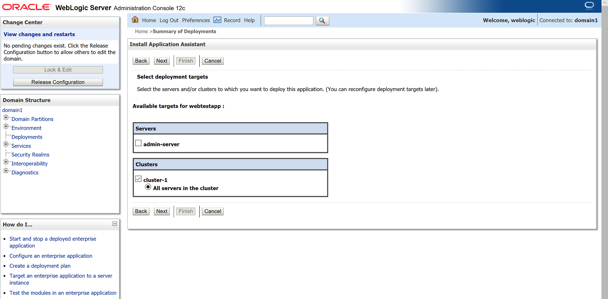
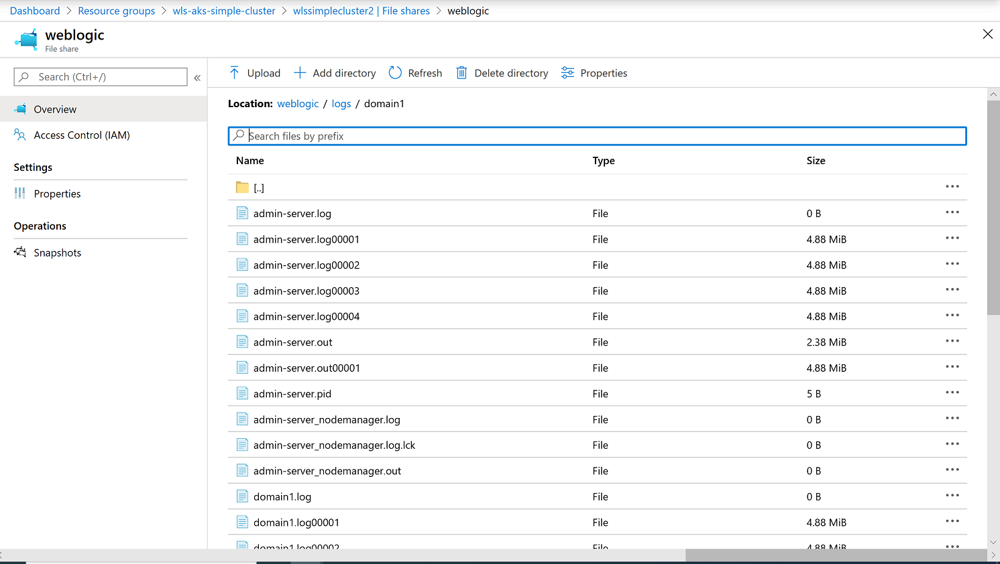

This sample demonstrates how to use the [Oracle WebLogic Server Kubernetes Operator](/weblogic-kubernetes-operator/) (hereafter "the operator") to set up a WebLogic Server (WLS) cluster on the Azure Kubernetes Service (AKS). After going through the steps, your WLS domain runs on an AKS cluster instance and you can manage your WLS domain by accessing the WebLogic Server Administration Console.

AKS is a managed Kubernetes Service that lets you quickly deploy and manage Kubernetes clusters. To learn more, please see the [Azure Kubernetes Service (AKS)](https://docs.microsoft.com/azure/aks/) overview page.

#### Contents

 - [Prerequisites](#prerequisites)
 - [Create the AKS cluster](#create-the-aks-cluster)
 - [Create storage and set up file share](#create-storage-and-set-up-file-share)
 - [Install WebLogic Server Kubernetes Operator](#install-weblogic-server-kubernetes-operator)
 - [Create WebLogic domain](#create-weblogic-domain)
 - [Automation](#automation)
 - [Deploy sample application](#deploy-sample-application)
 - [Access WebLogic Server logs](#access-weblogic-server-logs)
 - [Troubleshooting](#troubleshooting)
 - [Useful links](#useful-links)

#### Prerequisites

This sample assumes the following prerequisite environment setup.

* Operating System: GNU/Linux, macOS or [WSL for Windows 10](https://docs.microsoft.com/windows/wsl/install-win10).
* [Git](https://git-scm.com/downloads), use `git --version` to test if `git` works.  This document was tested with version 2.17.1.
* [Azure CLI](https://docs.microsoft.com/cli/azure), use `az --version` to test if `az` works.  This document was tested with version 2.9.1.
* [kubectl](https://kubernetes-io-vnext-staging.netlify.com/docs/tasks/tools/install-kubectl/), use `kubectl version` to test if `kubectl` works.  This document was tested with version v1.16.3.
* [helm](https://helm.sh/docs/intro/install/), version 3.1 and later, use `helm version` to check the `helm` version.  This document was tested with version v3.2.4.

##### Create Service Principal for AKS

An AKS cluster requires either an [Azure Active Directory (AD) service principal](https://docs.microsoft.com/azure/active-directory/develop/app-objects-and-service-principals) or a [managed identity](https://docs.microsoft.com/azure/aks/use-managed-identity) to interact with Azure resources.

We will use a service principal to create an AKS cluster. Follow the commands below to create a new service principal.

Please run `az login` first. Do set the subscription you want to work with. You can get a list of your subscriptions by running `az account list`.

```bash
# Login
$ az login

# Set your working subscription
$ export SUBSCRIPTION_ID=<your-subscription-id>
$ az account set -s $SUBSCRIPTION_ID
```

Create the new service principal with the following commands:

```bash
# Create Service Principal
$ export SP_NAME=myAKSClusterServicePrincipal
$ az ad sp create-for-rbac --skip-assignment --name $SP_NAME

# Copy the output to a file, we will use it later.
```

If you see an error similar to the following:

```bash
Found an existing application instance of "5pn2s201-nq4q-43n1-z942-p9r9571qr3rp". We will patch it
Insufficient privileges to complete the operation.
```

The problem may be a pre-existing service principal with the same name.  Either delete the other Service Principal or pick a different name.

Successful output will look like the following:

```json
{
  "appId": "r3qnq743-61s9-4758-8163-4qpo87s72s54",
  "displayName": "myAKSClusterServicePrincipal",
  "name": "http://myAKSClusterServicePrincipal",
  "password": "TfhR~uOJ1C1ftD5NS_LzJJj6UOjS2OwXfz",
  "tenant": "82sr215n-0ns5-404e-9161-206r0oqyq999"
}
```

Grant your service principal with a contributor role to create AKS resources.

```bash
# Use the <appId> from the output of the last command
$ export SP_APP_ID=r3qnq743-61s9-4758-8163-4qpo87s72s54
$ az role assignment create --assignee $SP_APP_ID --role Contributor
```

Successful output will look like the following:

```json
{
  "canDelegate": null,
  "id": "/subscriptions/p7844r91-o11q-4n7s-np6s-996308sopqo9/providers/Microsoft.Authorization/roleAssignments/4oq396os-rs95-4n6s-n3qo-sqqpnpo91035",
  "name": "4oq396os-rs95-4n6s-n3qo-sqqpnpo91035",
  "principalId": "952551r8-n129-4on3-oqo9-231n0s6011n3",
  "principalType": "ServicePrincipal",
  "roleDefinitionId": "/subscriptions/p7844r91-o11q-4n7s-np6s-996308sopqo9/providers/Microsoft.Authorization/roleDefinitions/o24988np-6180-42n0-no88-20s7382qq24p",
  "scope": "/subscriptions/p7844r91-o11q-4n7s-np6s-996308sopqo9",
}
```

##### Oracle Container Registry

You will need an Oracle account. The following steps will direct you to accept the license agreement for WebLogic Server.  Make note of your Oracle Account password and email.  This sample pertains to 12.2.1.3, but other versions may work as well.

1. Obtain the WebLogic Server image from the [Oracle Container Registry](https://container-registry.oracle.com/).

   a. First time users, [follow these directions](/weblogic-kubernetes-operator/userguide/managing-domains/domain-in-image/base-images/#obtaining-standard-images-from-the-oracle-container-registry).
   
   b. Find and then pull the WebLogic 12.2.1.3 install image:
   
      ```bash
      $ docker pull container-registry.oracle.com/middleware/weblogic:12.2.1.3
      ```

##### Clone WebLogic Server Kubernetes Operator repository

Clone the [Oracle WebLogic Server Kubernetes Operator repository](https://github.com/oracle/weblogic-kubernetes-operator) to your machine. We will use several scripts in this repository to create a WebLogic domain. This sample was tested with v3.0.3.

```bash
$ git clone https://github.com/oracle/weblogic-kubernetes-operator.git
#cd weblogic-kubernetes-operator
$ git checkout v3.0.3
```
  
{} The following sections of the sample instructions will guide you, step-by-step, through the process of setting up a WebLogic cluster on AKS - remaining as close as possible to a native Kubernetes experience. This lets you understand and customize each step. If you wish to have a more automated experience that abstracts some lower level details, you can skip to the [Automation](#automation) section.
{}

#### Create the AKS cluster

This sample requires that you disable the AKS addon `http_application_routing` by default.  If you want to enable  `http_application_routing`, please follow [HTTP application routing](https://docs.microsoft.com/azure/aks/http-application-routing).

Run the following commands to create the AKS cluster instance.

```bash
# Change these parameters as needed for your own environment
# Specify a prefix to name resources, only allow lowercase letters and numbers, between 1 and 7 characters
$ export NAME_PREFIX=0730
# Used to generate resource names.
$ export TIMESTAMP=`date +%s`
$ export AKS_CLUSTER_NAME="${NAME_PREFIX}aks${TIMESTAMP}"
$ export AKS_PERS_RESOURCE_GROUP="${NAME_PREFIX}resourcegroup${TIMESTAMP}"
$ export AKS_PERS_LOCATION=eastus
$ export SP_APP_ID=<appId from the az ad sp create-for-rbac command>
$ export SP_CLIENT_SECRET=<password from the az ad sp create-for-rbac command>

$ az group create --name $AKS_PERS_RESOURCE_GROUP --location $AKS_PERS_LOCATION
$ az aks create \
   --resource-group $AKS_PERS_RESOURCE_GROUP \
   --name $AKS_CLUSTER_NAME \
   --node-count 2 \
   --generate-ssh-keys \
   --nodepool-name nodepool1 \
   --node-vm-size Standard_DS2_v2 \
   --location $AKS_PERS_LOCATION \
   --service-principal $SP_APP_ID \
   --client-secret $SP_CLIENT_SECRET
```

Successful output will be a JSON object with the entry `"type": "Microsoft.ContainerService/ManagedClusters"`.

After the deployment finishes, run the following command to connect to the AKS cluster. This command updates your local `~/.kube/config` so that subsequent `kubectl` commands interact with the named AKS cluster.

```bash
$ az aks get-credentials --resource-group $AKS_PERS_RESOURCE_GROUP --name $AKS_CLUSTER_NAME
```

Successful output will look similar to:

```bash
Merged "0730aks1596087429" as current context in /home/username/.kube/config
```

To verify the connection to your cluster, use the `kubectl get` command to return a list of the cluster nodes.

```bash
$ kubectl get nodes
```

Example output:

```bash
$ kubectl get nodes
NAME                                STATUS   ROLES   AGE     VERSION
aks-nodepool1-15992006-vmss000000   Ready    agent   7m49s   v1.15.11
aks-nodepool1-15992006-vmss000001   Ready    agent   7m32s   v1.15.11
aks-nodepool1-15992006-vmss000002   Ready    agent   7m52s   v1.15.11
```

#### Create storage and set up file share

Our usage pattern for the operator involves creating Kubernetes "persistent volumes" to allow the WebLogic Server to persist its configuration and data separately from the Kubernetes Pods that run WebLogic Server workloads.

We will create an external data volume to access and persist data. There are several options for data sharing as described in [Storage options for applications in Azure Kubernetes Service (AKS)](https://docs.microsoft.com/azure/aks/concepts-storage).

We will use Azure Files as a Kubernetes volume. Consult the [Azure Files Documentation](https://docs.microsoft.com/azure/aks/azure-files-volume) for details about this full featured cloud storage solution.

First, create a storage account. Note that the storage account name can contain only lowercase letters and numbers, and must be between 3 and 24 characters in length:

```bash
# Change the value as needed for your own environment
$ export AKS_PERS_STORAGE_ACCOUNT_NAME="${NAME_PREFIX}storage${TIMESTAMP}"

$ az storage account create \
   -n $AKS_PERS_STORAGE_ACCOUNT_NAME \
   -g $AKS_PERS_RESOURCE_GROUP \
   -l $AKS_PERS_LOCATION \
   --sku Standard_LRS
```

Successful output will be a JSON object with the entry `"type": "Microsoft.Storage/storageAccounts"`.

Now we need to create a file share. To create the file share, you need a storage connection string. Run the `show-connection-string` command to get connection string, then create the share with `az storage share create`, as shown here.

```bash
# Change value as needed for your own environment
$ export AKS_PERS_SHARE_NAME="${NAME_PREFIX}-weblogic-${TIMESTAMP}"
# Get connection string
$ export AZURE_STORAGE_CONNECTION_STRING=$(az storage account show-connection-string -n $AKS_PERS_STORAGE_ACCOUNT_NAME -g $AKS_PERS_RESOURCE_GROUP -o tsv)
# Create file share
$ az storage share create -n $AKS_PERS_SHARE_NAME --connection-string $AZURE_STORAGE_CONNECTION_STRING
```

Successful output will be exactly the following:

```bash
{
  "created": true
}
```

The operator uses Kubernetes Secrets.  We need a storage key for the secret. These commands query the storage account to obtain the key, and then stores the storage account key as a Kubernetes secret.

```bash
$ export STORAGE_KEY=$(az storage account keys list --resource-group $AKS_PERS_RESOURCE_GROUP --account-name $AKS_PERS_STORAGE_ACCOUNT_NAME --query "[0].value" -o tsv)
```

Verify the successful output by examining the `STORAGE_KEY` environment variable.  It must not be empty.  It must be a long ASCII string.

We will use the `kubernetes/samples/scripts/create-kuberetes-secrets/create-azure-storage-credentials-secret.sh` script to create the storage account key as a Kubernetes secret, naming the secret with value `${NAME_PREFIX}azure-secret`. Please run:

```bash
# Please change persistentVolumeClaimNameSuffix if you changed pre-defined value "regcred" before generating the configuration files.
$ export SECRET_NAME_AZURE_FILE="${NAME_PREFIX}azure-secret"

#cd kubernetes/samples/scripts/create-kuberetes-secrets
$ ./create-azure-storage-credentials-secret.sh -s $SECRET_NAME_AZURE_FILE -a $AKS_PERS_STORAGE_ACCOUNT_NAME -k $STORAGE_KEY
```

You will see the following output:

```text
secret/0730azure-secret created
The secret 0730azure-secret has been successfully created in the default namespace.
```

##### Generate configuration files

This sample uses Kubernetes Persistent Volume Claims (PVC) and load balancing to bring WLS to AKS.  These features are expressed to Kubernetes using YAML files.  The script `kubernetes/samples/scripts/create-weblogic-domain-on-azure-kubernetes-service/create-domain-on-aks.sh` generates the required configuration files automatically, given an input file containing the parameters.  A parameters file is provided at `kubernetes/samples/scripts/create-weblogic-domain-on-azure-kubernetes-service/create-domain-on-aks-inputs.yaml`.  Copy and customize this file for your needs.

For example, given the service principal created above, the following values must be substituted in your copy of the input file.

| Name in YAML file | Example value | Notes |
|-------------------|---------------|-------|
| `azureLocation`   | `eastus`      | Must match the value provided for the environment variable `AKS_PERS_LOCATION`. |
| `azureServicePrincipalAppId` | `nr086o75-pn59-4782-no5n-nq2op0rsr1q6` | `appId` |
| `azureServicePrincipalClientSecret` | `8693089o-q190-45ps-9319-or36252s3s90` | `password` |
| `azureServicePrincipalTenantId` | `72s988os-86s1-cafe-babe-2q7pq011qo47` | `tenant` |
| `dockerEmail` | `yourDockerEmail` | Your Oracle Single Sign-On (SSO) account email, used to pull the WebLogic Server Docker image from the Oracle Container Registry. |
| `dockerPassword` | `yourDockerPassword`| Your Oracle Single Sign-On (SSO) account password in clear text. |
| `dockerUserName` | `yourDockerId` | The same value as `dockerEmail`. |
| `namePrefix` | `0730` | Alphanumeric value used as a disambiguation prefix for several Kubernetes resources. Make sure the value matches the value of `${NAME_PREFIX}` to keep names in step-by-step commands the same with those in configuration files. |

Use the following command to generate configuration files, assuming the output directory is `~/azure`.  The script will overwrite any files generated by a previous invocation.

```bash
#cd kubernetes/samples/scripts/create-weblogic-domain-on-azure-kubernetes-service
$ cp create-domain-on-aks-inputs.yaml my-create-domain-on-aks-inputs.yaml
$ ./create-domain-on-aks.sh -i my-create-domain-on-aks-inputs.yaml -o ~/azure -u ${TIMESTAMP}
```

After running the command, all needed configuration files are generated and output to `~/azure/weblogic-on-aks`:

```bash
The following files were generated:
  /home/username/azure/weblogic-on-aks/pv.yaml
  /home/username/azure/weblogic-on-aks/pvc.yaml
  /home/username/azure/weblogic-on-aks/admin-lb.yaml
  /home/username/azure/weblogic-on-aks/cluster-lb.yaml
  /home/username/azure/weblogic-on-aks/domain1.yaml
  /home/username/azure/weblogic-on-aks/cluster-admin-role.yaml

Completed
```

{} Beyond the required and default configurations generated by the command, you can modify the generated YAML files to further customize your deployment. Please consult the [operator documentation](), [AKS documentation](https://docs.microsoft.com/en-us/azure/aks/) and Kubernetes references for further information about customizing your deployment.
{}

##### Apply generated configuration files

In order to mount the file share as a persistent volume, we have provided a configuration file `pv.yaml`. You can find it in your output directory. The following content is an example that uses the value `0730-weblogic-1597391432` as "shareName", `0730azure-secret` as "secretName", and the persistent volume name is `0730-azurefile-1597391432`.

We will use the storage class `azurefile`. If you want to create a new class, follow this document [Create a storage class](https://docs.microsoft.com/en-us/azure/aks/azure-files-dynamic-pv#create-a-storage-class). For more information, see the page [Storage options for applications in Azure Kubernetes Service (AKS)](https://docs.microsoft.com/en-us/azure/aks/concepts-storage#storage-classes).

```yaml
apiVersion: v1
kind: PersistentVolume
metadata:
  name: 0730-azurefile-1597391432
spec:
  capacity:
    storage: 5Gi
  accessModes:
    - ReadWriteMany
  storageClassName: azurefile
  azureFile:
    secretName: 0730azure-secret
    shareName: 0730-weblogic-1597391432
    readOnly: false
  mountOptions:
  - dir_mode=0777
  - file_mode=0777
  - uid=1000
  - gid=1000
  - mfsymlinks
  - nobrl
```

We have provided another configuration file `pvc.yaml` for the PersistentVolumeClaim.  Both `pv.yaml` and `pvc.yaml` have exactly the same content for `storageClassName` attributes. This is required. We set the same value to the `metadata` property in both files. The following content is an example that uses the persistent volume claim name `0730-azurefile-1597391432`.

```yaml
apiVersion: v1
kind: PersistentVolumeClaim
metadata:
  name: 0730-azurefile-1597391432
spec:
  accessModes:
    - ReadWriteMany
  storageClassName: azurefile
  resources:
    requests:
      storage: 5Gi
```

Use the `kubectl` command to create the persistent volume and persistent volume claim.

```bash
$ kubectl apply -f ~/azure/weblogic-on-aks/pv.yaml
$ kubectl apply -f ~/azure/weblogic-on-aks/pvc.yaml
```

You will see the following output after each command, respectively.

```bash
$ kubectl apply -f ~/azure/weblogic-on-aks/pv.yaml
persistentvolume/0730-azurefile-1597391432 created
$ kubectl apply -f ~/azure/weblogic-on-aks/pvc.yaml
persistentvolumeclaim/0730-azurefile-1597391432 created
```

Use the following command to verify:

```bash
$ kubectl get pv,pvc
```

Example output:

```bash
$ kubectl get pv,pvc
NAME                                          CAPACITY   ACCESS MODES   RECLAIM POLICY   STATUS   CLAIM                                STORAGECLASS   REASON   AGE
persistentvolume/0730-azurefile-1597391432   5Gi        RWX            Retain           Bound    default/0730-azurefile-1597391432   azurefile               16m

NAME                                               STATUS   VOLUME                       CAPACITY   ACCESS MODES   STORAGECLASS   AGE
persistentvolumeclaim/0730-azurefile-1597391432   Bound    0730-azurefile-1597391432   5Gi        RWX            azurefile      16m
```

> **Note**: Carefully inspect the output and verify it matches the above. `ACCESS MODES`, `CLAIM`, and `STORAGECLASS` are vital.

#### Install WebLogic Server Kubernetes Operator into the AKS cluster

The Oracle WebLogic Server Kubernetes Operator is an adapter to integrate WebLogic Server and Kubernetes, allowing Kubernetes to serve as a container infrastructure hosting WLS instances.  The operator runs as a Kubernetes Pod and stands ready to perform actions related to running WLS on Kubernetes.

Kubernetes Operators use [Helm](https://helm.sh/) to manage Kubernetes applications. The operator’s Helm chart is located in the `kubernetes/charts/weblogic-operator` directory. Please install the operator by running the corresponding command.

```bash
$ helm repo add weblogic-operator https://oracle.github.io/weblogic-kubernetes-operator/charts
$ helm repo update
$ helm install weblogic-operator weblogic-operator/weblogic-operator --version "3.0.0"
```

The output will show something similar to the following:

```bash
$ helm install weblogic-operator weblogic-operator/weblogic-operator --version "3.0.0"
NAME: weblogic-operator
LAST DEPLOYED: Wed Jul  1 23:47:44 2020
NAMESPACE: default
STATUS: deployed
REVISION: 1
TEST SUITE: None
```

Verify the operator with the following command; the status will be running.

```bash
$ kubectl get pods -w
```

Example output:

```bash
$ kubectl get pods -w
NAME                                              READY   STATUS      RESTARTS   AGE
weblogic-operator-56654bcdb7-qww7f                1/1     Running     0          25m
```

{} You will have to press Ctrl-C to exit this command due to the `-w` flag.
{}

#### Create WebLogic domain

Now that we have created the AKS cluster, installed the operator, and verified that the operator is ready to go, we can have the operator create a WLS domain.

1. We will use the `kubernetes/samples/scripts/create-weblogic-domain-credentials/create-weblogic-credentials.sh` script to create the domain credentials as a Kubernetes secret.

   ```bash
   #cd kubernetes/samples/scripts/create-weblogic-domain-credentials
   $ ./create-weblogic-credentials.sh -u weblogic -p welcome1 -d domain1
   ```

   The successful output will look similar to the following:

   ```bash
   $ ./create-weblogic-credentials.sh -u weblogic -p welcome1 -d domain1
   secret/domain1-weblogic-credentials created
   secret/domain1-weblogic-credentials labeled
   The secret domain1-weblogic-credentials has been successfully created in the default namespace.
    ```

2. We will use the `kubernetes/samples/scripts/create-kuberetes-secrets/create-docker-credentials-secret.sh` script to create the Docker credentials as a Kubernetes secret. Please run:

   ```bash
   # Please change imagePullSecretNameSuffix if you change pre-defined value "regcred" before generating the configuration files.
   $ export SECRET_NAME_DOCKER="${NAME_PREFIX}regcred"

   #cd kubernetes/samples/scripts/create-kuberetes-secrets
   $ ./create-docker-credentials-secret.sh -s ${SECRET_NAME_DOCKER} -e <oracleSsoEmail> -p <oracleSsoPassword> -u <oracleSsoEmail> -d container-registry.oracle.com
   ```

   The following is an example of successful output:

   ```bash
   $ ./create-docker-credentials-secret.sh -s ${SECRET_NAME_DOCKER} -e foo@bar.com -p oracleSsoPassword -u foo@bar.com
   secret/0730regcred created
   The secret 0730regcred has been successfully created in the default namespace.
   ```

   Verify secrets with the following command:

   ```bash
   $ kubectl get secret
   ```

   Example output:

   ```bash
   $ kubectl get secret
   NAME                                      TYPE                                  DATA   AGE
   0730azure-secret                          Opaque                                2      17m
   0730regcred                               kubernetes.io/dockerconfigjson        1      2m25s
   default-token-csdvd                       kubernetes.io/service-account-token   3      25m
   domain1-weblogic-credentials              Opaque                                2      3m42s
   sh.helm.release.v1.weblogic-operator.v1   helm.sh/release.v1                    1      5m41s
   weblogic-operator-secrets                 Opaque                                1      5m41s
   ```

   > **Note**: If the `NAME` column in your output is missing any of the values shown above, please reexamine your execution of the preceding steps in this sample to ensure that you correctly followed all of them.  The `default-token-mwdj8` shown above will have a different ending in your output.

3. We will use the `kubernetes/samples/scripts/create-weblogic-domain/domain-home-on-pv/create-domain.sh` script to create the WLS domain in the persistent volume we created previously.

   We need to set up the domain configuration for the WebLogic domain. This step uses the configuration generated previously.

   Validate all the resources created above using the script `kubernetes/samples/scripts/create-weblogic-domain-on-azure-kubernetes-service/validate.sh`.
   
   Use the following commands to check if the resources are ready:

   ```bash
   #cd kubernetes/samples/scripts/create-weblogic-domain-on-azure-kubernetes-service
   $ ./validate.sh -g ${AKS_PERS_RESOURCE_GROUP} \
      --aks-name ${AKS_CLUSTER_NAME} \
      --file-share ${AKS_PERS_SHARE_NAME} \
      --storage-account ${AKS_PERS_STORAGE_ACCOUNT_NAME} \
      --domain-uid domain1 \
      --pv-name ${NAME_PREFIX}-azurefile-${TIMESTAMP} \
      --pvc-name ${NAME_PREFIX}-azurefile-${TIMESTAMP} \
      --secret-docker ${SECRET_NAME_DOCKER} \
      --secret-storage ${SECRET_NAME_AZURE_FILE}
   ```

   You will see output with `PASS` if all the resources are ready. The following is an example of output:

   ```text
   PASS
   You can create your domain with the following resources ready:
     Azure resource group: 0730resourcegroup1597391432
     Azure Kubenetes Service instacne: 0730aks1597391432
     Azure storage account: 0730storage1597391432
     Azure file share: 0730-weblogic-1597391432
     Kubenetes secret for Azure storage: 0730azure-secret
     Kubenetes secret for Docker Account: 0730regcred
     Kubenetes secret for Weblogic domain: domain1-weblogic-credentials
     Persistent Volume: 0730-azurefile-1597391432
     Persistent Volume Claim: 0730-azurefile-1597391432
   ```

   Now let's ask the operator to create a WebLogic Server domain within the AKS cluster.

   ```bash
   #cd kubernetes/samples/scripts/create-weblogic-domain/domain-home-on-pv
   $ ./create-domain.sh -i ~/azure/weblogic-on-aks/domain1.yaml -o ~/azure -e -v
   ```

   You may observe error-related output during the creation of the domain.  This is due to timing issues during domain creation.  The script accounts for this with a series of retries.  The error output looks similar to the following:

   ```text
   Waiting for the job to complete...
   Error from server (BadRequest): container "create-weblogic-sample-domain-job" in pod "domain1-create-weblogic-sample-domain-job-4l767" is waiting to start: PodInitializing
   status on iteration 1 of 20
   pod domain1-create-weblogic-sample-domain-job-4l767 status is Init:0/1
   status on iteration 2 of 20
   pod domain1-create-weblogic-sample-domain-job-4l767 status is Running
   ```
   
   If you see error messages that include the status `ImagePullBackOff` along with output similar to the following, it is likely your credentials for the Oracle Container Registry have not been successfully conveyed to the AKS cluster.
   
   ```bash
   Failed to pull image "container-registry.oracle.com/middleware/weblogic:12.2.1.3": rpc error: code = Unknown desc = Error response from daemon: Get https://container-registry-phx.oracle.com/v2/middleware/weblogic/manifests/12.2.1.3: unauthorized: authentication required
   ```
   
   Ensure the arguments you passed to the script `create-docker-credentials-secret.sh` are correct with respect to your Oracle SSO credentials.

   The following example output shows the WebLogic domain was created successfully.

   ```bash
   $ ./create-domain.sh -i ~/azure/weblogic-on-aks/domain1.yaml -o ~/azure -e -v
   Input parameters being used
   export version="create-weblogic-sample-domain-inputs-v1"
   export adminPort="7001"
   export adminServerName="admin-server"
   export domainUID="domain1"
   export domainHome="/shared/domains/domain1"
   export serverStartPolicy="IF_NEEDED"
   export clusterName="cluster-1"
   export configuredManagedServerCount="5"
   export initialManagedServerReplicas="2"
   export managedServerNameBase="managed-server"
   export managedServerPort="8001"
   export image="store/oracle/weblogic:12.2.1.3"
   export imagePullPolicy="IfNotPresent"
   export imagePullSecretName="0730regcred"
   export productionModeEnabled="true"
   export weblogicCredentialsSecretName="domain1-weblogic-credentials"
   export includeServerOutInPodLog="true"
   export logHome="/shared/logs/domain1"
   export httpAccessLogInLogHome="true"
   export t3ChannelPort="30012"
   export exposeAdminT3Channel="false"
   export adminNodePort="30701"
   export exposeAdminNodePort="true"
   export namespace="default"
   javaOptions=-Dweblogic.StdoutDebugEnabled=false
   export persistentVolumeClaimName="0730-azurefile-1597391432"
   export domainPVMountPath="/shared"
   export createDomainScriptsMountPath="/u01/weblogic"
   export createDomainScriptName="create-domain-job.sh"
   export createDomainFilesDir="wlst"
   export serverPodMemoryRequest="768Mi"
   export serverPodCpuRequest="250m"
   export istioEnabled="false"
   export istioReadinessPort="8888"

   Generating /home/username/azure/weblogic-domains/domain1/create-domain-job.yaml
   Generating /home/username/azure/weblogic-domains/domain1/delete-domain-job.yaml
   Generating /home/username/azure/weblogic-domains/domain1/domain.yaml
   Checking to see if the secret domain1-weblogic-credentials exists in namespace default
   Checking if the persistent volume claim 0730-azurefile-1597391432 in NameSpace default exists
   The persistent volume claim 0730-azurefile-1597391432 already exists in NameSpace default
   W0730 07:15:52.866794   53745 helpers.go:535] --dry-run is deprecated and can be replaced with --dry-run=client.
   configmap/domain1-create-weblogic-sample-domain-job-cm created
   Checking the configmap domain1-create-weblogic-sample-domain-job-cm was created
   configmap/domain1-create-weblogic-sample-domain-job-cm labeled
   Checking if object type job with name domain1-create-weblogic-sample-domain-job exists
   No resources found in default namespace.
   Creating the domain by creating the job /home/weblogic/azure/weblogic-domains/domain1/create-domain-job.yaml
   job.batch/domain1-create-weblogic-sample-domain-job created
   Waiting for the job to complete...
   Error from server (BadRequest): container "create-weblogic-sample-domain-job" in pod "domain1-create-weblogic-sample-domain-job-4l767" is waiting to start: PodInitializing
   status on iteration 1 of 20
   pod domain1-create-weblogic-sample-domain-job-4l767 status is Init:0/1
   status on iteration 2 of 20
   pod domain1-create-weblogic-sample-domain-job-4l767 status is Running
   status on iteration 3 of 20
   pod domain1-create-weblogic-sample-domain-job-4l767 status is Completed
   domain.weblogic.oracle/domain1 created

   Domain domain1 was created and will be started by the WebLogic Kubernetes Operator

   Administration console access is available at http://wlswls1596-0730resourcegrou-685ba0-7434b4f5.hcp.eastus.azmk8s.io:30701/console
   The following files were generated:
     /home/username/azure/weblogic-domains/domain1/create-domain-inputs.yaml
     /home/username/azure/weblogic-domains/domain1/create-domain-job.yaml
     /home/username/azure/weblogic-domains/domain1/domain.yaml

   Completed
   ```

   > **Note**: If your output does not show a successful completion, you must
   troubleshoot the reason and resolve it before proceeding to the next
   step.

4. You must create `LoadBalancer` services for the Administration Server and the WLS cluster.  This enables WLS to service requests from outside the AKS cluster.

   Use the configuration file in `~/azure/weblogic-on-aks/admin-lb.yaml` to create a load balancer service for the Administration Server. The following content is an example of `admin-lb.yaml`, with default domain UID  `domain1`, server name `admin-server`, and default port `7001`.

   ```yaml
   apiVersion: v1
   kind: Service
   metadata:
     name: domain1-admin-server-external-lb
     namespace: default
   spec:
     ports:
     - name: default
       port: 7001
       protocol: TCP
       targetPort: 7001
     selector:
       weblogic.domainUID: domain1
       weblogic.serverName: admin-server
     sessionAffinity: None
     type: LoadBalancer
   ```

   Create the load balancer service using the following command:

   ```bash
   $ kubectl apply -f ~/azure/weblogic-on-aks/admin-lb.yaml
   ```

   You will see the following output:

   ```bash
   $ kubectl apply -f ~/azure/weblogic-on-aks/admin-lb.yaml
   service/domain1-admin-server-external-lb created
   ```

   Use the configuration file in `~/azure/weblogic-on-aks/cluster-lb.yaml` to create a load balancer service for the managed servers. The following content is an example of `cluster-lb.yaml`, with default domain UID `domain1`, cluster name `cluster-1`, and default managed server port `8001`.

   ```yaml
   apiVersion: v1
   kind: Service
   metadata:
     name: domain1-cluster-1-lb
     namespace: default
   spec:
     ports:
     - name: default
       port: 8001
       protocol: TCP
       targetPort: 8001
     selector:
       weblogic.domainUID: domain1
       weblogic.clusterName: cluster-1
     sessionAffinity: None
     type: LoadBalancer
   ```

   Create the load balancer service using the following command:

   ```bash
   $ kubectl apply -f ~/azure/weblogic-on-aks/cluster-lb.yaml
   ```

   You will see the following output:

   ```bash
   $ kubectl  apply -f ~/azure/weblogic-on-aks/cluster-lb.yaml
   service/domain1-cluster-1-external-lb created
   ```

   After a short time, you will see the Administration Server and Managed Servers running. 

   Use the following command to check server pod status:

   ```bash
   $ kubectl get pods --watch
   ```

   It may take you up to 20 minutes to deploy all pods, please wait and make sure everything is ready. 
   
   You can tail the logs of the Administration Server with this command:
   
   ```bash
   kubectl logs -f domain1-admin-server
   ```
   
   The final example of pod output is as following:

   ```bash
   $ kubectl get pods --watch
   NAME                                              READY   STATUS      RESTARTS   AGE
   domain1-admin-server                              1/1     Running     0          11m
   domain1-create-weblogic-sample-domain-job-4l767   0/1     Completed   0          13m
   domain1-managed-server1                           1/1     Running     0          3m56s
   domain1-managed-server2                           1/1     Running     0          3m56s
   weblogic-operator-56654bcdb7-qww7f                1/1     Running     0          25m
   ```
   
{} If Kubernetes advertises the WebLogic pod as `Running` you can be assured the WebLogic Server actually is running because the operator ensures the Kubernetes health checks are actually polling the WebLogic health check mechanism.
{}

   Get the addresses of the Administration Server and Managed Servers (please wait for the external IP addresses to be assigned):

   ```bash
   $ kubectl get svc --watch
   ```

   The final example of servcie output is as following:

   ```bash
   $ kubectl get svc --watch
   NAME                               TYPE           CLUSTER-IP    EXTERNAL-IP      PORT(S)              AGE
   domain1-admin-server               ClusterIP      None          <none>           30012/TCP,7001/TCP   2d20h
   domain1-admin-server-external      NodePort       10.0.182.50   <none>           7001:30701/TCP       2d20h
   domain1-admin-server-external-lb   LoadBalancer   10.0.67.79    52.188.176.103   7001:32227/TCP       2d20h
   domain1-cluster-1-lb               LoadBalancer   10.0.112.43   104.45.176.215   8001:30874/TCP       2d17h
   domain1-cluster-cluster-1          ClusterIP      10.0.162.19   <none>           8001/TCP             2d20h
   domain1-managed-server1            ClusterIP      None          <none>           8001/TCP             2d20h
   domain1-managed-server2            ClusterIP      None          <none>           8001/TCP             2d20h
   internal-weblogic-operator-svc     ClusterIP      10.0.192.13   <none>           8082/TCP             2d22h
   kubernetes                         ClusterIP      10.0.0.1      <none>           443/TCP              2d22h
   ```

   In the example, the URL to access the Administration Server is: `http://52.188.176.103:7001/console`.  The default user name for the Administration Console is `weblogic` and the default password is `welcome1`.  Please change this for production deployments.

   If the WLS Administration Console is still not available, use `kubectl describe domain` to check domain status.

   ```bash
   $ kubectl describe domain domain1
   ```

   Make sure the status of cluster-1 is `ServersReady` and `Available`.

   ```yaml
   Status:
    Clusters:
      Cluster Name:      cluster-1
      Maximum Replicas:  5
      Minimum Replicas:  1
      Ready Replicas:    2
      Replicas:          2
      Replicas Goal:     2
    Conditions:
      Last Transition Time:  2020-07-06T05:39:32.539Z
      Reason:                ServersReady
      Status:                True
      Type:                  Available
    Replicas:                2
    Servers:
      Desired State:  RUNNING
      Node Name:      aks-nodepool1-11471722-vmss000001
      Server Name:    admin-server
      State:          RUNNING
      Cluster Name:   cluster-1
      Desired State:  RUNNING
      Node Name:      aks-nodepool1-11471722-vmss000001
      Server Name:    managed-server1
      State:          RUNNING
      Cluster Name:   cluster-1
      Desired State:  RUNNING
      Node Name:      aks-nodepool1-11471722-vmss000001
      Server Name:    managed-server2
      State:          RUNNING
      Cluster Name:   cluster-1
      Desired State:  SHUTDOWN
      Server Name:    managed-server3
      Cluster Name:   cluster-1
      Desired State:  SHUTDOWN
      Server Name:    managed-server4
      Cluster Name:   cluster-1
      Desired State:  SHUTDOWN
      Server Name:    managed-server5
   ```

#### Automation

If you want to automate the above steps from [Create the AKS cluster](#create-the-aks-cluster) onward, you can use the `kubernetes/samples/scripts/create-weblogic-domain-on-azure-kubernetes-service/create-domain-on-aks.sh` script with the `-e` option. This option applies the YAML files generated by the script.

For input values, you can edit `kubernetes/samples/scripts/create-weblogic-domain-on-azure-kubernetes-service/create-domain-on-aks-inputs.yaml` directly, or copy the file and edit your copy. The following values must be specified:

| Name in YAML file | Example value | Notes |
|-------------------|---------------|-------|
| `azureServicePrincipalAppId` | `nr086o75-pn59-4782-no5n-nq2op0rsr1q6` | Application ID of your service principal, refer to the application ID in the [Create Service Principal](#create-service-principal-for-aks) section. |
| `azureServicePrincipalClientSecret` | `8693089o-q190-45ps-9319-or36252s3s90` | A client secret of your service principal, refer to the client secret in the [Create Service Principal](#create-service-principal-for-aks) section. |
| `azureServicePrincipalTenantId` | `72s988os-86s1-cafe-babe-2q7pq011qo47` | Tenant (Directory ) ID of your service principal, refer to the client secret in the [Create Service Principal](#create-service-principal-for-aks) section. |
| `dockerEmail` | `yourDockerEmail` | Oracle Single Sign-On (SSO) account email, used to pull the WebLogic Server Docker image. |
| `dockerPassword` | `yourDockerPassword`| Password for Oracle SSO account, used to pull the WebLogic Server Docker image.  In clear text. |
| `dockerUserName` | `yourDockerId` | The same value as `dockerEmail`.  |
| `namePrefix` | `0730` | Alphanumeric value used as a disambiguation prefix for several Kubernetes resources. |

If you don't want to change the other parameters, you can use the default values.  Please make sure no extra whitespaces are added!

```bash
# Use ~/azure as output directory, please change it according to your requirement.

# cd kubernetes/samples/scripts/create-weblogic-domain-on-azure-kubernetes-service
$ cp create-domain-on-aks-inputs.yaml my-create-domain-on-aks-inputs.yaml
$ ./create-domain-on-aks.sh -i my-create-domain-on-aks-inputs.yaml -o ~/azure -e
```

The script will print the Administration Server address after a successful deployment.  The default user name for the Administration Console is `weblogic` and the default password is `welcome1`.  Please change this for production deployments.  To interact with the cluster using `kubectl`, use `az aks get-credentials` as shown in the script output.

{} You now have created an AKS cluster with `PersistentVolumeClaim` and `PersistentVolume` to contain the WLS domain configuration files.  Using those artifacts, you have used the operator to create a WLS domain.
{}

#### Deploy sample application

Now that you have WLS running in AKS, you can test the cluster by deploying the simple sample application included in the repository:

1. Go to the WebLogic Server Administration Console, Select "Lock & Edit".
2. Select Deployments.
3. Select Install.
4. Select Upload your file(s).
5. For the Deployment Archive, Select "Choose File".
6. Select the file `kubernetes/samples/charts/application/testwebapp.war`.
7. Select Next. Choose 'Install this deployment as an application'.
8. Select Next. Select cluster-1 and All servers in the cluster.
9. Accept the defaults in the next screens and Select Finish.
10. Select Activate Changes.



Next you will need to start the application:

1. Go to Deployments
1. Select Control
1. Select testwebapp
1. Select Start
1. Select Servicing all requests
1. Select Yes.

After the successful deployment, go to the application through the domain1-cluster-1-lb external IP.

```bash
$ kubectl  get svc domain1-cluster-1-external-lb
NAME                            TYPE           CLUSTER-IP     EXTERNAL-IP     PORT(S)          AGE
domain1-cluster-1-external-lb   LoadBalancer   10.0.108.249   52.224.248.40   8001:32695/TCP   30m
```

In the example, the application address is: `http://52.224.248.40:8001/testwebapp`.

The test application will list the server host and server IP on the page.

#### Access WebLogic Server logs

The logs are stored in the Azure file share. Follow these steps to access the log:

1. Go to the [Azure Portal](https://ms.portal.azure.com).
1. Go to your resource group.
1. Open the storage account.
1. In the "File service" section of the left panel, select File shares.
1. Select the file share name (e.g. weblogic in this example).
1. Select logs.
1. Select domain1.
1. WebLogic Server logs are listed in the folder.

   

#### Troubleshooting

1. **Get pod error details**

   You may get the following message while creating the WebLogic domain: "the job status is not Completed!"

   ```text
   status on iteration 20 of 20
   pod domain1-create-weblogic-sample-domain-job-nj7wl status is Init:0/1
   The create domain job is not showing status completed after waiting 300 seconds.
   Check the log output for errors.
   Error from server (BadRequest): container "create-weblogic-sample-domain-job" in pod "domain1-create-weblogic-sample-domain-job-nj7wl" is waiting to start: PodInitializing
   [ERROR] Exiting due to failure - the job status is not Completed!
   ```

   You can get further error details by running `kubectl describe pod`, as shown here:

   ```bash
   $ kubectl describe pod <your-pod-name>
   ```

   This is an output example:

   ```bash
   $ kubectl describe pod domain1-create-weblogic-sample-domain-job-nj7wl
   Events:
     Type     Reason       Age                  From                                        Message
     ----     ------       ----                 ----                                        -------
     Normal   Scheduled    4m2s                 default-scheduler                           Successfully assigned default/domain1-create-weblogic-sample-domain-job-qqv6k to aks-nodepool1-58449474-vmss000001
     Warning  FailedMount  119s                 kubelet, aks-nodepool1-58449474-vmss000001  Unable to mount volumes for pod "domain1-create-weblogic-sample-domain-job-qqv6k_default(15706980-73cb-11ea-b804-b2c91b494b00)": timeout expired waiting for volumes to attach or mount for pod "default"/"domain1-create-weblogic-sample-domain-job-qqv6k". list of unmounted volumes=[weblogic-sample-domain-storage-volume]. list of unattached volumes=[create-weblogic-sample-domain-job-cm-volume weblogic-sample-domain-storage-volume weblogic-credentials-volume default-token-zr7bq]
     Warning  FailedMount  114s (x9 over 4m2s)  kubelet, aks-nodepool1-58449474-vmss000001  MountVolume.SetUp failed for volume "0730-azurefile-1597391432" : Couldn't get secret default/azure-secrea
     ```

2. **Fail to access Administration Console**

   Here are some common reasons for this failure, along with some tips to help you investigate.

   * **Create WebLogic domain job fails**

   Check the deploy log and find the failure details with `kubectl describe pod podname`.
   Please go to 1. Getting pod error details.

   * **Process of starting the servers is still running**

   Check with `kubectl get svc` and if domain1-admin-server, domain1-managed-server1 and domain1-managed-server2 are not listed,
   we need to wait some more for the Administration Server to start.

   The following output is an example of when the Administration Server has started.

   ```bash
   $ kubectl get svc
   NAME                               TYPE           CLUSTER-IP    EXTERNAL-IP     PORT(S)              AGE
   domain1-admin-server               ClusterIP      None          <none>          30012/TCP,7001/TCP   7m3s
   domain1-admin-server-external      NodePort       10.0.78.211   <none>          7001:30701/TCP       7m3s
   domain1-admin-server-external-lb   LoadBalancer   10.0.6.144    40.71.233.81    7001:32758/TCP       7m32s
   domain1-cluster-1-lb               LoadBalancer   10.0.29.231   52.142.39.152   8001:31022/TCP       7m30s
   domain1-cluster-cluster-1          ClusterIP      10.0.80.134   <none>          8001/TCP             1s
   domain1-managed-server1            ClusterIP      None          <none>          8001/TCP             1s
   domain1-managed-server2            ClusterIP      None          <none>          8001/TCP             1s
   internal-weblogic-operator-svc     ClusterIP      10.0.1.23     <none>          8082/TCP             9m59s
   kubernetes                         ClusterIP      10.0.0.1      <none>          443/TCP              16m
   ```

   If services are up but the WLS Administration Console is still not available, use `kubectl describe domain` to check domain status.

   ```bash
   $ kubectl describe domain domain1
   ```

   Make sure the status of cluster-1 is `ServersReady` and `Available`. The status of admin-server, managed-server1 and managed-server2 should be `RUNNING`. Otherwise, the cluster is likely still in the process of becoming fully ready.

   ```yaml
   Status:
    Clusters:
      Cluster Name:      cluster-1
      Maximum Replicas:  5
      Minimum Replicas:  1
      Ready Replicas:    2
      Replicas:          2
      Replicas Goal:     2
    Conditions:
      Last Transition Time:  2020-07-06T05:39:32.539Z
      Reason:                ServersReady
      Status:                True
      Type:                  Available
    Replicas:                2
    Servers:
      Desired State:  RUNNING
      Node Name:      aks-nodepool1-11471722-vmss000001
      Server Name:    admin-server
      State:          RUNNING
      Cluster Name:   cluster-1
      Desired State:  RUNNING
      Node Name:      aks-nodepool1-11471722-vmss000001
      Server Name:    managed-server1
      State:          RUNNING
      Cluster Name:   cluster-1
      Desired State:  RUNNING
      Node Name:      aks-nodepool1-11471722-vmss000001
      Server Name:    managed-server2
      State:          RUNNING
      Cluster Name:   cluster-1
      Desired State:  SHUTDOWN
      Server Name:    managed-server3
      Cluster Name:   cluster-1
      Desired State:  SHUTDOWN
      Server Name:    managed-server4
      Cluster Name:   cluster-1
      Desired State:  SHUTDOWN
      Server Name:    managed-server5
   ```

3. **Domain debugging**

   Some suggestions for debugging problems with Model in Image after your Domain YAML file is deployed are found in the section on [debugging](/weblogic-kubernetes-operator/userguide/managing-domains/model-in-image/debugging/).

#### Clean Up Resources

The output from the `create-domain-on-aks.sh` script includes a statement about the Azure resources created by the script.  To delete the cluster and free all related resources, simply delete the resource groups.  The output will list the resource groups, such as.

```bash
The following Azure Resouces have been created: 
  Resource groups: ejb8191resourcegroup1597641911, MC_ejb8191resourcegroup1597641911_ejb8191akscluster1597641911_eastus
```

Given the above output, the following Azure CLI commands will delete the resource groups. 

```bash
az group delete --yes --no-wait --name ejb8191resourcegroup1597641911
az group delete --yes --no-wait --name MC_ejb8191resourcegroup1597641911_ejb8191akscluster1597641911_eastus
```

#### Useful links

* [Quickstart: Deploy an Azure Kubernetes Service cluster using the Azure CLI](https://docs.microsoft.com/azure/aks/kubernetes-walkthrough)
* [WebLogic Server Kubernetes Operator](https://oracle.github.io/weblogic-kubernetes-operator/userguide/introduction/introduction/)
* [Manually create and use a volume with Azure Files share in Azure Kubernetes Service (AKS)](https://docs.microsoft.com/azure/aks/azure-files-volume)
* [Create a Secret by providing credentials on the command line](https://kubernetes.io/docs/tasks/configure-pod-container/pull-image-private-registry/#create-a-secret-by-providing-credentials-on-the-command-line)
