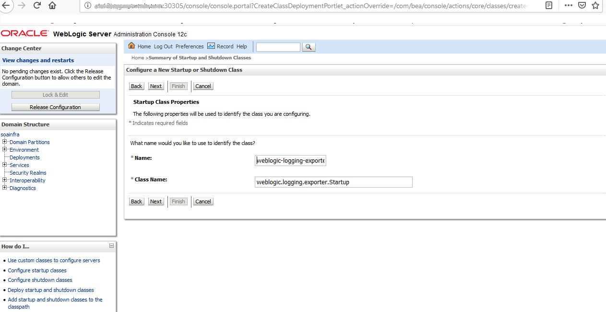

# Weblogic Logging Exporter Setup to publish logs into Elasticsearch

The WebLogic Logging Exporter adds a log event handler to WebLogic Server. 

WebLogic Server logs can be pushed into Elastic Stack in Kubernetes directly, by using the Elasticsearch REST API. For more details refer to [weblogic-logging-exporter](https://github.com/oracle/weblogic-logging-exporter) project.  

This documents provides the steps to publish WebLogic Server logs into Elasticsearch and interact with them in Kibana. 

Please follow the below steps to push the server server logs into Elasticsearch.  

## Download Weblogic logging exporter binaries

The Weblogic logging exporter pre-built binaries are available in the release page of the [weblogic-logging-exporter](https://github.com/oracle/weblogic-logging-exporter/releases) project.  
You need to download the 
* "weblogic-logging-exporter-0.1.1.jar" from this [link](https://github.com/oracle/weblogic-logging-exporter/releases)
* "snakeyaml-1.23.jar" from [Maven Central](https://search.maven.org/artifact/org.yaml/snakeyaml/1.23/bundle).  

## Copy JAR files to the Kubernetes Weblogic Domain Pod

Copy the weblogic-logging-exporter-0.1.1.jar and snakeyaml-1.23.jar files to the domain home folder in the Admin server pod.

```
$ kubectl cp snakeyaml-1.23.jar soans/soainfra-adminserver:/u01/oracle/user_projects/domains/soainfra/
 
$ kubectl cp weblogic-logging-exporter-0.1.1.jar soans/soainfra-adminserver:/u01/oracle/user_projects/domains/soainfra/
```
## Add a startup class to your domain configuration

In the Administration Console, navigate to "Environment" then "Startup and Shutdown classes" in the main menu.  
Add a new Startup class. You may choose any descriptive name and the class name must be "weblogic.logging.exporter.Startup".  

  

Target the startup class to each server that you want to export logs from.  

  

You can verify this by checking for the update in your config.xml which should be similar to this example:
```
<startup-class>
  <name>weblogic-logging-exporter</name>
  <target>AdminServer,soa_cluster</target>
  <class-name>weblogic.logging.exporter.Startup</class-name>
</startup-class>
```  

## Update Weblogic Server CLASS Path.

Copy setDomainEnv.sh from the pod to local folder.  
```
$ kubectl cp soans-au01/soainfra-adminserver:/u01/oracle/user_projects/domains/soainfra/bin/setDomainEnv.sh .
```  

Modify setDomainEnv.sh to update the Server Class path.  
```
CLASSPATH=/u01/oracle/user_projects/domains/soainfra/weblogic-logging-exporter-0.1.1.jar:/u01/oracle/user_projects/domains/soainfra/snakeyaml-1.23.jar:${CLASSPATH}
export CLASSPATH
```  

Copy back the modified setDomainEnv.sh to the pod.  
```
$ kubectl cp setDomainEnv.sh soans-au01/soainfra-adminserver:/u01/oracle/user_projects/domains/soainfra/bin/setDomainEnv.sh
```

## Create a configuration file for the WebLogic Logging Exporter  

Create a file named WebLogicLoggingExporter.yaml. Specify the elasticseach server host and port number.
```
weblogicLoggingIndexName: wls
publishHost: elasticsearch.default.svc.cluster.local
publishPort: 9200
domainUID: soainfra
weblogicLoggingExporterEnabled:  true
weblogicLoggingExporterSeverity:  Notice
weblogicLoggingExporterBulkSize: 2
weblogicLoggingExporterFilters:
- FilterExpression: NOT(MSGID = 'BEA-000449')
```  

Copy file to the domain folder in the weblogic server pod.  
```
$ kubectl cp WebLogicLoggingExporter.yaml soans-au01/soainfra-adminserver:/u01/oracle/user_projects/domains/soainfra/config/
```  

## Restart Weblogic Servers  

To restart the servers, edit the domain and change serverStartPolicy to NEVER for the weblogic servers to shutdown.  
```
$ kubectl edit domain -n soans-au01
 
  serverService:
    annotations: {}
    labels: {}
  serverStartPolicy: NEVER
  webLogicCredentialsSecret:
    name: soainfra-domain-credentials
 
$ kubectl get pods -n soans-au01
NAME                   READY     STATUS        RESTARTS   AGE
soainfra-adminserver   0/1       Terminating   0          4d
soainfra-soa-server1   0/1       Terminating   0          4d
soainfra-soa-server2   0/1       Terminating   0          4d
```

After all the server are shutdown edit domain again and set serverStartPolicy to IF_NEEDED for the servers to start again.  
```
$ kubectl get pods -n soans-au01
NAME                   READY     STATUS    RESTARTS   AGE
soainfra-adminserver   1/1       Running   0          8m
soainfra-soa-server1   1/1       Running   0          7m
soainfra-soa-server2   1/1       Running   0          7m
```  

In the server logs, you will be able to see the Weblogic-logging-exporter class being called.  
```
======================= Weblogic Logging Exporter Startup class called                                                 
Reading configuration from file name: /u01/oracle/user_projects/domains/soainfra/config/WebLogicLoggingExporter.yaml   
Config{weblogicLoggingIndexName='wls', publishHost='domain.host.com', publishPort=9200, weblogicLoggingExporterSeverity='Notice', weblogicLoggingExporterBulkSize='2', enabled=true, weblogicLoggingExporterFilters=FilterConfig{expression='NOT(MSGID = 'BEA-000449')', servers=[]}], domainUID='soainfra'}
```  

## Create index pattern in Kibana  
Create an index pattern "wls*" in Kibana > Management. After the server starts, you will be able to see the log data in the Kibana dashboard.  

   


