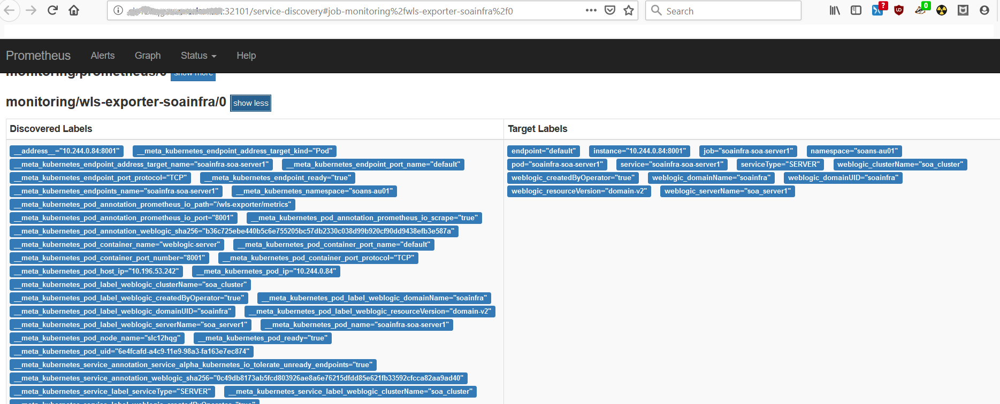

# Weblogic Monitor Exporter Setup to monitor the SOA domain instance

You can monitor the SOA instance using Prometheus and Grapahna by exporting the metrics from the domain instance using the weblogic monitor exporter to the prometheus.

This document provides the steps to setup the weblogic monitor exporter to push the data to prometheus in order to monitor the SOA instance.

## Build Weblogic Monitor Exporter  

Create a working directory and make sure it has full access persmissions. 
```
mkdir <Working_dir>
cd  <Working_dir>
```  

Clone the repository  
```
$ git clone https://github.com/oracle/weblogic-monitoring-exporter.git
```  

Change directory to weblogic-monitoring-exporter and execute 'mvn package'  
```
$ mvn package                                                                                                                   
[WARNING]                                                                                                                                                                                   
[WARNING] Some problems were encountered while building the effective settings                                                                                                              
[WARNING] 'proxies.proxy.id' must be unique but found duplicate proxy with id optional @ <mvn_home>/apache-maven-3.6.0/conf/settings.xml                                             
[WARNING]                                                                                                                                                                                   
[INFO] Scanning for projects...                                                                                                                                                             
[INFO]                                                                                                                                                                                      
[INFO] -------------------< io.prometheus.wls:wls-exporter >-------------------                                                                                                             
[INFO] Building WebLogic Monitoring Exporter 1.0-SNAPSHOT                                                                                                                                   
[INFO] --------------------------------[ jar ]---------------------------------                                                                                                             
[INFO]                                                                                                                                                                                      
[INFO] --- maven-resources-plugin:2.6:resources (default-resources) @ wls-exporter ---                                                                                                      
[WARNING] Using platform encoding (UTF-8 actually) to copy filtered resources, i.e. build is platform dependent!                                                                            
[INFO] Copying 2 resources                                                                                                                                                                  
[INFO]                                                                                                                                                                                      
[INFO] --- maven-compiler-plugin:3.6.1:compile (default-compile) @ wls-exporter ---                                                                                                         
[INFO] Changes detected - recompiling the module!                                                                                                                                           
[WARNING] File encoding has not been set, using platform encoding UTF-8, i.e. build is platform dependent!                                                                                  
[INFO] Compiling 33 source files to <Working_dir>/weblogic-monitor/weblogic-monitoring-exporter/target/classes                                                                          
[INFO]                                                                                                                                                                                      
[INFO] --- maven-resources-plugin:2.6:testResources (default-testResources) @ wls-exporter ---                                                                                              
[WARNING] Using platform encoding (UTF-8 actually) to copy filtered resources, i.e. build is platform dependent!                                                                            
[INFO] skip non existing resourceDirectory <Working_dir>/weblogic-monitor/weblogic-monitoring-exporter/src/test/resources                                                               
[INFO]                                                                                                                                                                                      
[INFO] --- maven-compiler-plugin:3.6.1:testCompile (default-testCompile) @ wls-exporter ---                                                                                                 
[INFO] Changes detected - recompiling the module!                                                                                                                                           
[WARNING] File encoding has not been set, using platform encoding UTF-8, i.e. build is platform dependent!                                                                                  
[INFO] Compiling 35 source files to <Working_dir>/weblogic-monitor/weblogic-monitoring-exporter/target/test-classes                                                                     
[INFO]                                                                                                                                                                                      
[INFO] --- maven-surefire-plugin:2.12.4:test (default-test) @ wls-exporter ---                                                                                                              
[INFO] Surefire report directory: <Working_dir>/weblogic-monitor/weblogic-monitoring-exporter/target/surefire-reports
[INFO]                                                                                                                                                                                      
[INFO] --- maven-jar-plugin:2.4:jar (default-jar) @ wls-exporter ---                                                                                                                        
[INFO] Building jar: <Working_dir>/weblogic-monitor/weblogic-monitoring-exporter/target/wls-exporter-1.0-SNAPSHOT.jar                                                                   
[INFO] ------------------------------------------------------------------------                                                                                                             
[INFO] BUILD SUCCESS                                                                                                                                                                        
[INFO] ------------------------------------------------------------------------                                                                                                             
[INFO] Total time:  10.668 s                                                                                                                                                                
[INFO] Finished at: 2019-06-20T07:08:47-07:00                                                                                                                                               
[INFO] ------------------------------------------------------------------------
```  

## Create configuration file for WLS-Exporter  

Change directory to weblogic-monitoring-exporter/webapp. Create a config.yaml with the sample content as below:  
```
metricsNameSnakeCase: true
restPort: 7001
queries:
- applicationRuntimes:
    key: name
    keyName: app
    componentRuntimes:
      type: WebAppComponentRuntime
      prefix: webapp_config_
      key: name
      values: [deploymentState, contextRoot, sourceInfo, openSessionsHighCount, openSessionsCurrentCount, sessionsOpenedTotalCount, sessionCookieMaxAgeSecs, sessionInvalidationIntervalSecs, sessionTimeoutSecs, singleThreadedServletPoolSize, sessionIDLength, servletReloadCheckSecs, jSPPageCheckSecs]
      servlets:
        prefix: weblogic_servlet_
        key: servletName
        values: [invocationTotalCount, reloadTotal, executionTimeAverage, poolMaxCapacity, executionTimeTotal, reloadTotalCount, executionTimeHigh, executionTimeLow]
- JVMRuntime:
    key: name
    values: [heapFreeCurrent, heapFreePercent, heapSizeCurrent, heapSizeMax, uptime, processCpuLoad]
``` 

## Generate deployment package  
  
From directory weblogic-monitoring-exporter/webapp run "mvn package -Dconfiguration=./config.yaml" to create the deployment package. The config.yaml will be the configuration file for the weblogic-monitor-exporter. As the listening ports of AdminServer and Soa_servers are different, you may have to have seperate packages with restPort as 7001 and 8001 in config.yaml.  
```
$ mvn package -Dconfiguration=./config.yaml
[WARNING]
[WARNING] Some problems were encountered while building the effective settings
[WARNING] 'proxies.proxy.id' must be unique but found duplicate proxy with id optional @ <Working_dir>/apache-maven-3.6.0/conf/settings.xml
[WARNING]
[INFO] Scanning for projects...
[INFO]
[INFO] -----------< com.oracle.weblogic.prometheus:exporter-webapp >-----------
[INFO] Building exporter-webapp Maven Webapp 1.0-SNAPSHOT
[INFO] --------------------------------[ war ]---------------------------------
[INFO]
[INFO] --- copy-rename-maven-plugin:1.0:copy (copy-configuration) @ exporter-webapp ---
[INFO] Copied <Working_dir>/weblogic-monitor/weblogic-monitoring-exporter/webapp/config.yaml to <Working_dir>/weblogic-monitor/weblogic-monitoring-exporter/webapp/target/configuration/config.yml
[INFO]
[INFO] --- maven-resources-plugin:2.6:resources (default-resources) @ exporter-webapp ---
[WARNING] Using platform encoding (UTF-8 actually) to copy filtered resources, i.e. build is platform dependent!
[INFO] skip non existing resourceDirectory <Working_dir>/weblogic-monitor/weblogic-monitoring-exporter/webapp/src/main/resources
[INFO]
[INFO] --- maven-compiler-plugin:3.1:compile (default-compile) @ exporter-webapp ---
[INFO] No sources to compile
[INFO]
[INFO] --- maven-resources-plugin:2.6:testResources (default-testResources) @ exporter-webapp ---
[WARNING] Using platform encoding (UTF-8 actually) to copy filtered resources, i.e. build is platform dependent!
[INFO] skip non existing resourceDirectory <Working_dir>/weblogic-monitor/weblogic-monitoring-exporter/webapp/src/test/resources
[INFO]
[INFO] --- maven-compiler-plugin:3.1:testCompile (default-testCompile) @ exporter-webapp ---
[INFO] No sources to compile
[INFO]
[INFO] --- maven-surefire-plugin:2.12.4:test (default-test) @ exporter-webapp ---
[INFO] No tests to run.
[INFO]
[INFO] --- maven-war-plugin:2.6:war (default-war) @ exporter-webapp ---
[INFO] Packaging webapp
[INFO] Assembling webapp [exporter-webapp] in [<Working_dir>/weblogic-monitor/weblogic-monitoring-exporter/webapp/target/wls-exporter]
[INFO] Processing war project
[INFO] Copying webapp webResources [<Working_dir>/weblogic-monitor/weblogic-monitoring-exporter/webapp/src/main/notices] to [<Working_dir>/weblogic-monitor/weblogic-monitoring-exporter/webapp/target/wls-exporter]
[INFO] Copying webapp resources [<Working_dir>/weblogic-monitor/weblogic-monitoring-exporter/webapp/target/configuration]
[INFO] Webapp assembled in [57 msecs]
[INFO] Building war: <Working_dir>/weblogic-monitor/weblogic-monitoring-exporter/webapp/target/wls-exporter.war
[INFO] ------------------------------------------------------------------------
[INFO] BUILD SUCCESS
[INFO] ------------------------------------------------------------------------
[INFO] Total time:  3.621 s
[INFO] Finished at: 2019-06-20T09:01:12-07:00
```  

The generated package will be at weblogic-monitoring-exporter/webapp/target/wls-exporter.war.  

## Deploy Weblogic-monitor-exporter  

Deploy weblogic-monitor-exporter in the AdminServer and Soa maanaged servers separately through Oracle Enterprise Manager.   
The URL would be like http://server:30305/em  
Here 30305 is the frontend port of the traefik load balancer.

  

Select the servers to deploy:  

 

Set the application name:  

The application name has to be different if deployed separately in AdminServer and Soa managed servers.  
Set the context-root to "wls-exporter" for both the deployments. Select "Install and start application" option.

 

Then deploy weblogic-monitor-exporter application and then activate changes for the application to start.  
If the application started and the port is exposed, then the url "http://<server:port>/wls-exporter" will be accessible.  

   

## Prometheus Operator Configuration

Now you have to configure Prometheus to collect the metrics from the weblogic-monitor-exporter. Prometheus operator identifies the targets using service discovery. To get the weblogic-monitor-exporter end point discovered as target, we will need to create a service monitor pointing to the service. Below the sample service monitor deployment yaml.  

### ServiceMonitor for wls-exporter:
```
apiVersion: v1
kind: Secret
metadata:                 
  name: basic-auth 
  namespace: monitoring 
data:          
  password: V2VsY29tZTE= # Welcome1                                                                                                                          
  user: d2VibG9naWM=  # weblogic
type: Opaque
---               
apiVersion: monitoring.coreos.com/v1
kind: ServiceMonitor
metadata:            
  name: wls-exporter-soainfra
  namespace: monitoring
  labels: 
    k8s-app: wls-exporter
spec:
  namespaceSelector:
    matchNames:       
    - soans             
  selector:
    matchLabels:          
      weblogic.domainName: soainfra
  endpoints:               
  - basicAuth:
      password:    
        name: basic-auth        
        key: password
	  username:                  
        name: basic-auth       
        key: user            
    port: default       
    relabelings:     
      - action: labelmap     
        regex: __meta_kubernetes_service_label_(.+)
    interval: 10s
    honorLabels: true
    path: /wls-exporter/metrics
```  

The scraping of metrics from wls-exporter requires basic auth. So a secret is created with username/password are base64 encoded. Be careful in the generation of base64 encoded string of user and password. New line character could be included in the encoded string and cause authentication failure. To avoid new line string, use the following sample:  
```
$ echo -n "Welcome1" | base64 
V2VsY29tZTE=
``` 

In this deployment, it is used "weblogic.domainName: soainfra" as label for selector→matchLabels. So all the server services will be selected for the service monitor. Otherwise you may have to create separate service monitors for the servers if the server name is used as matching labels. The relabelings configuration is required as Prometheus by default ignores the labels provided in the wls-exporter.  

## Add RoleBinding/Role for Weblogic domain namespace

You need to add RoleBinding for the namespace under which the weblogic servers pods are running in the Kubernetes cluster. This RoleBinding is required for the Prometheus to access the endpoints provided by the Weblogic monitor exporter. Edit "prometheus-roleBindingSpecificNamespaces.yaml" in the Prometheus operator deployment manifests and add the RoleBinding for the namespace ("soans") similar to example as below,

```
- apiVersion: rbac.authorization.k8s.io/v1 
 kind: RoleBinding 
 metadata: 
 name: prometheus-k8s 
 namespace: soans 
 roleRef: 
 apiGroup: rbac.authorization.k8s.io 
 kind: Role 
 name: prometheus-k8s 
 subjects: 
 - kind: ServiceAccount 
 name: prometheus-k8s 
 namespace: monitoring 
``` 

Similarly you need to add Role for the namespace under which the weblogic servers pods are running in the Kubernetes cluster. Edit "prometheus-roleSpecificNamespaces.yaml" in the Prometheus operator deployment manifests and add the RoleBinding for the namespace ("soans") similar to example as below,
```
- apiVersion: rbac.authorization.k8s.io/v1 
 kind: Role 
 metadata: 
 name: prometheus-k8s 
 namespace: soans
 rules: 
 - apiGroups: 
 - "" 
 resources: 
 - services 
 - endpoints 
 - pods 
 verbs: 
 - get 
 - list 
 - watch
```  

Then apply "prometheus-roleBindingSpecificNamespaces.yaml" & "prometheus-roleSpecificNamespaces.yaml" for the RoleBinding/Role to take effect in the cluster.  
```
$ kubectl apply -f prometheus-roleBindingSpecificNamespaces.yaml

$ kubectl apply -f prometheus-roleSpecificNamespaces.yaml
```  

## Deploy ServiceMonitor

After creating the deployment yaml for the service monitor. Deploy the service monitor using the following command:
```
$ kubectl create -f wls-exporter.yaml
``` 

## Service Discovery

After the deployment of ServiceMonitor, the wls-exporter should be discovered by Prometheus and able to scrape metrics.

   

## Grafana Dashboard

Below is a screenshot of a sample Graphana dashboard which is deployed using the dashboard provided in 
 [weblogic-monitor-exporter](https://github.com/oracle/weblogic-monitoring-exporter/blob/master/samples/kubernetes/end2end/dashboard/weblogic_dashboard.json)


