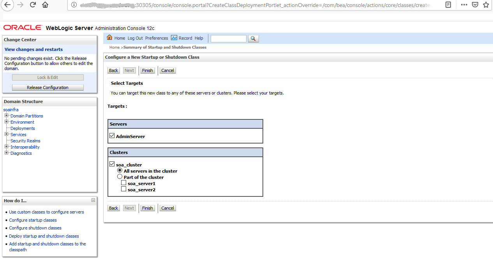

# WebLogic Logging Exporter Setup to Publish Logs into Elasticsearch

The WebLogic Logging Exporter adds a log event handler to WebLogic Server. 

WebLogic Server logs can be pushed into Elasticsearch in Kubernetes directly, by using the Elasticsearch REST API. For more details refer to [weblogic-logging-exporter](https://github.com/oracle/weblogic-logging-exporter) project.  

This documents provides the steps to publish WebLogic Server logs into Elasticsearch and interact with them in Kibana. 

## Prerequisite

This document assumes that you have already setup Elasticsearch/Kibana for logs collection. If you have not, please refer this [document](/kubernetes/samples/scripts/elasticsearch-and-kibana/README.md) to setup Elasticsearch/Kibana from WebLogic operator samples.

---  

Please follow the below steps to push the server logs into Elasticsearch.  

## Download WebLogic Logging Exporter Binaries

The WebLogic Logging Exporter pre-built binaries are available in the release page of the [weblogic-logging-exporter](https://github.com/oracle/weblogic-logging-exporter/releases) project.  
You need to download the 
* `weblogic-logging-exporter-0.1.1.jar` from this [link](https://github.com/oracle/weblogic-logging-exporter/releases)
* `snakeyaml-1.23.jar` from [Maven Central](https://search.maven.org/artifact/org.yaml/snakeyaml/1.23/bundle).  

## Copy downloaded JAR Files to the WebLogic Domain Home

```
NOTE: Please note that below are the identifiers used in the sample commands in this document.

* soans: is the SOA Domain namespace.
* soainfra: is the domainUID
* soainfra-adminserver: is the Administration Server pod name
```

Copy the `weblogic-logging-exporter-0.1.1.jar` and `snakeyaml-1.23.jar` files to the domain home folder in the Administration Server pod.

```
Command:
$ kubectl cp <file-to-copy> <namespace>/<Administration-Server-pod>:<domainhome>

```

```
Sample commands: 
$ kubectl cp snakeyaml-1.23.jar soans/soainfra-adminserver:/u01/oracle/user_projects/domains/soainfra/
 
$ kubectl cp weblogic-logging-exporter-0.1.1.jar soans/soainfra-adminserver:/u01/oracle/user_projects/domains/soainfra/
```

## Add a Startup Class to the Domain Configuration

In the Administration Console, navigate to "Environment" then "Startup and Shutdown classes" in the main menu.  
Add a new Startup class. You may choose any descriptive name and the class name must be "weblogic.logging.exporter.Startup".  

  

Target the startup class to each server that you want to export logs from.  

  

You can verify this by checking for the update in your config.xml which should be similar to this example:
```
<startup-class>
  <name>weblogic-logging-exporter</name>
  <target>AdminServer,soa_cluster</target>
  <class-name>weblogic.logging.exporter.Startup</class-name>
</startup-class>
```  

## Update WebLogic Server CLASSPATH.

Copy setDomainEnv.sh from the pod to local folder.  
```
$ kubectl cp soans/soainfra-adminserver:/u01/oracle/user_projects/domains/soainfra/bin/setDomainEnv.sh .
```  

Modify setDomainEnv.sh to update the Server Class path.  
```
CLASSPATH=/u01/oracle/user_projects/domains/soainfra/weblogic-logging-exporter-0.1.1.jar:/u01/oracle/user_projects/domains/soainfra/snakeyaml-1.23.jar:${CLASSPATH}
export CLASSPATH
```  

Copy back the modified setDomainEnv.sh to the pod.  
```
$ kubectl cp setDomainEnv.sh soans/soainfra-adminserver:/u01/oracle/user_projects/domains/soainfra/bin/setDomainEnv.sh
```

## Create a Configuration File for the WebLogic Logging Exporter  

Create a file named `WebLogicLoggingExporter.yaml`. Specify the Elasticseach server host and port number.
```
weblogicLoggingIndexName: wls
publishHost: elasticsearch.default.svc.cluster.local
publishPort: 9200
domainUID: soainfra
weblogicLoggingExporterEnabled: true
weblogicLoggingExporterSeverity: TRACE
weblogicLoggingExporterBulkSize: 1
```  

Copy `WebLogicLoggingExporter.yaml` to the domain home directory in the WebLogic Administration Server pod.  
```
$ kubectl cp WebLogicLoggingExporter.yaml soans/soainfra-adminserver:/u01/oracle/user_projects/domains/soainfra/config/
```  

## Restart All Servers in the Domain

To restart the servers, you need to stop and start them using below commands:

To Stop the servers:
```
$ kubectl patch domain soainfra -n soans --type='json' -p='[{"op": "replace", "path": "/spec/serverStartPolicy", "value": "NEVER" }]'

```

To Start the servers:
```
$ kubectl patch domain soainfra -n soans --type='json' -p='[{"op": "replace", "path": "/spec/serverStartPolicy", "value": "IF_NEEDED" }]'
```

After all the servers are started, in all the server logs, you will be able to see the Weblogic-logging-exporter class being called as shown below.  
```
======================= Weblogic Logging Exporter Startup class called                                                 
Reading configuration from file name: /u01/oracle/user_projects/domains/soainfra/config/WebLogicLoggingExporter.yaml   
Config{weblogicLoggingIndexName='wls', publishHost='domain.host.com', publishPort=9200, weblogicLoggingExporterSeverity='Notice', weblogicLoggingExporterBulkSize='2', enabled=true, weblogicLoggingExporterFilters=FilterConfig{expression='NOT(MSGID = 'BEA-000449')', servers=[]}], domainUID='soainfra'}
```  

## Create an Index Pattern in Kibana  
Create an index pattern "wls*" in Kibana > Management. After the servers are started, you will be able to see the log data in the Kibana dashboard.  

   


