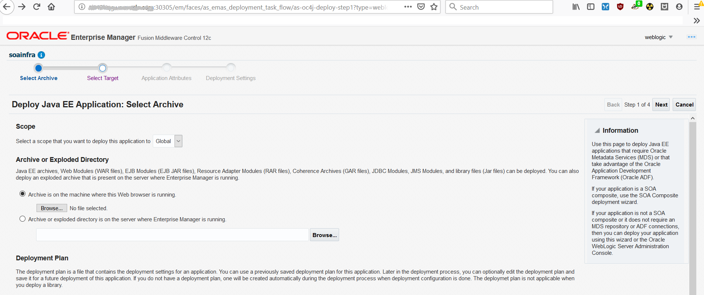
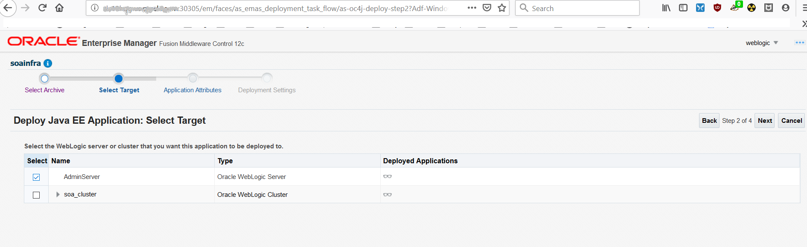
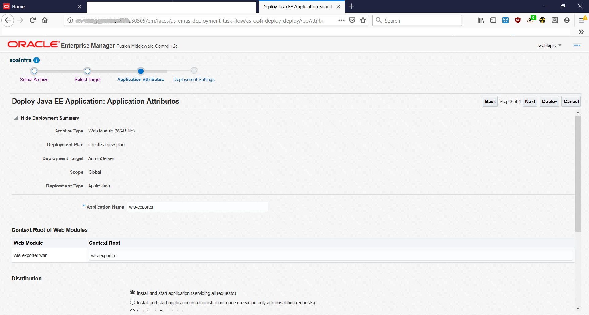
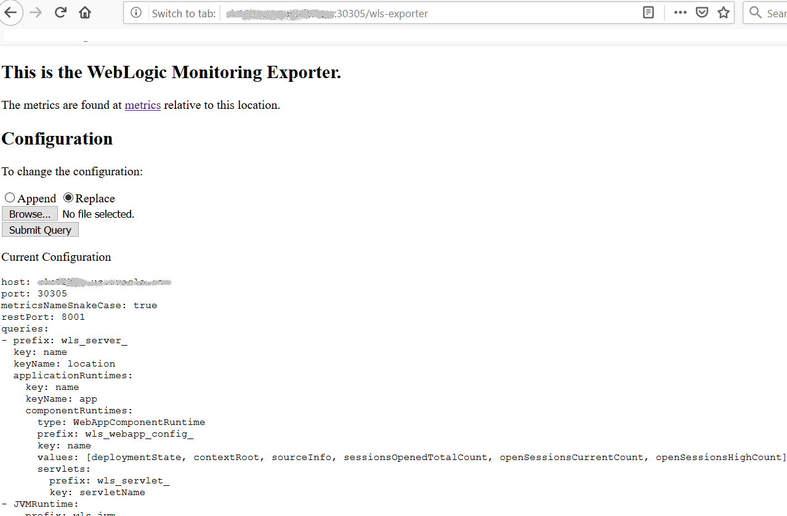
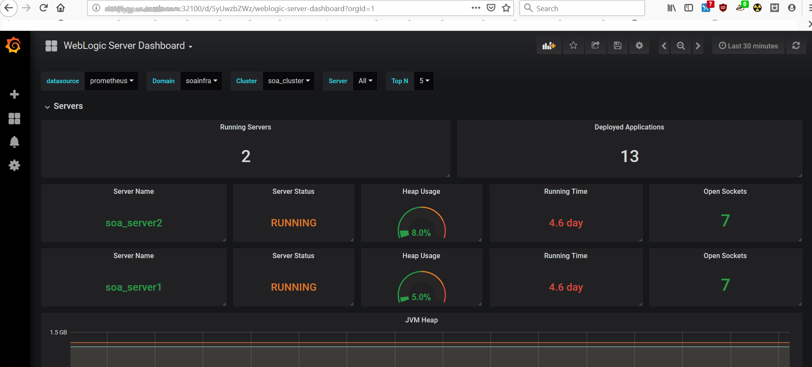

You can monitor a SOA domain using Prometheus and Grafana by exporting the metrics from the domain instance using the WebLogic Monitoring Exporter.

This document provides the steps to set up the WebLogic Monitoring Exporter to push the data to Prometheus in order to monitor a SOA domain.

## Prerequisite

This document assumes that Prometheus operator is deployed on the Kubernetes cluster. If it is not already deployed, please follow the below quick start steps for Prometheus Operator deployment. 

#### Clone Kube-Prometheus Project

```bash
$ git clone https://github.com/coreos/kube-prometheus.git
```

#### Create Kube-Prometheus Resources

Change to folder `kube-prometheus` and execute the following commands to create the namespace and CRDs, and then wait for their availability before creating the remaining resources.

```bash
$ cd kube-prometheus

$ kubectl create -f manifests/setup
$ until kubectl get servicemonitors --all-namespaces ; do date; sleep 1; echo ""; done
$ kubectl create -f manifests/
```

#### Label the nodes
Kube-Prometheus requires all exporter nodes to be labelled with `kubernetes.io/os=linux`. If a node is not labelled with this, then you need to label it using the following command:

```
$ kubectl label nodes --all kubernetes.io/os=linux
```
#### Provide external access
To provide external access for Grafana, Prometheus and Alertmanager, you need to execute the commands below:

```bash
$ kubectl patch svc grafana -n monitoring --type=json -p '[{"op": "replace", "path": "/spec/type", "value": "NodePort" },{"op": "replace", "path": "/spec/ports/0/nodePort", "value": 32100 }]'
$ kubectl patch svc prometheus-k8s -n monitoring --type=json -p '[{"op": "replace", "path": "/spec/type", "value": "NodePort" },{"op": "replace", "path": "/spec/ports/0/nodePort", "value": 32101 }]'
$ kubectl patch svc alertmanager-main -n monitoring --type=json -p '[{"op": "replace", "path": "/spec/type", "value": "NodePort" },{"op": "replace", "path": "/spec/ports/0/nodePort", "value": 32102 }]'

NOTE: Here
# 32100 is the external port for Grafana
# 32101 is the external port for Prometheus
# 32102 is the external port for Alertmanager
```
---  

Follow the instructions below to set up WebLogic Monitoring Exporter in a SOA domain environment for the collection of WebLogic Server metrics and monitoring.

## 1. Download WebLogic Monitoring Exporter

Download WebLogic Monitoring Exporter package from [here](https://github.com/oracle/weblogic-monitoring-exporter/releases).  
You need to download `wls-exporter.war` and `getX.X.X.sh` files from above location.

## 2. Create Configuration File for WebLogic Monitoring Exporter

In this step you need to create the configuration file for WebLogic Monitoring Exporter. This configuration file will have the server port for serving the webapp, metrics to be scraped from the WebLogic Server etc.

Below is the sample snippet of the configuration:

```
metricsNameSnakeCase: true
restPort: 7001
queries:
- key: name
  keyName: location
  prefix: wls_server_
  applicationRuntimes:
    key: name
    keyName: app
    componentRuntimes:
      prefix: wls_webapp_config_
      type: WebAppComponentRuntime
      key: name
      values: [deploymentState, contextRoot, sourceInfo, openSessionsHighCount, openSessionsCurrentCount, sessionsOpenedTotalCount, sessionCookieMaxAgeSecs, sessionInvalidationIntervalSecs, sessionTimeoutSecs, singleThreadedServletPoolSize, sessionIDLength, servletReloadCheckSecs, jSPPageCheckSecs]
      servlets:
        prefix: wls_servlet_
        key: servletName

- JVMRuntime:
    prefix: wls_jvm_
    key: name

- executeQueueRuntimes:
    prefix: wls_socketmuxer_
    key: name
    values: [pendingRequestCurrentCount]

- workManagerRuntimes:
    prefix: wls_workmanager_
    key: name
    values: [stuckThreadCount, pendingRequests, completedRequests]

- threadPoolRuntime:
    prefix: wls_threadpool_
    key: name
    values: [executeThreadTotalCount, queueLength, stuckThreadCount, hoggingThreadCount]

- JMSRuntime:
    key: name
    keyName: jmsruntime
    prefix: wls_jmsruntime_
    JMSServers:
      prefix: wls_jms_
      key: name
      keyName: jmsserver
      destinations:
        prefix: wls_jms_dest_
        key: name
        keyName: destination

- persistentStoreRuntimes:
    prefix: wls_persistentstore_
    key: name
- JDBCServiceRuntime:
    JDBCDataSourceRuntimeMBeans:
      prefix: wls_datasource_
      key: name
- JTARuntime:
    prefix: wls_jta_
    key: name
```

## 3. Generate the Deployment Package

In this step you will generate the deployment package. You need to generate two separate packages with restPort as 7001 and 8001 in `config.yaml`. The two packages are required as the listening ports are different for Administration Server and Managed Servers.

Use `getX.X.X.sh` script to update the configuration file into `wls-exporter` package.  
Below is the sample usage:

```
$ ./get1.1.0.sh config-admin.yaml
 % Total % Received % Xferd Average Speed Time Time Time Current
 Dload Upload Total Spent Left Speed
100 607 0 607 0 0 915 0 --:--:-- --:--:-- --:--:-- 915
100 2016k 100 2016k 0 0 839k 0 0:00:02 0:00:02 --:--:-- 1696k
created /tmp/ci-H1SNbxKo1b
/tmp/ci-H1SNbxKo1b ~/weblogic-monitor/tmp
in temp dir
 adding: config.yml (deflated 63%)
~/weblogic-monitor/tmp
$ ls
config-admin.yaml get1.1.0.sh wls-exporter.war
```

Similarly you need to generate the deployment package for the Managed Servers / Cluster with the different configuration file.

## 4. Deploy WebLogic Monitoring Exporter

Follow below instructions to deploy the package in the WebLogic Servers.

a) Deploy WebLogic Monitoring Exporter (`wls-exporter.war`) in the Administration Server and Managed Servers separately through Oracle Enterprise Manager.



b) Select the servers to deploy,



c) Set the application name. The application name has to be different if deployed separately in Administration Server and Managed Servers. Set the context-root to "wls-exporter" for both the deployments. Select "Install and start application" option.



d) Then deploy WebLogic Monitoring Exporter application (`wls-exporter.war`) and then activate changes for the application to start. If the application is started and the port is exposed, then you can access the WebLogic Monitoring Exporter console using the below url: 

"http://<server:port>/wls-exporter"



## 5. Prometheus Operator Configuration

This document provides configuration for Prometheus operator deployment. For standalone Prometheus deployment, please refer to samples provided [here](https://github.com/oracle/weblogic-monitoring-exporter/tree/master/samples/kubernetes/deployments). You have to configure Prometheus to collect the metrics from the WebLogic Monitoring Exporter. Prometheus operator identifies the targets using service discovery. To get the WebLogic Monitoring Exporter end point discovered as target, you need to create a service monitor pointing to the service. Below is the sample service monitor deployment yaml configuration file.  

ServiceMonitor for wls-exporter:
```
apiVersion: v1
kind: Secret
metadata:
  name: basic-auth
  namespace: monitoring
data:
  password: V2VsY29tZTE= # Welcome1 i.e.'WebLogic password'
  user: d2VibG9naWM= # weblogic  i.e. 'WebLogic username'
type: Opaque
---
apiVersion: monitoring.coreos.com/v1
kind: ServiceMonitor
metadata:
  name: wls-exporter-soainfra
  namespace: monitoring
  labels:
    k8s-app: wls-exporter
spec:
  namespaceSelector:
    matchNames:
    - soans
  selector:
    matchLabels:
      weblogic.domainName: soainfra
  endpoints:
  - basicAuth:
      password:
        name: basic-auth
        key: password
      username:
        name: basic-auth
        key: user
    port: default
    relabelings:
      - action: labelmap
        regex: __meta_kubernetes_service_label_(.+)
    interval: 10s
    honorLabels: true
    path: /wls-exporter/metrics
```

The scraping of metrics from wls-exporter requires basic auth. So a secret is created with username and password are base64 encoded.

NOTE :- Be careful in the generation of base64 encoded string of username and password. A new line character might get appended in the encoded string and causes authentication failure. To avoid new line string, use the following sample:

```
$ echo -n "Welcome1" | base64
V2VsY29tZTE=
```

In the above deployment yaml configuration for wls-exporter, `weblogic.domainName: soainfra` is used as label under `spec.selector.matchLabels`. So all the server services will be selected for the service monitor. Otherwise you may have to create separate service monitors for each server if the server name is used as matching labels in `spec.selector.matchLabels`. The relabeling of configuration is required, as Prometheus by default ignores the labels provided in the wls-exporter.  

By default Prometheus will not store all the labels provided by the target. In the service monitor deployment yaml configuration, it is required to mention the relabeling configuration (`spec.endpoints.relabelings`), so that certain labels provided by weblogic-monitoring-exporter (required for Grafana Dashboard) are stored in Prometheus. Please do not delete below section from the configuration yaml.
```
relabelings:
  - action: labelmap
    regex: __meta_kubernetes_service_label_(.+)
``` 

## 6. Add RoleBinding/Role for WebLogic Domain namespace

You need to add RoleBinding for the namespace under which the WebLogic Servers pods are running in the Kubernetes cluster. This RoleBinding is required for the Prometheus to access the endpoints provided by the WebLogic Monitoring Exporter. Edit "prometheus-roleBindingSpecificNamespaces.yaml" in the Prometheus operator deployment manifests and add the RoleBinding for the namespace ("soans") similar to example as below,

```
- apiVersion: rbac.authorization.k8s.io/v1
 kind: RoleBinding
 metadata:
 name: prometheus-k8s
 namespace: soans
 roleRef:
 apiGroup: rbac.authorization.k8s.io
 kind: Role
 name: prometheus-k8s
 subjects:
 - kind: ServiceAccount
 name: prometheus-k8s
 namespace: monitoring
```
Similarly you need to add Role for the namespace under which the WebLogic Servers pods are running in the Kubernetes cluster. Edit "prometheus-roleSpecificNamespaces.yaml" in the Prometheus operator deployment manifests and add the Role for the namespace ("soans") similar to example as below,
```
- apiVersion: rbac.authorization.k8s.io/v1
 kind: Role
 metadata:
 name: prometheus-k8s
 namespace: soans
 rules:
 - apiGroups:
 - ""
 resources:
 - services
 - endpoints
 - pods
 verbs:
 - get
 - list
 - watch
```
Then apply "prometheus-roleBindingSpecificNamespaces.yaml" & "prometheus-roleSpecificNamespaces.yaml" for the RoleBinding/Role to take effect in the cluster.
```
$ kubectl apply -f prometheus-roleBindingSpecificNamespaces.yaml

$ kubectl apply -f prometheus-roleSpecificNamespaces.yaml
```
## 7. Deploy ServiceMonitor

After creating the deployment yaml for the service monitor. Deploy the service monitor using the following command:
```
$ kubectl create -f wls-exporter.yaml
```
## 8. Service Discovery

After the deployment of ServiceMonitor, the wls-exporter should be discovered by Prometheus and able to scrape metrics. Below is the screenshot of Prometheus web UI showing the service discovery of wls-exporter.


## 7. Grafana Dashboard

Deploy the Grafana dashboard provided in WebLogic-Monitoring-Exporter. Below is the screenshot of the dashboard:



