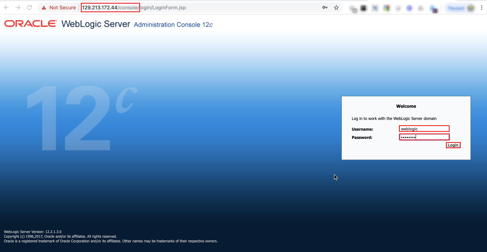
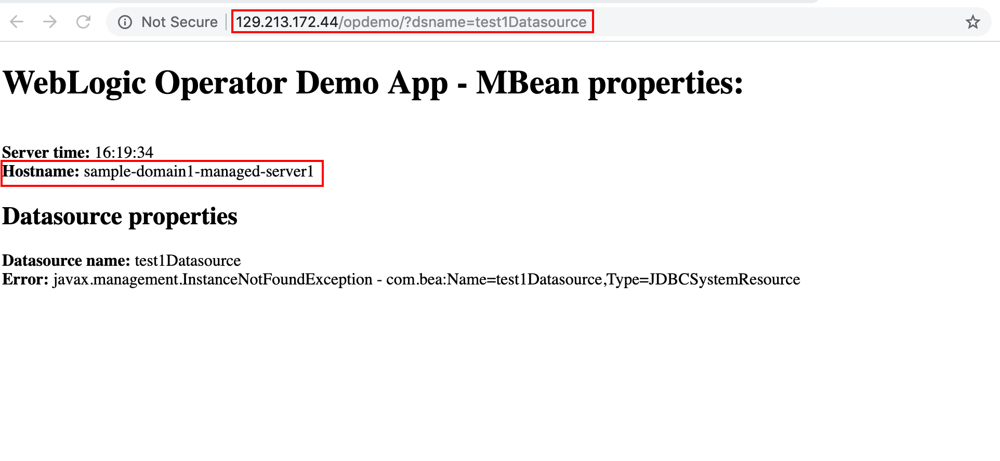

# Oracle WebLogic Server Kubernetes Operator Tutorial #

### Deploy a WebLogic Server domain  ###

#### Prepare the Kubernetes cluster to run WebLogic Server domains ####

Create the domain namespace:
```shell
$ kubectl create namespace sample-domain1-ns
```
Create a Kubernetes Secret containing the Administration Server boot credentials:
```shell
$ kubectl -n sample-domain1-ns create secret generic sample-domain1-weblogic-credentials \
  --from-literal=username=weblogic \
  --from-literal=password=welcome1
```

Label the domain namespace:
```shell
$ kubectl label ns sample-domain1-ns weblogic-operator=enabled
```

#### Update the Traefik ingress controller configuration ####

After you have your domain namespace (the WebLogic domain is not deployed yet), you have to update the ingress controller configuration to specify where the domain will be deployed.

To update Traefik, execute the following `helm upgrade` command:
```shell
$ helm upgrade traefik-operator \
  stable/traefik \
  --namespace traefik \
  --reuse-values \
  --set "kubernetes.namespaces={traefik,sample-domain1-ns}" \
  --wait
```
Note that the only updated parameter is to add the domain namespace.

#### Deploy a WebLogic domain on Kubernetes ####

To deploy WebLogic domain, you need to create a Domain resource definition which contains the necessary parameters for the operator to start the WebLogic Server domain properly.

We provided for you a `domain.yaml` file that contains a YAML representation of the custom resource object. Please copy it locally:
```shell
$ curl -LSs https://raw.githubusercontent.com/oracle/weblogic-kubernetes-operator/master/kubernetes/hands-on-lab/domain.yaml >~/domain.yaml
```
Review it in your favorite editor or a [browser](../domain.yaml).

Create the domain custom resource object with the following command:
```shell
$ kubectl apply -f ~/domain.yaml
```
Check the introspector job, which will run first:
```shell
$ kubectl get pod -n sample-domain1-ns
NAME                                         READY     STATUS              RESTARTS   AGE
sample-domain1-introspect-domain-job-kcn4n   0/1       ContainerCreating   0          7s
```
Periodically check the pods in the domain namespace and soon you will see the servers starting:
```shell
$ kubectl get po -n sample-domain1-ns -o wide
NAME                             READY     STATUS    RESTARTS   AGE       IP            NODE            NOMINATED NODE
sample-domain1-admin-server      1/1       Running   0          2m        10.244.2.10   130.61.84.41    <none>
sample-domain1-managed-server1   1/1       Running   0          1m        10.244.2.11   130.61.84.41    <none>
sample-domain1-managed-server2   0/1       Running   0          1m        10.244.1.4    130.61.52.240   <none>
```
You should see three running pods similar to the results shown above. If you don't see all the running pods, wait and then check periodically. The entire domain deployment may take up to 2-3 minutes depending on the compute shapes.

In order to access any application or the Administration Console deployed on WebLogic, you have to configure a *Traefik* Ingress. An OCI load balancer is already assigned during the *Traefik* install in the previous step.

As a simple solution, it's best to configure path routing, which will route external traffic through *Traefik* to the domain cluster address or the Administration Server Console.

Execute the following Ingress resource definition:
```shell
$ cat << EOF | kubectl apply -f -
apiVersion: networking.k8s.io/v1beta1
kind: Ingress
metadata:
  name: traefik-pathrouting-1
  namespace: sample-domain1-ns
  annotations:
    kubernetes.io/ingress.class: traefik
spec:
  rules:
  - host:
    http:
      paths:
      - path: /
        backend:
          serviceName: sample-domain1-cluster-cluster-1
          servicePort: 8001
      - path: /console
        backend:
          serviceName: sample-domain1-admin-server
          servicePort: 7001          
EOF
```

Please note the two backends and the namespace, `serviceName`, `servicePort` definitions. The first backend is the domain cluster service to reach the application at the root context path. The second is for the admin console which is a different service.

Once the Ingress has been created construct the URL of the Administration Console based on the following pattern:

`http://EXTERNAL-IP/console`

The `EXTERNAL-IP` was determined during the Traefik install. If you forgot to note it, then execute the following command to get the public IP address:
```shell
$ kubectl describe svc traefik-operator --namespace traefik | grep Ingress | awk '{print $3}'
129.213.172.44
```
Construct the Administration Console URL and open it in a browser:

Enter the administrative user credentials (weblogic/welcome1) and click **Login**.



!Please note in this use case that the use of the Administration Console is just for demo/test purposes because the domain configuration is persisted in the pod, which means that after the restart, the original values (baked into the image) will be used again. To override certain configuration parameters - to ensure image portability - follow the override part of this tutorial.

#### Test the sample web application ####

The URL pattern of the sample application is the following:

`http://EXTERNAL-IP/opdemo/?dsname=testDatasource`



Refresh the page and notice the hostname changes. It reflects the Managed Server's name which responds to the request. You should see load balancing between the two Managed Servers.
