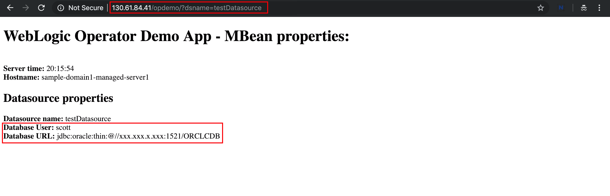
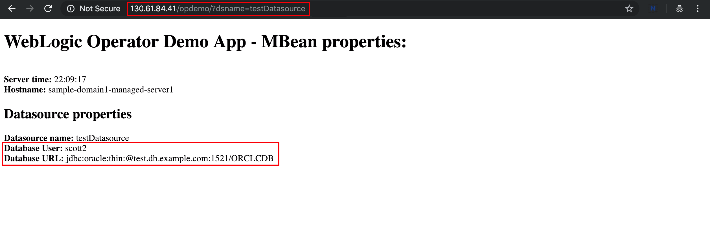

# Oracle WebLogic Server Kubernetes Operator Tutorial #

### Override the domain configuration  ###

You can modify the WebLogic domain configuration for both the "domain on a persistent volume" and the "domain in image" options before deploying a domain resource:

- When the domain is on a persistent volume, you can use WLST or WDT to change the configuration.
- For either case, you can use configuration overrides.

Use configuration overrides (also called situational configuration) to customize a WebLogic domain home configuration without modifying the domain's actual `config.xml` or system resource files. For example, you may want to override a JDBC data source XML module user name and URL so that it references a different database.

You can use overrides to customize domains as they are moved from QA to production, are deployed to different sites, or are even deployed multiple times at the same site.

Overrides leverage a built-in WebLogic feature called "Configuration Overriding" which is often informally called "Situational Configuration." Situational configuration consists of XML formatted files that closely resemble the structure of the WebLogic `config.xml` file and system resource module XML files. In addition, the attribute fields in these files can embed `add`, `replace`, and `delete` verbs to specify the desired override action for the field.

For more details, see the [Configuration overrides](https://oracle.github.io/weblogic-kubernetes-operator/userguide/managing-domains/configoverrides/) documentation.

#### Prepare a JDBC override ####

The operator requires a different file name format for override templates. For JDBC, it has to be `jdbc-MODULENAME.xml`. A MODULENAME must correspond to the MBean name of a system resource defined in your original `config.xml` file.

The custom WebLogic image - you created using Oracle Pipelines - has a JDBC data source called *testDatasource*. So, you have to create a template named *jdbc-testDatasource.xml*.
Before you create the necessary files, first make a directory which will contain only the situational JDBC configuration template and a `version.txt` file.
```bash
mkdir -p ~/override
```
Create the template file:
```bash
cat > ~/override/jdbc-testDatasource.xml <<'EOF'
<?xml version='1.0' encoding='UTF-8'?>
<jdbc-data-source xmlns="http://xmlns.oracle.com/weblogic/jdbc-data-source"
                  xmlns:f="http://xmlns.oracle.com/weblogic/jdbc-data-source-fragment"
                  xmlns:s="http://xmlns.oracle.com/weblogic/situational-config">
  <name>testDatasource</name>
  <jdbc-driver-params>
    <url f:combine-mode="replace">${secret:dbsecret.url}</url>
    <properties>
       <property>
          <name>user</name>
          <value f:combine-mode="replace">${secret:dbsecret.username}</value>
       </property>
    </properties>
  </jdbc-driver-params>
</jdbc-data-source>
EOF
```
Note! This template contains a macro to override the JDBC user name and URL parameters. The values referred to from the Kubernetes secret.

Now, create the *version.txt* file which reflects the version of the operator.
```bash
cat > ~/override/version.txt <<EOF
2.0
EOF
```
Now, create a Kubernetes configuration map (*jdbccm*) from the directory of the template and version file.
```bash
kubectl -n sample-domain1-ns create cm jdbccm --from-file ~/override
kubectl -n sample-domain1-ns label cm jdbccm weblogic.domainUID=sample-domain1
```
Please note the name of the configuration map which is *jdbccm*.

You can check the configuration map that you created:
```bash
$ kubectl describe cm jdbccm -n sample-domain1-ns
Name:         jdbccm
Namespace:    sample-domain1-ns
Labels:       weblogic.domainUID=sample-domain1
Annotations:  <none>

Data
====
jdbc-testDatasource.xml:
----
<?xml version='1.0' encoding='UTF-8'?>
<jdbc-data-source xmlns="http://xmlns.oracle.com/weblogic/jdbc-data-source"
                  xmlns:f="http://xmlns.oracle.com/weblogic/jdbc-data-source-fragment"
                  xmlns:s="http://xmlns.oracle.com/weblogic/situational-config">
  <name>testDatasource</name>
  <jdbc-driver-params>
    <url f:combine-mode="replace">${secret:dbsecret.url}</url>
    <properties>
       <property>
          <name>user</name>
          <value f:combine-mode="replace">${secret:dbsecret.username}</value>
       </property>
    </properties>
  </jdbc-driver-params>
</jdbc-data-source>

version.txt:
----
2.0

Events:  <none>
```

The last thing that you need to create is the secret which contains the values of the JDBC user name and URL parameters.

To create the secret, execute the following `kubectl` command:
```bash
kubectl -n sample-domain1-ns create secret generic dbsecret --from-literal=username=scott2 --from-literal=url=jdbc:oracle:thin:@test.db.example.com:1521/ORCLCDB
kubectl -n sample-domain1-ns label secret dbsecret weblogic.domainUID=sample-domain1
```
Please note the values (*username=scott2*, *url=jdbc:oracle:thin:@test.db.example.com:1521/ORCLCDB*) and the name of the secret which is *dbsecret*.

Before applying the changes, check the current JDBC parameters using the sample web application. Open a browser using the following URL pattern:

`http://EXTERNAL-IP/opdemo/?dsname=testDatasource`



Note the value of the database User and database URL.

The final step is to modify the domain resource definition (*domain.yaml*) to include the override configuration map and secret.

Open the *domain.yaml* file and in the `spec:` section, add (or append) the following entries. Be careful to keep the correct indentation:
```yaml
spec:
  [ ... ]
  configOverrides: jdbccm
  configOverrideSecrets: [dbsecret]
```
Save the changes of the domain resource definition file.

#### Restart the WebLogic domain ####

Any override changes require stopping all the WebLogic pods, applying your domain resource (if it changed), and restarting the WebLogic pods before they can take effect.

To stop all the running WebLogic Server pods in your domain, apply a changed resource, and then start the domain:

1. Open the *domain.yaml* file again and set your domain resource `serverStartPolicy` to `NEVER`.

2. Apply changes:
```bash
kubectl apply -f ~/domain.yaml
```
Check the pod's status:
```bash
$ kubectl get po -n sample-domain1-ns
NAME                             READY     STATUS        RESTARTS   AGE
sample-domain1-admin-server      1/1       Terminating   0          1h
sample-domain1-managed-server1   1/1       Terminating   0          1h
$ kubectl get po -n sample-domain1-ns
No resources found.
```
Wait until all the pods are terminated and no resources found.

3. Open the *domain.yaml* file again and set your domain resource `serverStartPolicy` back to `IF_NEEDED`.

4. Apply changes:
```bash
kubectl apply -f ~/domain.yaml
```
Check the pod's status periodically and wait until all the pods are up and ready:
```bash
$ kubectl get po -n sample-domain1-ns
NAME                             READY     STATUS    RESTARTS   AGE
sample-domain1-admin-server      1/1       Running   0          2m
sample-domain1-managed-server1   1/1       Running   0          1m
```

Now, check the expected values of the JDBC data source using the sample web application again:

`http://EXTERNAL-IP/opdemo/?dsname=testDatasource`



You should see the following changes:
- **Database User**: scott2
- **Database URL**: jdbc:oracle:thin:@test.db.example.com:1521/ORCLCDB
