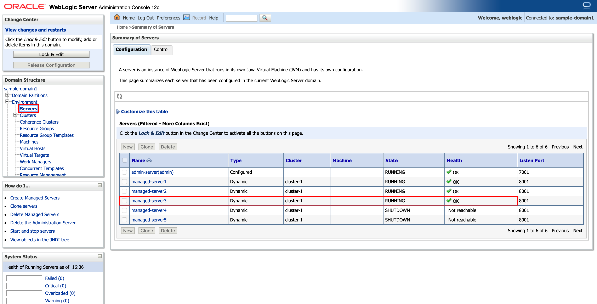

# Oracle WebLogic Server Kubernetes Operator Tutorial #

### Scale the WebLogic cluster  ###

WebLogic Server supports two types of clustering configurations, configured and dynamic. Configured clusters are created by manually configuring each individual Managed Server instance. In dynamic clusters, the Managed Server configurations are generated from a single, shared template.  With dynamic clusters, when additional server capacity is needed, new server instances can be added to the cluster without having to manually configure them individually. Also, unlike configured clusters, scaling up of dynamic clusters is not restricted to the set of servers defined in the cluster but can be increased based on runtime demands.

The operator provides several ways to initiate scaling of WebLogic clusters, including:

- On-demand, updating the domain resource directly (using `kubectl`).
- Calling the operator's REST scale API, for example, from curl.
- Using a WLDF policy rule and script action to call the operator's REST scale API.
- Using a Prometheus alert action to call the operator's REST scale API.

#### Scaling a WebLogic cluster using `kubectl`  ####

The easiest way to scale a WebLogic cluster in Kubernetes is to simply edit the replicas property within a domain resource.  To retain changes, edit the *domain.yaml* file and apply the changes using `kubectl`. Use your favorite editor to open the *domain.yaml* file.

Find the following part:
```yaml
clusters:
- clusterName: cluster-1
  serverStartState: "RUNNING"
  replicas: 2
```
Modify `replicas` to 3 and save the changes. You can use the `vi` editor for example:
```bash
vi ~/domain.yaml`
```
Apply the changes using `kubectl`:
```bash
kubectl apply -f ~/domain.yaml
```
Check the changes in the number of pods using `kubectl`:
```bash
kubectl get po -n sample-domain1-ns
NAME                             READY     STATUS        RESTARTS   AGE
sample-domain1-admin-server      1/1       Running       0          57m
sample-domain1-managed-server1   1/1       Running       0          56m
sample-domain1-managed-server2   1/1       Running       0          55m
sample-domain1-managed-server3   1/1       Running       0          1m
```
Soon, Managed Server 3 will appear and will be ready within a few minutes. You can also check the Managed Server scaling action using the WebLogic Server Administration Console:



Note! You can edit the existing (running) domain resource file directly by using the `kubectl edit` command. In this case, your `domain.yaml` file, available on your desktop, will not reflect the changes of the running domain resource.

```bash
kubectl edit domain DOMAIN_UID -n DOMAIN_NAMESPACE
```
In case you used the default settings, the syntax is:

```bash
kubectl edit domain sample-domain1 -n sample-domain1-ns
```
It will use a `vi`-like editor.

---
Note! Do not use the Console to scale the cluster. The operator controls this operation. Use the operator options to scale your cluster deployed on Kubernetes.

---
