# Create Oracle Container Engine for Kubernetes (OKE) on Oracle Cloud Infrastructure (OCI) #

Oracle Cloud Infrastructure Container Engine for Kubernetes is a fully-managed, scalable, and highly available service that you can use to deploy your containerised applications to the cloud. Use Container Engine for Kubernetes (sometimes abbreviated to just OKE) when your development team wants to reliably build, deploy, and manage cloud-native applications. You specify the compute resources that your applications require, and Container Engine for Kubernetes provisions them on Oracle Cloud Infrastructure in an existing OCI tenancy.

### Prerequisites ###

[Oracle Cloud Infrastructure](https://cloud.oracle.com/en_US/cloud-infrastructure) enabled account.

To create Container Engine for Kubernetes (OKE) the following steps need to be completed:

- Create network resources (VCN, Subnets, Security lists, etc.)
- Create Cluster.
- Create NodePool.

This tutorial shows the simplest way the *Quick Start* feature creates and configures all the necessary resources for a 3 Kubernetes node cluster. All the nodes will be deployed in different Availability Domains to ensure high availability.

More information about OKE and custom cluster deployment:

- [Oracle Container Engine documentation](https://docs.cloud.oracle.com/iaas/Content/ContEng/Concepts/contengoverview.htm)

#### Open the OCI console ####

Sign in using your Cloud Services link you got in email during the registration process. (If this is the first time you have to change the generated first time password.)

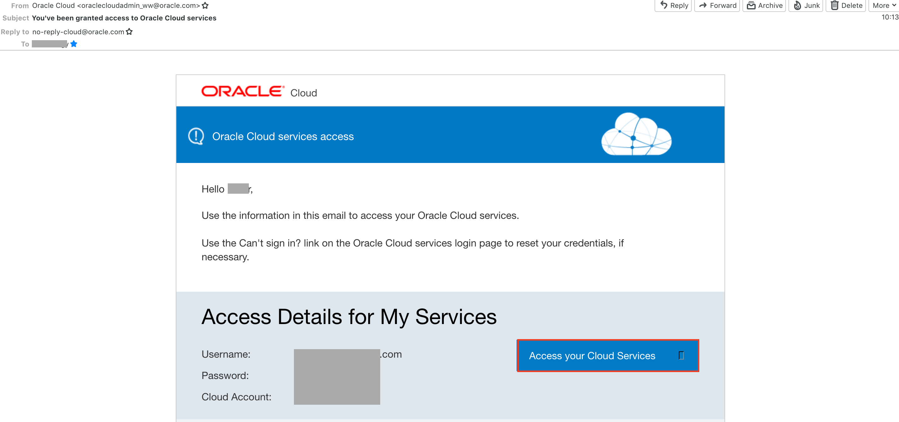

Use the username and the password distributed by the instructor. Click **Sign In**.


Click the menu icon at the top left corner and select **Compute** on the left sliding menu.

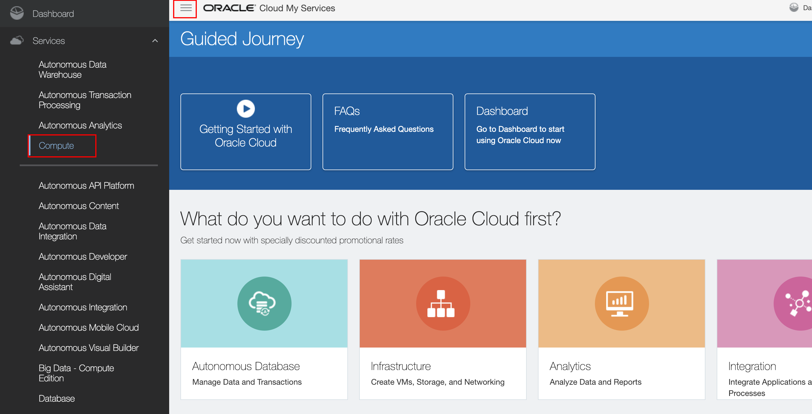

You have to land on the OCI console page.

#### Create Policy ####

A service policy allows OKE to create resources in tenancy such as compute. An OKE resource policy or policies enables you to regulate which groups in your tenancy can do what with the OKE API.

Optionally create more resource policies if you want to regulate which groups can access different parts of the OKE service.

Open the navigation menu. Under **Identity**, click **Policies**.


Select on left hand side menu a "root" compartment for your account (see screenshot). A list of the policies in the compartment you're viewing is displayed. If you want to attach the policy to a compartment other than the one you're viewing, select the desired compartment from the list on the left. Click **Create Policy**.

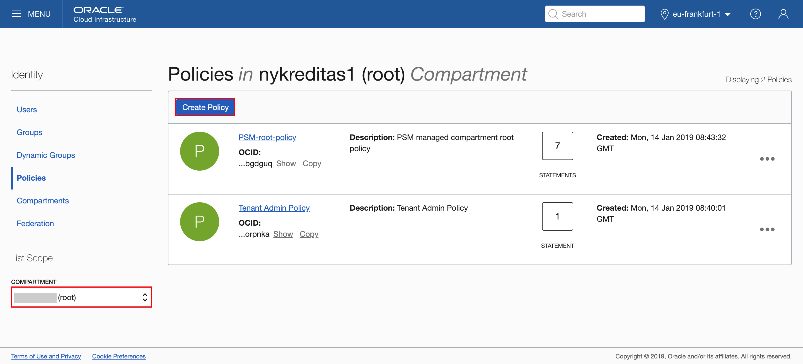

Enter the following:

- **Name:** A unique name for the policy. The name must be unique across all policies in your tenancy. You cannot change this later.
- **Description:** A friendly description.
- **Policy Versioning:** Select **Keep Policy Current**. It ensures that the policy stays current with any future changes to the service's definitions of verbs and resources.
- **Statement:** A policy statement. It MUST be: `allow service OKE to manage all-resources in tenancy`
- **Tags:** Don't apply tags.

Click **Create**.

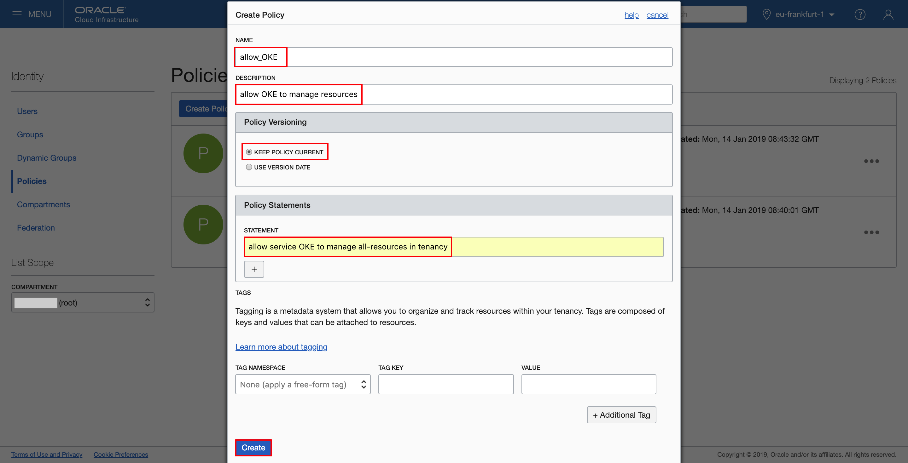

#### Create OKE (Oracle Container Engine for Kubernetes) cluster ####

*Quick Create* feature uses default settings to create a *quick cluster* with new network resources as required. This approach is the fastest way to create a new cluster. If you accept all the default values, you can create a new cluster in just a few clicks. New network resources for the cluster are created automatically, along with a node pool and three worker nodes.

In the Console, open the navigation menu. Under *Solutions, Platform and Edge*, go to *Developer Services* and click **Container Clusters (OKE)**.


On the Cluster List page, click **Create Cluster**.

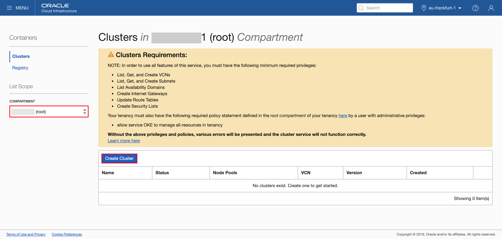

In the Create Cluster Solution dialog, select *Quick Create* and click **Launch Workflow**.

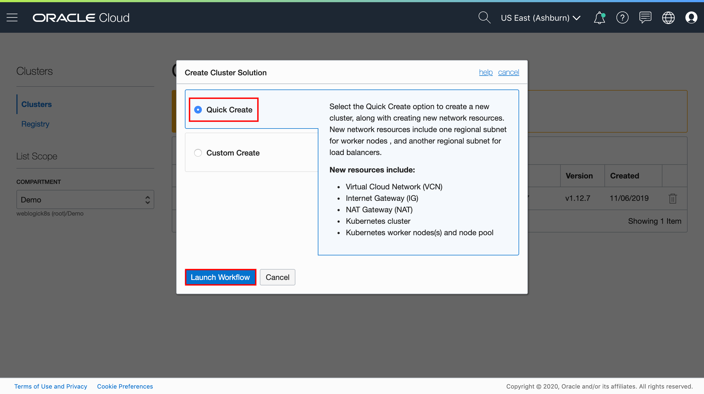

Select **Quick Create** to create a new cluster with default settings, along with new network resources for the new cluster.
The Create Virtual Cloud Network panel shows the network resources that will be created for you by default, namely a VCN, two load balancer subnets, and three worker node subnets.

Specify the following configuration details on Cluster Creation page:
- **Name**: The name of the cluster. Leave the default value.
- **Compartment**: The name of the compartment. Leave the default value.
- **Kubernetes version**: The version of the Kubernetes. Leave the default value. (Don't select version 16 even if it is default version - please select version 15 in such case)
- **Choose Visibility Type**: Is the cluster going to be routable or not. Leave the default value.
- **Shape**: The shape to use for each node in the node pool. The shape determines the number of CPUs and the amount of memory allocated to each node. The list shows only those shapes available in your tenancy that are supported by Container Engine for Kubernetes. Select the available *VM.Standard2.1*
- **Number of nodes**: The number of worker nodes to create. Leave the default value *3*
- **Kubernetes Dashboard Enabled**: Leave the default false (DISABLED).
- **Tiller (Helm) Enabled**: Leave the default false (DISABLED).

Click **Next** to review the details you entered for the new cluster.

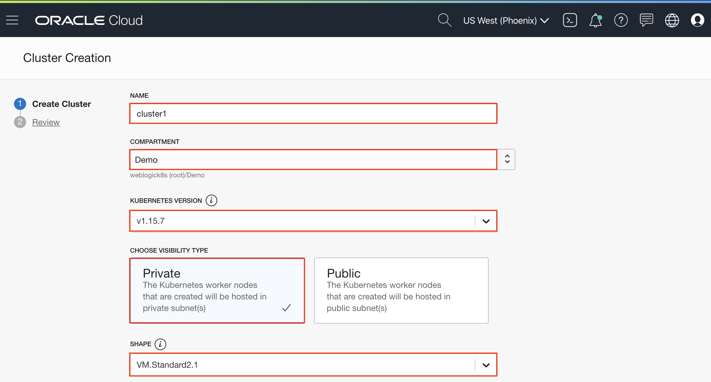
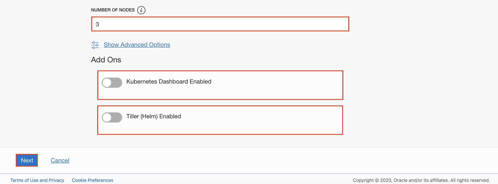

On the *Review* page, click **Submit** to create the new network resources and the new cluster.

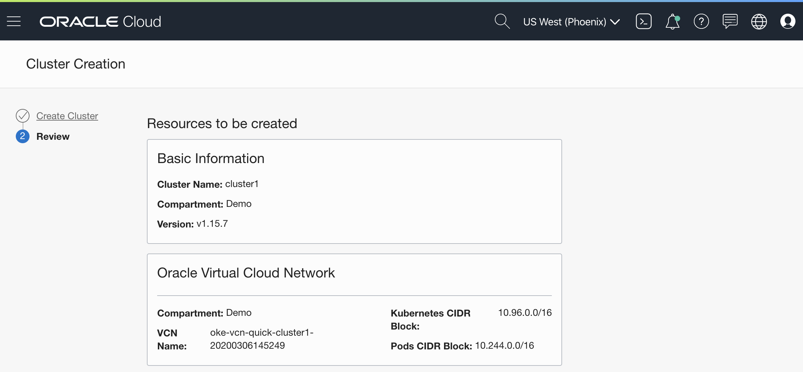
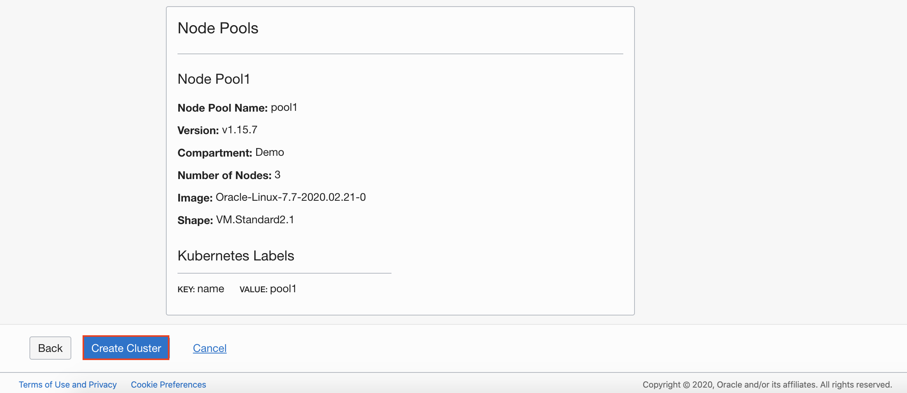

You see the different network resources being created for you.

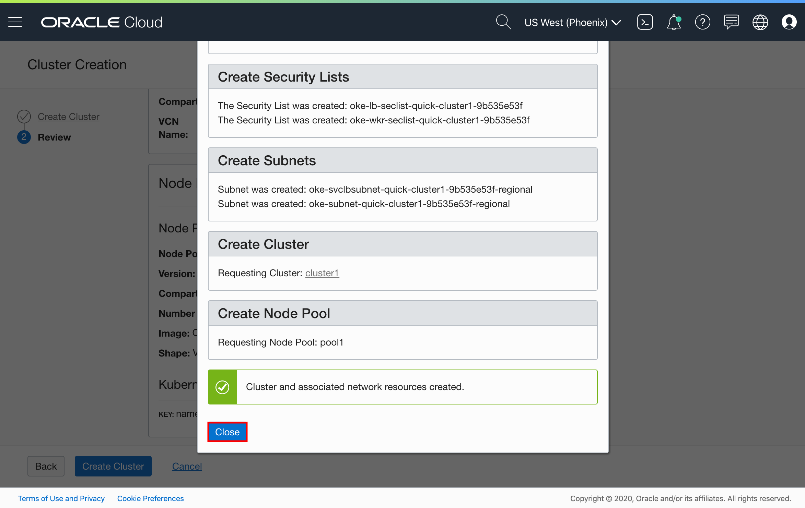

Click **Close** and the new cluster is shown on the *Cluster Details* page. When it has been created, the new cluster has a status of *Active*.

#### OCI Cloud Shell ####

Oracle Cloud Infrastructure (OCI) Cloud Shell is a web browser-based terminal accessible from the Oracle Cloud Console. Cloud Shell provides access to a Linux shell, with a pre-authenticated Oracle Cloud Infrastructure CLI and other useful tools (*Git, kubectl, helm, OCI CLI*) to complete WebLogic Operator tutorials. Cloud Shell is accessible from the Console. Your Cloud Shell will appear in the Oracle Cloud Console as a persistent frame of the Console, and will stay active as you navigate to different pages of the Console.

Click the Cloud Shell icon in the Console header (top right area in the browser).

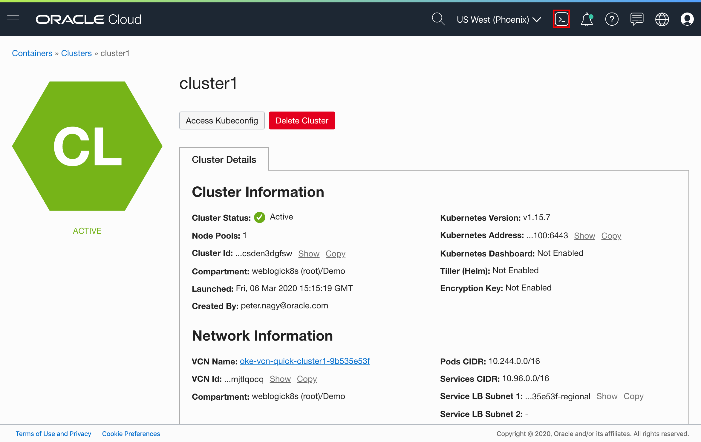

Wait a few second for the Cloud Shell.

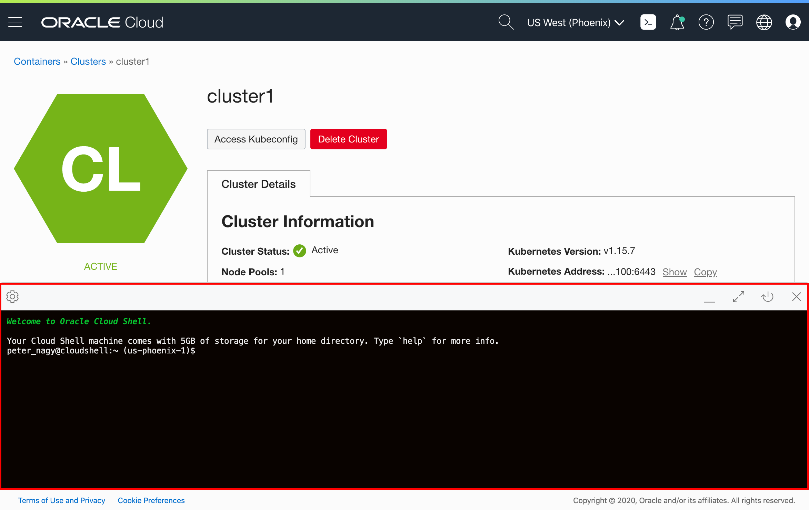

You can minimise and restore the terminal size at any time.

##### Configure kubectl #####

Your Cloud Shell comes with the OCI CLI pre-authenticated, so there’s no setup to do before you can start using it.

To complete the `kubectl` configuration Click **Access Kubeconfig** button on your cluster detail page. (If you moved away then open the navigation menu and under **Developer Services**, click **Clusters**. Select your cluster and click to get the detail page.


A dialog pops up which contains the customized OCI command that you need to execute to create Kubernetes configuration file.

Click the **Copy** link to copy the `oci ce...` command to Cloud Shell. Close the configuration dialog before you try to paste the command into terminal.

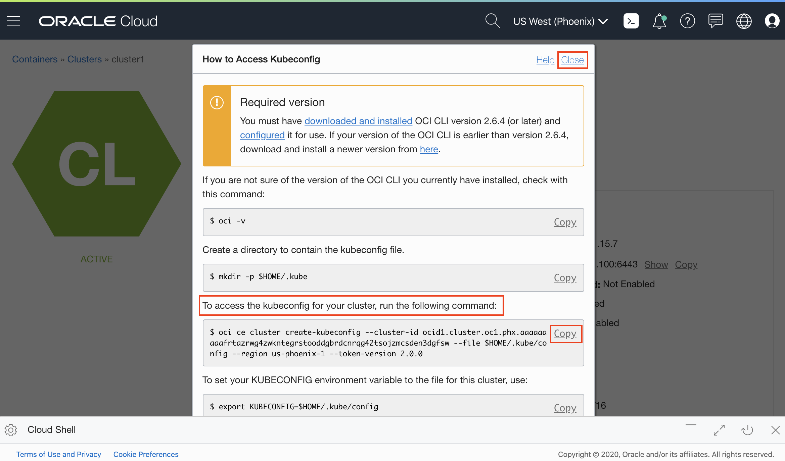
So for example that command looks like:
```bash
$ oci ce cluster create-kubeconfig --cluster-id ocid1.cluster.oc1.THIS_IS_EXAMPLE_DONT_COPY_PASTE_FROM_HERE --file $HOME/.kube/config --region us-phoenix-1 --token-version 2.0.0
New config written to the Kubeconfig file /home/peter_nagy/.kube/config
```
Now check that `kubectl` is working, for example using the `get node` command:
```bash
$ kubectl get node
NAME        STATUS   ROLES   AGE    VERSION
10.0.10.2   Ready    node    117m   v1.15.7
10.0.10.3   Ready    node    116m   v1.15.7
10.0.10.4   Ready    node    117m   v1.15.7
```
If you see the node's information the configuration was successful.

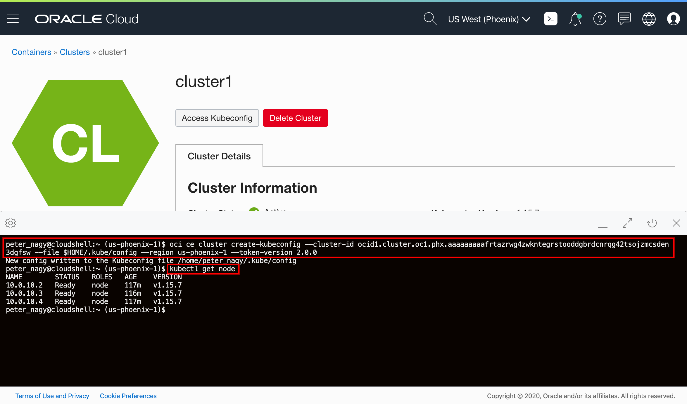

##### Set up the RBAC policy for the OKE cluster #####

In order to have permission to access the Kubernetes cluster, you need to authorize your OCI account as a cluster-admin on the OCI Container Engine for Kubernetes cluster. This will require your user OCID.

In the Console click on your OCI user name and select User Settings. On the user details page you can find the user OCID. Click Copy and paste temporary to a text editor.


Then execute the role binding command using your(!) user OCID:
```bash
kubectl create clusterrolebinding my-cluster-admin-binding --clusterrole=cluster-admin --user=<YOUR_USER_OCID>
```
For example:
```bash
$ kubectl create clusterrolebinding my-cluster-admin-binding --clusterrole=cluster-admin --user=ocid1.user.oc1..AGAIN_THIS_IS_EXAMPLE
clusterrolebinding.rbac.authorization.k8s.io/my-cluster-admin-binding created
```
Congratulation, now your OCI OKE environment is ready to deploy your WebLogic domain.
