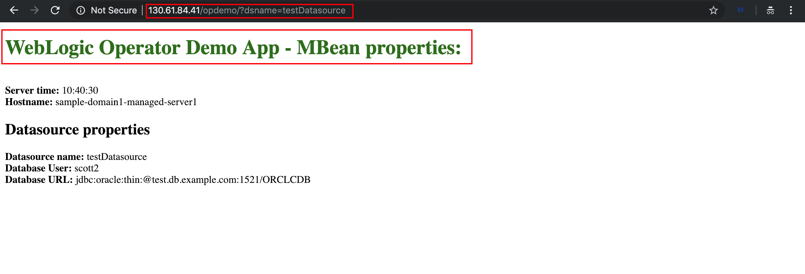

# Oracle WebLogic Operator Tutorial #

### Application Lifecycle Management ###

This tutorial implements the Docker image with the WebLogic domain inside the image deployment. This means all the artefacts including the deployed applications, domain related files are stored within the image. This results new WebLogic Docker image every time when the application modified. In this - widely adopted - approach the image is the packaging unit instead of the Web/Enterprise Application Archive (*war*, *ear*).

For the purpose of this lab we created another image that contains domain and updated version of the application (green title on the main page). This image is available at `iad.ocir.io/weblogick8s/weblogic-operator-tutorial-store:2.0`

#### Modify the domain.yaml ####

Go and edit  your domain resource definition (*domain.yaml*) file and modify the image location. So the modifed line with image should look like
```yaml
  image: "iad.ocir.io/weblogick8s/weblogic-operator-tutorial-store:2.0"
```

Don't forget the leading spaces to keep the proper indentation.

Apply the domain resource changes:
```bash
kubectl apply -f ~/domain.yaml
```
You can immediately check the status of your servers/pods (you should observe the restart of WLS domain):
```bash
$ kubectl get po -n sample-domain1-ns
NAME                             READY     STATUS        RESTARTS   AGE
sample-domain1-admin-server      1/1       Terminating   0          22m
sample-domain1-managed-server1   1/1       Running       0          20m
sample-domain1-managed-server2   1/1       Running       0          21m
sample-domain1-managed-server3   1/1       Running       0          21m
```
The operator now performs a rolling server restart one by one. The first one is the *Admin* server than the *Managed* servers.

During the rolling restart check your web application periodically. If the responding server already restarted then you have to see the change (green fonts) you made on the application. If the server is not yet restarted then it still serves the old version of the application.

`http://EXTERNAL-IP/opdemo/?dsname=testDatasource`


