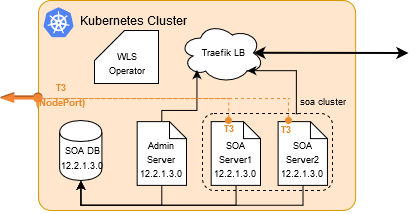
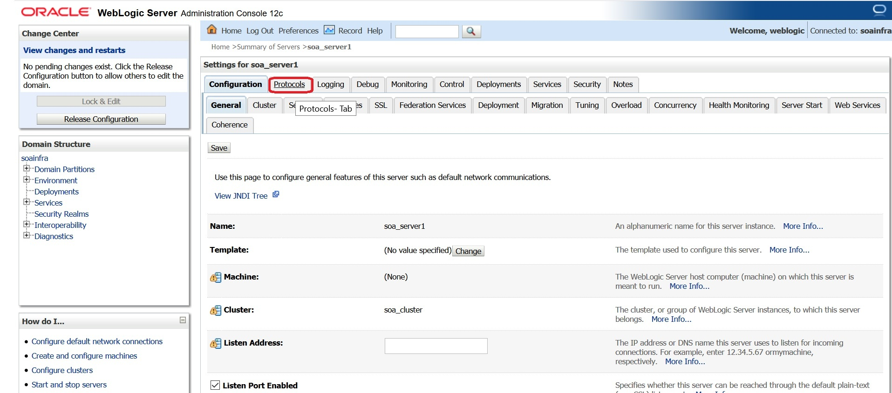
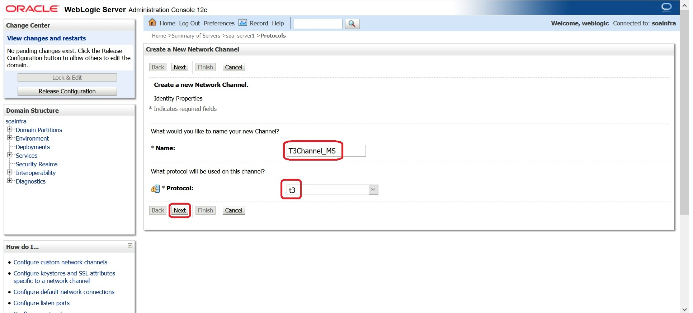
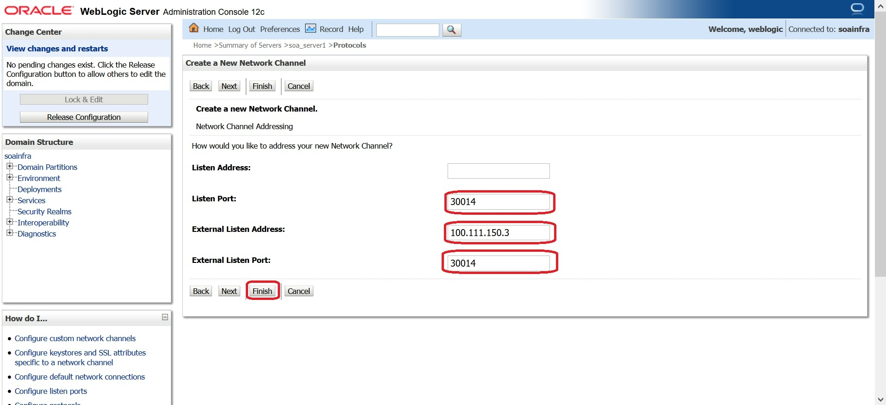
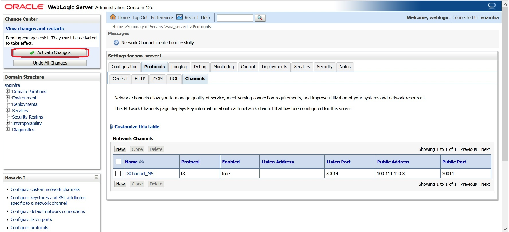

T3 ports for Managed Servers in Oracle SOA deployed in WebLogic Kubernetes operator Environment are not available by default.

This document provides steps to create T3 channel and the corresponding Kubernetes Service to expose the T3 protocol for Managed Servers in SOA Domain.



With the following steps you will be creating T3 port at 30014 on all Managed Servers for soa_cluster with below details:

* Name: T3Channel_MS
* Listen Port:  30014
* External Listen Address: \<Master IP Address> 
* External Listen Port:  30014

`Note: In case you are using different NodePort to expose T3 for Managed Server externally, then use same value for "External Listen Port"`

## Step 1 : Create T3 Channels for Managed Servers

WebLogic Server supports several ways to configure T3 channel. Below steps describe the methods to create T3 channel using WebLogic Server Administration Console or using WLST Scripts.

### Method 1 : Using WebLogic Server Administration Console

1. Login to WebLogic Server Administration  Console and obtain the configuration lock by clicking on **Lock & Edit**

2. In the left pane of the Console, expand **Environment** and **select Servers**.

3. On the Servers page, click on the **soa_server1** and go to **Protocols** page

    

4. Select **Channel** and then Click **"New"**

5. Enter the Network Channel Name as say **"T3Channel_MS"**, Select Protocol as **"t3"** and Click **"Next"**

    

6. Enter Listen Port as **"30014"**, External Listen Address as **"\<Master IP>"** and External Listen Port as **"30014"**. Leave empty for **"Listen Address"**. Click **"Finish"** to create the Network Channel for **soa_server1**.

    

7. Perform step 3 to 6 for all Managed Servers in soa_cluster. When creating Network Channel for other Managed Servers, make sure to use same values as for all parameters including "Network Channel Name".

8. To activate these changes, in the Change Center of the Administration Console, click **Activate Changes**. 

    

9. These changes does not require any server restarts. Once the T3 channels are created with port say 30014, proceed with creating the Kubernetes Service to access this port externally. 

### Method 2 : Using WLST Script

The following steps creates a custom T3 channel for all Managed Servers with name **T3Channel_MS** that has a listen port **listen_port** and a paired public port **public_port**.

1. Create `t3config_ms.py` with below content:

``` Python
host = sys.argv[1]
port = sys.argv[2]
user_name = sys.argv[3]
password = sys.argv[4]
listen_port = sys.argv[5]
public_port = sys.argv[6]
public_address = sys.argv[7]
managedNameBase = sys.argv[8]
ms_count = sys.argv[9]
print('custom host : [%s]' % host);
print('custom port : [%s]' % port);
print('custom user_name : [%s]' % user_name);
print('custom password : ********');
print('public address : [%s]' % public_address);
print('channel listen port : [%s]' % listen_port);
print('channel public listen port : [%s]' % public_port);

connect(user_name, password, 't3://' + host + ':' + port)

edit()
startEdit()
for index in range(0, int(ms_count)):
  cd('/')
  msIndex = index+1
  cd('/')
  name = '%s%s' % (managedNameBase, msIndex)
  cd('Servers/%s/' % name )
  create('T3Channel_MS','NetworkAccessPoint')
  cd('NetworkAccessPoints/T3Channel_MS')
  set('Protocol','t3')
  set('ListenPort',int(listen_port))
  set('PublicPort',int(public_port))
  set('PublicAddress', public_address)
  print('Channel T3Channel_MS added ...for ' + name)
activate()
disconnect()
```

2. Copy `t3config_ms.py` into Domain Home (e.g., `/u01/oracle/user_projects/domains/soainfra`) of Administration Server pod (e.g., soainfra-adminserver in soans namespace)

        $ kubectl cp t3config_ms.py soans/soainfra-adminserver:/u01/oracle/user_projects/domains/soainfra

3. Execute `wlst.sh t3config_ms.py` by exec into Administration Server pod with below parameters

    * host: \<Master IP Address>
    * port:  30012 *# Administration Server T3 port*
    * user_name: weblogic 
    * password: Welcome1 *# weblogic password*
    * listen_port: 30014 *# New port for T3 Managed Servers*
    * public_port: 30014 *# Kubernetes NodePort which will be used to expose T3 port externally*
    * public_address: \<Master IP Address>    
    * managedNameBase: soa_server *# Give Managed Server base name. For osb_cluster this will be osb_server*
    * ms_count: 5 *# Number of configured Managed Servers* 

    ```
    Command:
    $ kubectl exec -it \<Administration Server pod> -n \<namespace> -- /u01/oracle/oracle_common/common/bin/wlst.sh  \<domain_home>/t3config_ms.py \<master_ip>  \<t3 port on Administration Server>  weblogic \<password for weblogic> \<t3 port on Managed Server> \<t3 nodeport> \<master_ip> \<managedNameBase> \<ms_count>
    ```
        Sample Command:
        $ kubectl exec -it soainfra-adminserver -n soans -- /u01/oracle/oracle_common/common/bin/wlst.sh /u01/oracle/user_projects/domains/soainfra/t3config_ms.py 100.111.150.3 30012 weblogic Welcome1 30014 30014 100.111.150.3 soa_server 5

## Step 2 : Create Kubernetes Service to expose T3 port 30014 as NodePort Service

1. Create `t3_ms_svc.yaml` with below contents to expose T3 at Managed Server port 30014 for domainName and domainUID as "soainfra" and  cluster as "soa_cluster" :

    ```
    apiVersion: v1
    kind: Service
    metadata:
    name: soainfra-soa-cluster-t3-external
    namespace: soans
    labels:
        weblogic.clusterName: soa_cluster
        weblogic.domainName: soainfra
        weblogic.domainUID: soainfra
    spec:
    type: NodePort
    selector:
        weblogic.clusterName: soa_cluster
        weblogic.domainName: soainfra
        weblogic.domainUID: soainfra
    ports:
        - name: t3port
        protocol: TCP
        port: 30014
        targetPort: 30014
        nodePort: 30014
    ```

2. Create the NodePort Service for port 30014 with command:

        $ kubectl create -f t3_ms_svc.yaml

3. Now you can access t3 for Managed Server with below URL

        t3://<master_ip>:30014

