This document provides steps to deploy SOA composites and applications from Oracle JDeveloper (that runs outside the Kubernetes network) to the SOA instance in WebLogic Kubernetes Operator Environment.

```
Note: Dev and Test environment only. For production you should deploy using Application Control and WLST methods.
```

## Deploy to SOA from JDeveloper

To deploy SOA composites and applications from Oracle JDeveloper, Administration Server should have been configured to expose a T3 channel using the *exposeAdminT3Channel* setting when creating the domain, then the matching T3 service can be used to connect.

By default when *exposeAdminT3Channel* is set WebLogic Kubernetes Operator Environment will expose NodePort for the T3 channel of the NetworkAccessPoint at 30012 (Use *t3ChannelPort* to configure port to different value).

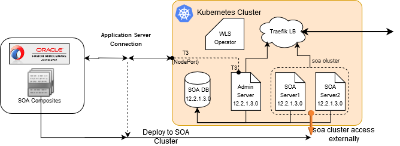

## Prerequisities

Note: Replace entries inside <xxxx> specific to your environment

NOTE  : The Managed Server t3 port is not exposed by default and opening this will have a security risk as the authentication method here is based on a username and password. It is not recommended to do this on production instances.

1.  Get the Kubernetes Cluster Master Address and verify the T3 port which will be used for creating application server connections. You can use below kubectl command to get the T3 port:

        $ kubectl get service <domainUID>-<AdministrationServerName>-external -n  <namespace>-o jsonpath='{.spec.ports[0].nodePort}'

2.  JDeveloper need to access Managed Server during deployment. In WebLogic operator Environment each Managed Servers are pods and cannot be accessed directly by JDeveloper. Hence we need to configure the Managed Server's reachability:

    a. Decide on external IP address to be used to configure access of Managed Server ( soa cluster). Master or worker node IP address can be used to configure Managed Server accessibility. In case you decide to use some other external IP address, that need to be accessible from Kubernetes Cluster. Here we will be using Kubernetes Cluster Master IP.
    
    b. Get the pod names of Administration and Managed Servers (i.e. "\<domainUID>-\<server name>") which will be used to map in `/etc/hosts`.
    
    c. Update `/etc/hosts` (or in Windows: `C:\Windows\System32\Drivers\etc\hosts`) on the host from where JDeveloper is running with below entires where
        
        <Master IP> <Administration Server pod name>
        <Master IP> <Managed Server1 pod name>
        <Master IP> <Managed Server2 pod name>
    
    d. Get the Kubernetes service name of the SOA Cluster so that we can make them access externally with Master IP ( or External IP).
        
        $ kubectl get service <domainUID>-cluster-<soa-cluster> -n <namespace>
    
    e. Create a Kubernetes service to expose SOA cluster service (“<domainUID>-cluster-<soa-cluster>”) to available externally with same port of Managed Server:
        
        $ kubectl expose service  <domainUID>-cluster-<soa-cluster> --name <domainUID>-<soa-cluster>-ext --external-ip=<Master IP> -n <namespace>

## Create an Application Server Connection in JDeveloper

1. Create a new application server connection in JDeveloper 

    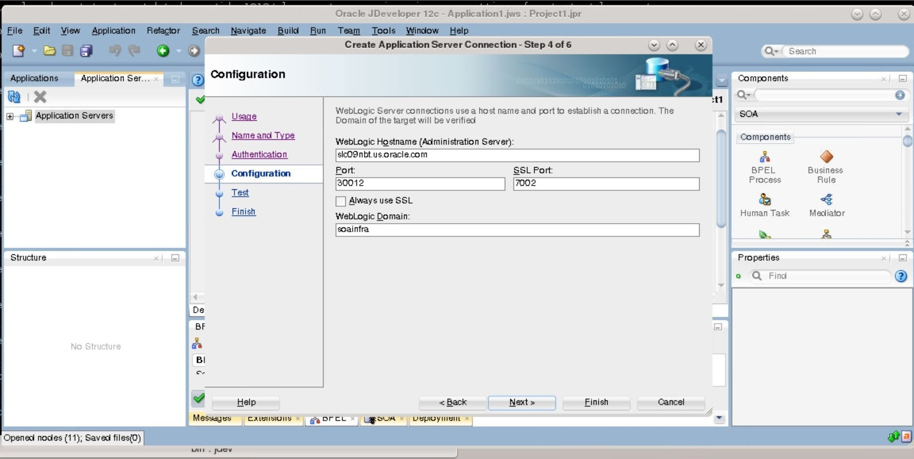

2. In the configuration page provide the WebLogic Hostname as Kubernetes Master Address
3. Update the Port as T3 port ( default is  30012) obtained in the prerequisites step 1
4. Enter the WebLogic Domain i.e (domainUID)
5. Test the Connection and it should be successful without any error

    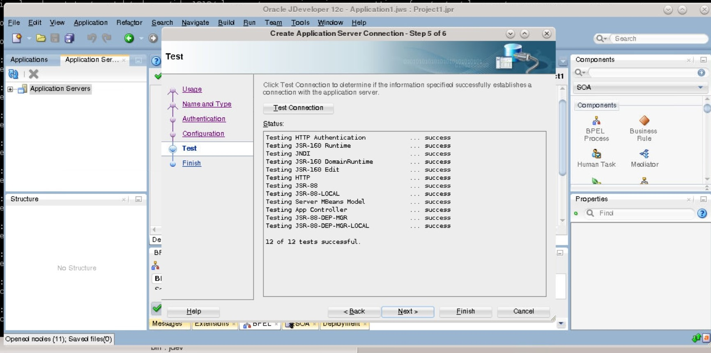

## Deployment of SOA Composites to SOA using JDeveloper

1. In JDeveloper, right click the SOA project you want to deploy and select the Deploy menu. This  invokes the deployment wizard

     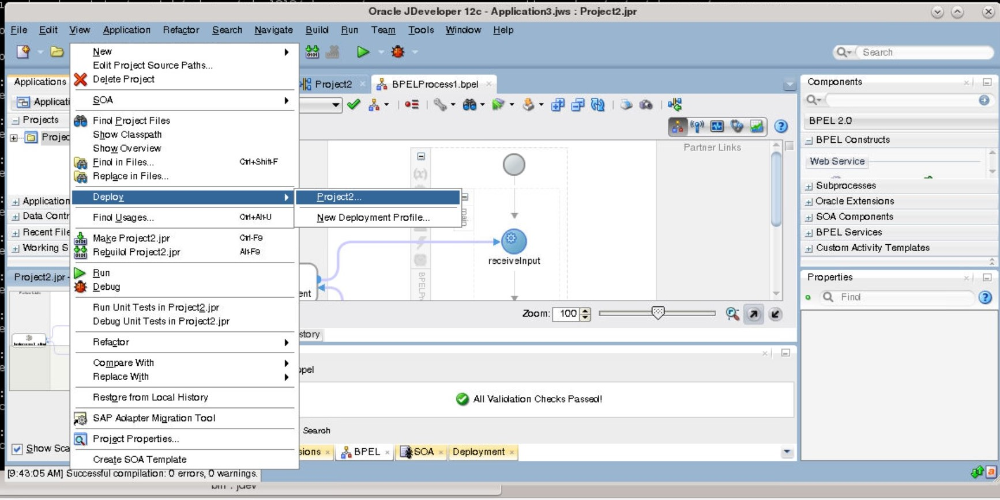

2. In the deployment wizard, select the application server connection that was created earlier.

    If the prerequisites has been configured correctly, the next step looks up the SOA servers and shows the Managed Servers for deploying the composite.

    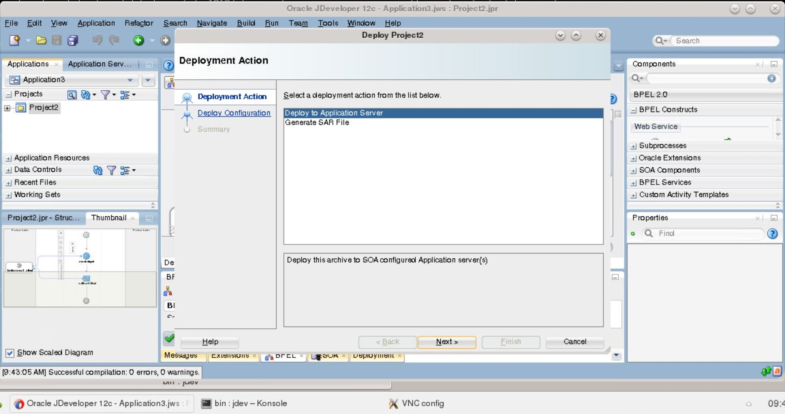

3. Using the application server connection, Managed Servers (SOA cluster) are discovered and get listed on the select servers page. Select the SOA cluster and click Next.

    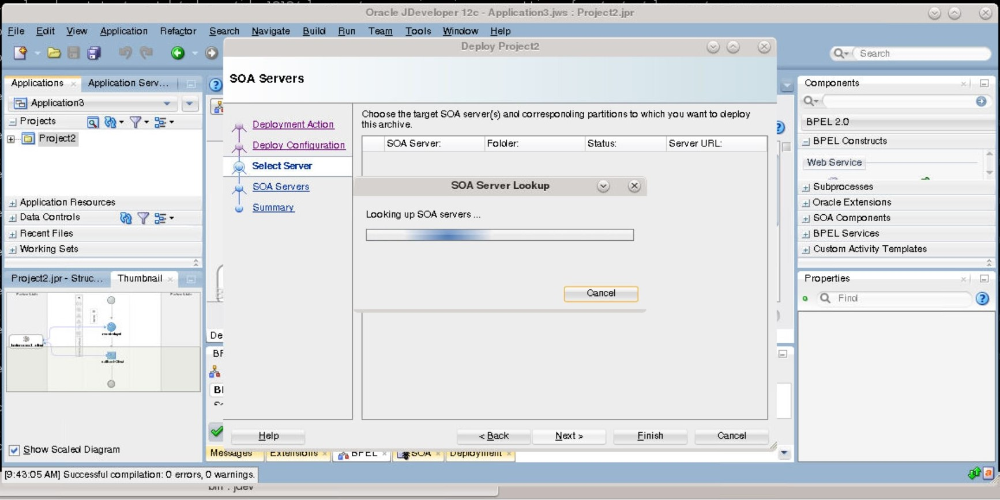
    
    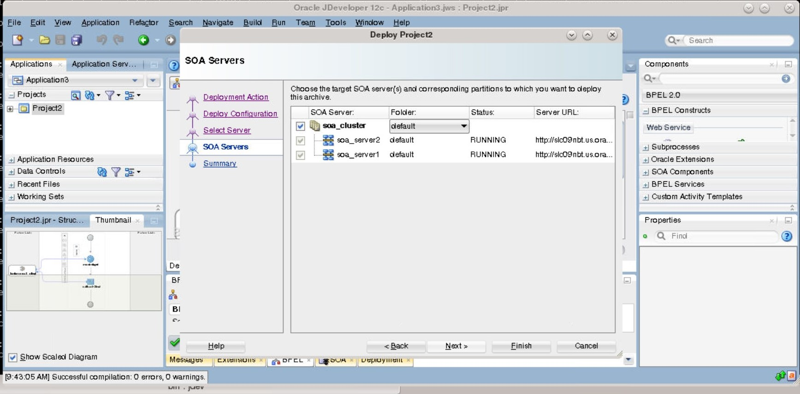

4. On Summary page, click Finish to start deploying the composites to SOA cluster.

    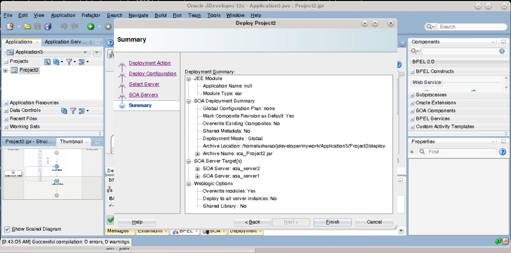

    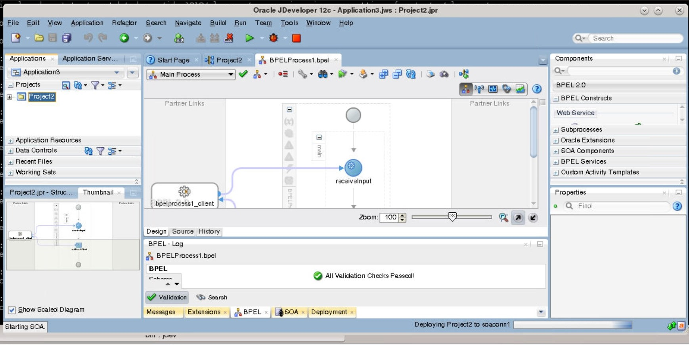
    
5. Once deployment is successful, verify with soa-infra URL to confirm the composites are deployed on both servers:

    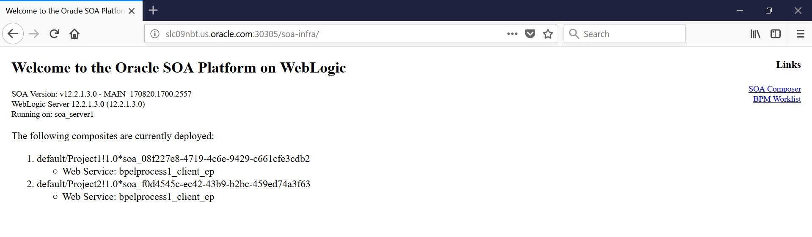

    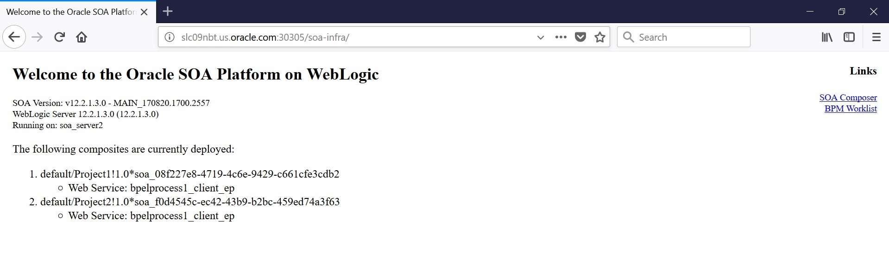

