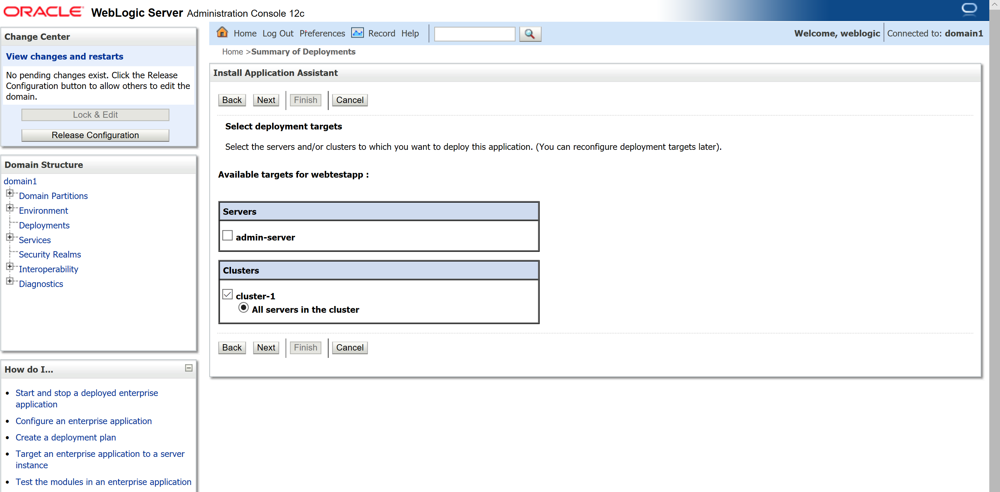
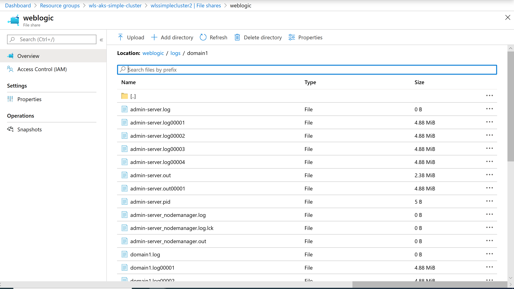

# Running a WebLogic Cluster on the Azure Kubernetes Service

This guide demonstrates how to use the [Oracle WebLogic Kubernetes Operator](https://oracle.github.io/weblogic-kubernetes-operator/) (hereafter "the Operator") to set up a WebLogic cluster on the Azure Kubernetes Service (AKS). After going through the steps in the guide, your WebLogic cluster domain runs on an AKS cluster instance and you can manage your WebLogic domain with a browser by accessing the WebLogic Server Console portal.

Table of Contents
=================

[Prerequisites](#prerequisites)  
[Generate Configuration Files](#generate-configuration-files)  
[Create AKS cluster](#create-aks-cluster)   
[Create Storage and Set Up File Share](#create-storage-and-set-up-file-share)  
[Install WebLogic Operator](#install-weblogic-operator)  
[Create WebLogic Domain](#create-weblogic-domain)  
[Automation](#automation)  
[Deploy Sample Application](#deploy-sample-application)  
[Access WebLogic Logs](#access-weblogic-logs)  
[Troubleshooting](#troubleshooting)  
[Useful Links](#useful-links)  

## Prerequisites

This guide assumes the following prerequisites.

### Environment for Setup

This guide was written with two execution environments in mind.

1. Run the commands on your local computer. This allows for the greatest flexibility while requiring some setup effort.
1. Run the commands in the Azure Cloud Shell. Cloud Shell is a browser based utility and runs on the Azure portal. This option may be best for users already familiar with the utility and Azure. It is also suitable for users wanting to avoid installing additional software on their local computer.

#### Local Environment Setup

* Operating System: Linux, Unix, macOS, [WSL for Windows 10](https://docs.microsoft.com/en-us/windows/wsl/install-win10)
* [Git](https://git-scm.com/downloads), use `git --version` to test if `git` works.
* [Azure CLI](https://docs.microsoft.com/en-us/cli/azure), use `az --version` to test if `az` works.
* [kubectl](https://kubernetes-io-vnext-staging.netlify.com/docs/tasks/tools/install-kubectl/), use `kubectl version` to test if `kubectl` works.
* [helm](https://helm.sh/docs/intro/install/), version 3.1 and above, use `helm version` to check the `helm` version.

#### Azure Cloud Shell

The Azure Cloud Shell already has the necessary prerequisites installed. To
start the Azure Cloud Shell, please go to [Overview of Azure Cloud
Shell](https://docs.microsoft.com/en-us/azure/cloud-shell/overview).

### Create Service Principal for AKS

An AKS cluster requires either an [Azure Active Directory (AD) service principal](https://docs.microsoft.com/en-us/azure/active-directory/develop/app-objects-and-service-principals) or a [managed identity](https://docs.microsoft.com/en-us/azure/aks/use-managed-identity) to interact with Azure resources.

We will use a service principal to create an AKS cluster. Follow the commands below to create a new service principal.

If you run commands in your local environment, please run `az login` first. Skip that command if you run on the Azure Cloud Shell. Do set the subscription you want to work with. You can get a list of your subscriptions by running `az account list`.

```bash
# Login
az login

SUBSCRIPTION_ID=<your-subscription-id>

# Set your working subscription
az account set -s $SUBSCRIPTION_ID

```

Create the new Service Principal with the following commands.  

```bash
SP_NAME=myAKSClusterServicePrincipal

# Create Service Principal

az ad sp create-for-rbac --skip-assignment --name $SP_NAME

# Copy the output to a file, we will use it to 
# grant your service principal with a contributor role in AKS.
# Specifically we will need the app ID, client secret and tenant ID later.

# Use the <appId> from the output of the last command 
az role assignment create --assignee <appId> --role Contributor
```

If you see an error similar to the following

```bash
Found an existing application instance of "5ca2f201-ad4d-43a1-a942-c9e9571de3ec". We will patch it
Insufficient privileges to complete the operation.
```

The problem may be a pre-existing Service Principal with the same name.  Either delete the other Service Principal or pick a different name.

### Docker Hub

You will need a Docker Hub account. If you don't have an existing account, please sign up for a new account at [DockerHub](https://hub.docker.com/). Note down your username, password and  email for Docker Hub. Because this guide uses a Docker image for a specific version of WLS, and WLS requires accepting license terms, do a Docker Hub "checkout" of [Oracle WebLogic Server](https://hub.docker.com/_/oracle-weblogic-server-12c).  This guide was written with 12.2.1.3, but other versions may work as well.

### Clone WebLogic Operator Repository

Please clone this repository to your machine, we will use the scripts to create domain.

```
git clone https://github.com/oracle/weblogic-kubernetes-operator.git
```
  
  
*The following sections of the guide will take you step-by-step through the process of setting up a WebLogic cluster on AKS - remaining as close as possible to a native Kubernetes experience. This allows you to understand and customize each step. If you wish to have a more automated experience that abstracts some lower level details, you can skip to the [Automation](#automation) section.*

## Generate Configuration Files

You will need yaml files to create file share and load balancer. We provide [create-domain-on-aks.sh](create-domain-on-aks.sh) to generate all configuration files automatically, you just need to specify customized values and the output directory.

You can use default value for all parameters if you don't want to change them.

Use the following command to generate configuration files, assuming the output directory is `~/azure`
```
#cd kubernetes/samples/scripts/create-weblogic-domain-on-azure-kubernetes-service
bash create-domain-on-aks.sh -i create-domain-on-aks-inputs.yaml -o ~/azure
```

After running the command, all needed configuration files are generated, and output to `~/azure/weblogic-on-aks`, you will get information like:

```
The following files were generated:
  /home/haiche/azure/weblogic-on-aks/pv.yaml
  /home/haiche/azure/weblogic-on-aks/pvc.yaml
  /home/haiche/azure/weblogic-on-aks/admin-lb.yaml
  /home/haiche/azure/weblogic-on-aks/cluster-lb.yaml
  /home/haiche/azure/weblogic-on-aks/domain1.yaml

Completed
```

## Create Azure Kubernetes Service (AKS) Cluster

AKS is a managed Kubernetes service that lets you quickly deploy and
manage clusters. To learn more, please go to the [Azure Kubernetes Service
(AKS)](https://docs.microsoft.com/en-us/azure/aks/) overview page.  We will deploy an
Azure Kubernetes Service (AKS) cluster using the Azure CLI.


We will disable http-application-routing by default, if you want to
enable http_application_routing, please follow [HTTP application
routing](https://docs.microsoft.com/en-us/azure/aks/http-application-routing).

Run the following commands to create the AKS cluster instance.

```
# Change these parameters as needed for your own environment
AKS_CLUSTER_NAME=WLSSimpleCluster
AKS_PERS_RESOURCE_GROUP=wls-simple-cluster
AKS_PERS_LOCATION=eastus
SP_APP_ID=<service-principal-app-id>
SP_CLIENT_SECRET=<service-principal-client-secret>

az group create --name $AKS_PERS_RESOURCE_GROUP --location $AKS_PERS_LOCATION
az aks create \
   --resource-group $AKS_PERS_RESOURCE_GROUP \
   --name $AKS_CLUSTER_NAME \
   --node-count 3 \
   --generate-ssh-keys \
   --nodepool-name nodepool1 \
   --node-vm-size Standard_D4s_v3 \
   --location $AKS_PERS_LOCATION \
   --service-principal $SP_APP_ID \
   --client-secret $SP_CLIENT_SECRET
```

After the deployment finishes, run the following command to connect to
the AKS cluster. This command updates your local `~/.kube/config` so that
subsequent `kubectl` commands interact with the named AKS cluster.

```
az aks get-credentials --resource-group $AKS_PERS_RESOURCE_GROUP --name $AKS_CLUSTER_NAME
```

To verify the connection to your cluster, use the kubectl get command to
return a list of the cluster nodes.

```
kubectl get nodes
```

Example output:

```
NAME                                STATUS   ROLES   AGE     VERSION
aks-nodepool1-58449474-vmss000000   Ready    agent   2d22h   v1.14.8
aks-nodepool1-58449474-vmss000001   Ready    agent   2d22h   v1.14.8
aks-nodepool1-58449474-vmss000002   Ready    agent   2d22h   v1.14.8
```

## Create Storage and Set Up File Share

Our usage pattern for the Operator involves creating Kubernetes
"persistent volumes" to allow WebLogic to persist its configuration and
data separately from the Kubernetes pods that run WebLogic workloads.

We will create an external data volume to access and persist data. There
are several options for data sharing as described in [Storage options for applications
in Azure Kubernetes Service
(AKS)](https://docs.microsoft.com/en-us/azure/aks/concepts-storage).

We will use Azure Files as a Kubernetes volume. Consult the [Azure
Files
Documentation](https://docs.microsoft.com/en-us/azure/aks/azure-files-volume)
for details about this full featured cloud storage solution.

Create a storage account first, please note that the storage account name can contain only lowercase letters and numbers, between 3 and 24 characters:

```
# Change the value as needed for your own environment
AKS_PERS_STORAGE_ACCOUNT_NAME=wlssimplestorageacct

az storage account create \
   -n $AKS_PERS_STORAGE_ACCOUNT_NAME \
   -g $AKS_PERS_RESOURCE_GROUP \
   -l $AKS_PERS_LOCATION \
   --sku Standard_LRS
```

Now we need to create a file share. We need a storage connection string to create the
file share. Run the `show-connection-string` command to get connection
string, then create the share with `az storage share create`, as shown
here.

```
# Change value as needed for your own environment
AKS_PERS_SHARE_NAME=weblogic

export AZURE_STORAGE_CONNECTION_STRING=$(az storage account show-connection-string -n $AKS_PERS_STORAGE_ACCOUNT_NAME -g $AKS_PERS_RESOURCE_GROUP -o tsv)

az storage share create -n $AKS_PERS_SHARE_NAME --connection-string $AZURE_STORAGE_CONNECTION_STRING
```

We need to create a Kubernetes secret. We need a storage key for the secret. Run `az
storage account keys list` to query the storage key and use `kubectl create
secret` to create `azure-secret`.

```
STORAGE_KEY=$(az storage account keys list --resource-group $AKS_PERS_RESOURCE_GROUP --account-name $AKS_PERS_STORAGE_ACCOUNT_NAME --query "[0].value" -o tsv)

kubectl create secret generic azure-secret --from-literal=azurestorageaccountname=$AKS_PERS_STORAGE_ACCOUNT_NAME --from-literal=azurestorageaccountkey=$STORAGE_KEY
```

In order to mount the file share as a persistent volume, we have provided a configuration file `pv.yaml`. You can find it from your output directory. The following content is an example that uses default value `weblogic` as "shareName", `azure-secret` as "secretName", and default persistent volume claim name `azurefile`.

```
apiVersion: v1
kind: PersistentVolume
metadata:
  name: azurefile
spec:
  capacity:
    storage: 5Gi
  accessModes:
    - ReadWriteMany
  storageClassName: azurefile
  azureFile:
    secretName: azure-secret
    shareName: weblogic
    readOnly: false
  mountOptions:
  - dir_mode=0777
  - file_mode=0777
  - uid=1000
  - gid=1000
  - mfsymlinks
  - nobrl
```

We have provided another configuration file `pv.yaml` for the PersistentVolumeClaim.  Both `pv.yaml` and `pvc.yaml` have exactly the same content in the `metadata` and `storageClassName` attributes. This is required. The following content is an example that uses default persistent volume claim name `azurefile` as "storageClassName".

```
apiVersion: v1
kind: PersistentVolumeClaim
metadata:
  name: azurefile
spec:
  accessModes:
    - ReadWriteMany
  storageClassName: azurefile
  resources:
    requests:
      storage: 5Gi
```

Use the `kubectl` command to create the persistent volume and persistent volume claim.

```
kubectl apply -f ~/azure/weblogic-on-aks/pv.yaml
kubectl apply -f ~/azure/weblogic-on-aks/pvc.yaml
```

Use the following command to verify:

```
kubectl get pv,pvc
```

Example output:

```
NAME        CAPACITY   ACCESS MODES   RECLAIM POLICY   STATUS   CLAIM               STORAGECLASS   REASON   AGE
azurefile   5Gi        RWX            Retain           Bound    default/azurefile   azurefile               2d21h

NAME        STATUS   VOLUME      CAPACITY   ACCESS MODES   STORAGECLASS   AGE
azurefile   Bound    azurefile   5Gi        RWX            azurefile      2d21h
```

Carefully inspect the output and verify it matches the above. `ACCESS
MODES`, `CLAIM`, and `STORAGECLASS` are vital.

## Install WebLogic Operator

The Oracle WebLogic Server Kubernetes Operator (the Operator) is an adapter
to integrate WebLogic Server and Kubernetes, allowing Kubernetes to
serve as a container infrastructure hosting WebLogic Server instances.

The official Oracle documentation for the Operator is available at this location:
[https://oracle.github.io/weblogic-kubernetes-operator/](https://oracle.github.io/weblogic-kubernetes-operator/).

Kubernetes Operators use [Helm](https://helm.sh/) to manage Kubernetes
applications. You have to grant the Helm service account with the cluster-admin role with the following command.

```
 cat <<EOF | kubectl apply -f -
apiVersion: rbac.authorization.k8s.io/v1
kind: ClusterRoleBinding
metadata:
  name: helm-user-cluster-admin-role
roleRef:
  apiGroup: rbac.authorization.k8s.io
  kind: ClusterRole
  name: cluster-admin
subjects:
- kind: ServiceAccount
  name: default
  namespace: kube-system
EOF
```

Install the WebLogic Operator, the Operator’s Helm chart is located in the
`kubernetes/charts/weblogic-operator` directory. Please check the Helm version
first if you are using the Azure Cloud Shell, and run the corresponding
command.

```
# Check the helm version
helm version

# For Helm 3.x, run the following
helm repo add weblogic-operator https://oracle.github.io/weblogic-kubernetes-operator/charts
helm repo update
helm install weblogic-operator weblogic-operator/weblogic-operator

# For helm 2.x, run the following
helm init
helm repo add weblogic-operator https://oracle.github.io/weblogic-kubernetes-operator/charts
helm repo update
helm install weblogic-operator/weblogic-operator --name weblogic-operator
```

Verify the Operator with the following command, the status should be running.

```
kubectl get pods -w
```

Example output:

```
NAME                                              READY   STATUS      RESTARTS   AGE
weblogic-operator-6655cdc949-x58ts                1/1     Running     0          2d21h
```
## Create WebLogic Domain

1. We will use the [create-weblogic-credentials.sh](../create-weblogic-domain-credentials/create-weblogic-credentials.sh) to create the domain credentials.

  ```
  #cd weblogic-kubernetes-operator/kubernetes/samples/scripts/create-weblogic-domain-credentials
  ./create-weblogic-credentials.sh -u weblogic -p welcome1 -d domain1
  ```

2. Create the Docker Hub credentials for pulling the WebLogic image. Please change
   `docker-username`, `docker-password`, `docker-email` to your Docker Hub account details.

   ```
   kubectl create secret docker-registry regcred \
   --docker-server=docker.io \
   --docker-username=username \
   --docker-password=password \
   --docker-email=test@example.com
   ```

   Verify secrets with the following command:

   ```
   kubectl get secret
   ```

   Example output:

   ```
   NAME                                      TYPE                                  DATA   AGE
   azure-secret                              Opaque                                2      2d21h
   default-token-mwdj8                       kubernetes.io/service-account-token   3      2d22h
   domain1-weblogic-credentials              Opaque                                2      2d21h
   regcred                                   kubernetes.io/dockerconfigjson        1      2d20h
   sh.helm.release.v1.weblogic-operator.v1   helm.sh/release.v1                    1      2d21h
   weblogic-operator-secrets                 Opaque                                1      2d21h
   ```

3. We will use [create-domain.sh](../create-weblogic-domain/domain-home-on-pv/create-domain.sh) to create the domain in the persistent volume we created previously.

   First, we need to set up domain configuration for the WebLogic domain. We have created a file `~/azure/weblogic-on-aks/domain1.yaml` by changing the [create-domain-inputs.yaml](../create-weblogic-domain/domain-home-on-pv/create-domain-inputs.yaml) with the following values.

   * `image`: Set to the DockerHub path of the image, with the value `store/oracle/weblogic:12.2.1.3` by default.
   * `imagePullSecretName`: Uncommented and set to the DockerHub credential you created previously, named `regcred` by default.
   * `exposeAdminNodePort`: Set to true, as we will use the Admin Console Portal to manage WebLogic Server.
   * `persistentVolumeClaimName`: We will persist data to default value `azurefile` by default.

   Here is the example snippet:

   ```
   image: store/oracle/weblogic:12.2.1.3
   imagePullSecretName: regcred
   exposeAdminNodePort: true
   persistentVolumeClaimName: azurefile
   ```

   Create `domain1` with the following command:

   ```
   #cd weblogic-kubernetes-operator/kubernetes/samples/scripts/create-weblogic-domain/domain-home-on-pv
   ./create-domain.sh -i ~/azure/weblogic-on-aks/domain1.yaml -o ~/azure -e -v
   ```

   The following example output shows the WebLogic domain was created successfully.

   ```
   NAME: weblogic-operator
   LAST DEPLOYED: Mon Mar 30 10:29:58 2020
   NAMESPACE: default
   STATUS: deployed
   REVISION: 1
   TEST SUITE: None
   fatal: destination path 'weblogic-kubernetes-operator' already exists and is not an empty directory.
   secret/domain1-weblogic-credentials created
   secret/domain1-weblogic-credentials labeled
   The secret domain1-weblogic-credentials has been successfully created in the default namespace.
   secret/regcred created
   Input parameters being used
   export version="create-weblogic-sample-domain-inputs-v1"
   export adminPort="7001"
   export adminServerName="admin-server"
   export domainUID="domain1"
   export domainHome="/shared/domains/domain1"
   export serverStartPolicy="IF_NEEDED"
   export clusterName="cluster-1"
   export configuredManagedServerCount="5"
   export initialManagedServerReplicas="2"
   export managedServerNameBase="managed-server"
   export managedServerPort="8001"
   export image="store/oracle/weblogic:12.2.1.3"
   export imagePullPolicy="IfNotPresent"
   export imagePullSecretName="regcred"
   export productionModeEnabled="true"
   export weblogicCredentialsSecretName="domain1-weblogic-credentials"
   export includeServerOutInPodLog="true"
   export logHome="/shared/logs/domain1"
   export t3ChannelPort="30012"
   export exposeAdminT3Channel="false"
   export adminNodePort="30701"
   export exposeAdminNodePort="true"
   export namespace="default"
   javaOptions=-Dweblogic.StdoutDebugEnabled=false
   export persistentVolumeClaimName="azurefile"
   export domainPVMountPath="/shared"
   export createDomainScriptsMountPath="/u01/weblogic"
   export createDomainScriptName="create-domain-job.sh"
   export createDomainFilesDir="wlst"
   export istioEnabled="false"
   export istioReadinessPort="8888"

   Generating /home/haixia/azure/weblogic-domains/domain1/create-domain-job.yaml
   Generating /home/haixia/azure/weblogic-domains/domain1/delete-domain-job.yaml
   Generating /home/haixia/azure/weblogic-domains/domain1/domain.yaml
   Checking to see if the secret domain1-weblogic-credentials exists in namespace default
   Checking if the persistent volume claim azurefile in NameSpace default exists
   The persistent volume claim azurefile already exists in NameSpace default
   configmap/domain1-create-weblogic-sample-domain-job-cm created
   Checking the configmap domain1-create-weblogic-sample-domain-job-cm was created
   configmap/domain1-create-weblogic-sample-domain-job-cm labeled
   Checking if object type job with name domain1-create-weblogic-sample-domain-job exists
   No resources found in default namespace.
   Creating the domain by creating the job /home/haixia/azure/weblogic-domains/domain1/create-domain-job.yaml
   job.batch/domain1-create-weblogic-sample-domain-job created
   Waiting for the job to complete...
   Error from server (BadRequest): container "create-weblogic-sample-domain-job" in pod "domain1-create-weblogic-sample-domain-job-p5htr" is waiting to start: PodInitializing
   status on iteration 1 of 20
   pod domain1-create-weblogic-sample-domain-job-p5htr status is Init:0/1
   Error from server (BadRequest): container "create-weblogic-sample-domain-job" in pod "domain1-create-weblogic-sample-domain-job-p5htr" is waiting to start: PodInitializing
   status on iteration 2 of 20
   pod domain1-create-weblogic-sample-domain-job-p5htr status is Init:0/1
   status on iteration 3 of 20
   pod domain1-create-weblogic-sample-domain-job-p5htr status is Completed
   domain.weblogic.oracle/domain1 created

   Domain domain1 was created and will be started by the WebLogic Kubernetes Operator

   Administration console access is available at http://wlssimplec-wls-aks-simple-c-685ba0-35aaf494.hcp.eastus.azmk8s.io:30701/console
   The following files were generated:
     /home/haixia/azure/weblogic-domains/domain1/create-domain-inputs.yaml
     /home/haixia/azure/weblogic-domains/domain1/create-domain-job.yaml
     /home/haixia/azure/weblogic-domains/domain1/domain.yaml

   Completed
   ```
   
   If your output does not show a successful completion, you must
   troubleshoot the reason and resolve it before proceeding to the next
   step.

4. In order to expose the power of WebLogic to the outside world, you
   must create `LoadBalancer` services for the Admin Server and the cluster.

  Use the configuration file in `~/azure/weblogic-on-aks/admin-lb.yaml` to create a load balancer for the admin server. The following content is an example of `admin-lb.yaml`, with default domain uid  `domain1`, admin server name `admin-server`, and default port `7001`.

   ```
   apiVersion: v1
   kind: Service
   metadata:
     name: domain1-admin-server-external-lb
     namespace: default
   spec:
     ports:
     - name: default
       port: 7001
       protocol: TCP
       targetPort: 7001
     selector:
       weblogic.domainUID: domain1
       weblogic.serverName: admin-server
     sessionAffinity: None
     type: LoadBalancer
   ```

   Create the admin load balancer service using the following command.

   ```
   kubectl  apply -f ~/azure/weblogic-on-aks/admin-lb.yaml
   ```

   Use the configuration file in `~/azure/weblogic-on-aks/cluster-lb.yaml` to create a load balancer for the managed servers. The following content is an example of `cluster-lb.yaml`, with default domain uid `domain1`, cluster name `cluster-1`, and default managed server port `8001`.


   ```
   apiVersion: v1
   kind: Service
   metadata:
     name: domain1-cluster-1-lb
     namespace: default
   spec:
     ports:
     - name: default
       port: 8001
       protocol: TCP
       targetPort: 8001
     selector:
       weblogic.domainUID: domain1
       weblogic.clusterName: cluster-1
     sessionAffinity: None
     type: LoadBalancer
   ```

   Create the cluster load balancer service using the following command.

   ```
   kubectl  apply -f ~/azure/weblogic-on-aks/cluster-lb.yaml
   ```

   Get the addresses of the Admin and Managed Servers (please wait for the external IP addresses to be assigned):

   ```
   kubectl get svc --watch
   ```

   It may take you up to 20 minutes to deploy all pods, please wait and make sure everything is ready. The final example output is as following:

   ```
   NAME                               TYPE           CLUSTER-IP    EXTERNAL-IP      PORT(S)              AGE
   domain1-admin-server               ClusterIP      None          <none>           30012/TCP,7001/TCP   2d20h
   domain1-admin-server-external      NodePort       10.0.182.50   <none>           7001:30701/TCP       2d20h
   domain1-admin-server-external-lb   LoadBalancer   10.0.67.79    52.188.176.103   7001:32227/TCP       2d20h
   domain1-cluster-1-lb               LoadBalancer   10.0.112.43   104.45.176.215   8001:30874/TCP       2d17h
   domain1-cluster-cluster-1          ClusterIP      10.0.162.19   <none>           8001/TCP             2d20h
   domain1-managed-server1            ClusterIP      None          <none>           8001/TCP             2d20h
   domain1-managed-server2            ClusterIP      None          <none>           8001/TCP             2d20h
   internal-weblogic-operator-svc     ClusterIP      10.0.192.13   <none>           8082/TCP             2d22h
   kubernetes                         ClusterIP      10.0.0.1      <none>           443/TCP              2d22h
   ```
   In the example, the URL to access the admin server is: http://52.188.176.103:7001/console

## Automation

If you want to automate all the above steps, please use the [create-domain-on-aks.sh](create-domain-on-aks.sh).

For input values, you can edit [create-domain-on-aks-inputs.yaml](create-domain-on-aks-inputs.yaml) directly, or copy the file and edit in your copy. The following values must be specified.
  * `azureServicePrincipalAppId`: Application id of the service principal, must be specified, refer to the application id in [Create Service Principal](#create-service-principal-for-aks) section.
  * `azureServicePrincipalClientSecret`: A client secret of the service principal, must be specified, refer to the client secret in [Create Service Principal](#create-service-principal-for-aks) section.
  * `azureServicePrincipalTenantId`: Tenant(Directory ) id of the service principal, must be specified, refer to the client secret in [Create Service Principal](#create-service-principal-for-aks) section.
  * `dockerUserName`: Your docker user name, must be specified, refer to [Docker Hub](#docker-hub) section.
  * `dockerPassword`: Your docker password, must be specified, refer to [Docker Hub](#docker-hub) section.
  * `dockerEmail`: Your docker email, must be specified, refer to [Docker Hub](#docker-hub) section.

  You can use the default value for other parameters, if you don't want to change them.
  Please make sure no extra whitespaces are added!

```
# Use ~/azure as output directory, please change it according to your requirement.

# Use create-domain-on-aks-inputs.yaml as input file
# cd kubernetes/samples/scripts/create-weblogic-domain-on-azure-kubernetes-service
bash create-domain-on-aks.sh -i create-domain-on-aks-inputs.yaml -o ~/azure -e

# Use your own input file.
# cd kubernetes/samples/scripts/create-weblogic-domain-on-azure-kubernetes-service
bash create-domain-on-aks.sh -i <your-input>.yaml -o ~/azure -e

```

The script will print the Admin Server IP address after successful deployment.

It may take you up to 20 minutes to deploy all pods, please wait and make sure everything is ready. The final example output of `kubectl get svc` is as following:

   ```
   NAME                               TYPE           CLUSTER-IP    EXTERNAL-IP      PORT(S)              AGE
   domain1-admin-server               ClusterIP      None          <none>           30012/TCP,7001/TCP   2d20h
   domain1-admin-server-external      NodePort       10.0.182.50   <none>           7001:30701/TCP       2d20h
   domain1-admin-server-external-lb   LoadBalancer   10.0.67.79    52.188.176.103   7001:32227/TCP       2d20h
   domain1-cluster-1-lb               LoadBalancer   10.0.112.43   104.45.176.215   8001:30874/TCP       2d17h
   domain1-cluster-cluster-1          ClusterIP      10.0.162.19   <none>           8001/TCP             2d20h
   domain1-managed-server1            ClusterIP      None          <none>           8001/TCP             2d20h
   domain1-managed-server2            ClusterIP      None          <none>           8001/TCP             2d20h
   internal-weblogic-operator-svc     ClusterIP      10.0.192.13   <none>           8082/TCP             2d22h
   kubernetes                         ClusterIP      10.0.0.1      <none>           443/TCP              2d22h
   ```
   
In the example, the URL to access the admin server is: http://52.188.176.103:7001/console

## Deploy Sample Application

You may optionally test the cluster by deploying the simple sample application included in this guide:

1. Go to the admin server console, click "Lock & Edit".
2. Click Deployments.
3. Click Install.
4. Click Upload your file(s).
5. For the Deployment Archive, click "Choose File".
6. Select the file [testwebapp.war](../../charts/application/testwebapp.war) in `kubernetes/samples/charts/application`.
7. Click Next. Choose 'Install this deployment as an application'.
8. Click Next. Select cluster-1 and All servers in the cluster.
9. Accept the defaults in the next screens and click Finish.
10. Click Activate Changes.



Next you will need to start the application:

1. Go to Deplyments
2. Click Control
3. Select testwebapp
4. Start
5. Servicing all requests

After successful deployment, go to the application through the domain1-cluster-1-lb external IP.

```
kubectl  get svc domain1-cluster-1-lb

NAME                   TYPE           CLUSTER-IP    EXTERNAL-IP      PORT(S)          AGE
domain1-cluster-1-lb   LoadBalancer   10.0.112.43   104.45.176.215   8001:30874/TCP   2d18h
```

In the example, the application address is: http://104.45.176.215:8001/testwebapp.

The test application will list the server host and server IP on the page.

## Access WebLogic Logs

The logs are stored in the Azure file share. Follow these steps to access the log:

1. Go to the [Azure Portal](https://ms.portal.azure.com).
2. Go to your resource group.
3. Open the storage account.
4. Go to File shares.
5. Click the file share name (e.g. weblogic in this example).
6. Click logs.
7. Click domain1.
8. WebLogic server logs are listed in the folder.

   

## Troubleshooting

1. **Getting pod error details**

   You may get the following message while creating the WebLogic domain: "the job status is not Completed!"

   ```
   status on iteration 20 of 20
   pod domain1-create-weblogic-sample-domain-job-nj7wl status is Init:0/1
   The create domain job is not showing status completed after waiting 300 seconds.
   Check the log output for errors.
   Error from server (BadRequest): container "create-weblogic-sample-domain-job" in pod "domain1-create-weblogic-sample-domain-job-nj7wl" is waiting to start: PodInitializing
   [ERROR] Exiting due to failure - the job status is not Completed!
   ```

   You can get further error details by running `kubectl describe pod`, as shown here:

   ```
   # replace domain1-create-weblogic-sample-domain-job-nj7wl with your pod name
   kubectl describe pod domain1-create-weblogic-sample-domain-job-nj7wl
   ```
   Error example:

   ```
   Events:
     Type     Reason       Age                  From                                        Message
     ----     ------       ----                 ----                                        -------
     Normal   Scheduled    4m2s                 default-scheduler                           Successfully assigned default/domain1-create-weblogic-sample-domain-job-qqv6k to aks-nodepool1-58449474-vmss000001
     Warning  FailedMount  119s                 kubelet, aks-nodepool1-58449474-vmss000001  Unable to mount volumes for pod "domain1-create-weblogic-sample-domain-job-qqv6k_default(15706980-73cb-11ea-b804-b2c91b494b00)": timeout expired waiting for volumes to attach or mount for pod "default"/"domain1-create-weblogic-sample-domain-job-qqv6k". list of unmounted volumes=[weblogic-sample-domain-storage-volume]. list of unattached volumes=[create-weblogic-sample-domain-job-cm-volume weblogic-sample-domain-storage-volume weblogic-credentials-volume default-token-zr7bq]
     Warning  FailedMount  114s (x9 over 4m2s)  kubelet, aks-nodepool1-58449474-vmss000001  MountVolume.SetUp failed for volume "azurefile" : Couldn't get secret default/azure-secrea
     ```
2. **Failing to access Admin Console**

   There are different reasons for Admin Console failures.
   
   * **Create WebLogic domain job fails**

   You can check the deploy log and find the failure details with `kubectl describe pod podname`. 
   Please go to 1. Getting pod error details.

   * **Process of starting the Admin Server is still running**

   Check with `kubectl get svc` and if domain1-admin-server is not listed,
   we need to wait some more for the Admin Server to start.

   The following output is an example of when the Admin Server has started.

   ```
   NAME                               TYPE           CLUSTER-IP    EXTERNAL-IP     PORT(S)              AGE
   domain1-admin-server               ClusterIP      None          <none>          30012/TCP,7001/TCP   7m3s
   domain1-admin-server-external      NodePort       10.0.78.211   <none>          7001:30701/TCP       7m3s
   domain1-admin-server-external-lb   LoadBalancer   10.0.6.144    40.71.233.81    7001:32758/TCP       7m32s
   domain1-cluster-1-lb               LoadBalancer   10.0.29.231   52.142.39.152   8001:31022/TCP       7m30s
   domain1-cluster-cluster-1          ClusterIP      10.0.80.134   <none>          8001/TCP             1s
   domain1-managed-server1            ClusterIP      None          <none>          8001/TCP             1s
   domain1-managed-server2            ClusterIP      None          <none>          8001/TCP             1s
   internal-weblogic-operator-svc     ClusterIP      10.0.1.23     <none>          8082/TCP             9m59s
   kubernetes                         ClusterIP      10.0.0.1      <none>          443/TCP              16m
   ```

## Useful Links

* [Quickstart: Deploy an Azure Kubernetes Service cluster using the Azure CLI](https://docs.microsoft.com/en-us/azure/aks/kubernetes-walkthrough)  
* [WebLogic Kubernetes Operator](https://oracle.github.io/weblogic-kubernetes-operator/userguide/introduction/introduction/)  
* [Manually create and use a volume with Azure Files share in Azure Kubernetes Service (AKS)](https://docs.microsoft.com/en-us/azure/aks/azure-files-volume)  
* [Create a Secret by providing credentials on the command line](https://kubernetes.io/docs/tasks/configure-pod-container/pull-image-private-registry/#create-a-secret-by-providing-credentials-on-the-command-line)
