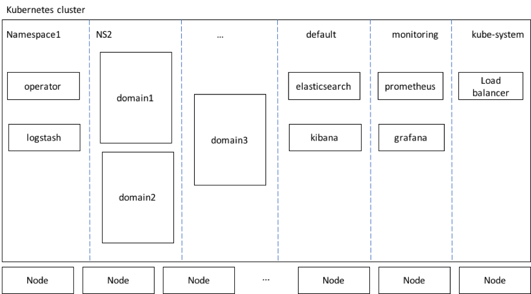

# Architectural overview

The operator consists of the following two main parts:

*	The operator itself, a process that runs in a Docker container deployed into a Kubernetes *pod* and which performs the actual management tasks.
*	A Kubernetes *job* which can be used to create a WebLogic *domain*.

The operator is packaged in a Docker image `container-registry.oracle.com/middleware/weblogic-operator:latest`.  This image can be deployed to a Kubernetes *cluster*.  It is recommended that the *operator* be deployed in its own *namespace*.  Only one *operator* is permitted in a *namespace*, however multiple *operators* may be deployed in a Kubernetes *cluster* provided they are each in their own *namespace* and the list of *namespaces* they manage do not overlap.

Scripts are provided to deploy the *operator* to a Kubernetes *cluster*.  These scripts also provide options to install and configure a load balancer, ELK integration and Prometheus integration.

The *operator* registers a Kubernetes *custom resource definition* called `domain.weblogic.oracle` (shortname `domain`, plural `domains`).  

The diagram below shows the general layout of high level components, including optional components, in a Kubernetes *cluster* that is hosting WebLogic *domains* and the *operator*:

The Kubernetes *cluster* has several namespaces.  Components may be deployed into *namespaces* as follows:

*	The operator is deployed into its own namespace.  If the ELK integration option is configured, then a Logstash pod will also be deployed in the operator’s namespace.
*	WebLogic *domains* will be deployed into various *namespaces*.  There can be more than one *domain* in a *namespace* if desired.  There is no limit on the number of *domains* or *namespaces* that an *operator* can manage.  Note that there can be more than one *operator* in a Kubernetes *cluster*, but each *operator* is configured with a list of the specific *namespaces* that it is responsible for.  The *operator* will not take any action on any *domain* that is not in one of the *namespaces* the *operator* is configured to manage.
*	If the ELK integration option is configured, ElasticSearch and Kibana will be deployed in the `default` *namespace*.
*	If the Prometheus integration option is configured, Prometheus and Grafana will be deployed in the `monitoring` *namespace*.
*	If a load balancer is configured, it will be deployed in the `kube-system` *namespace*.
