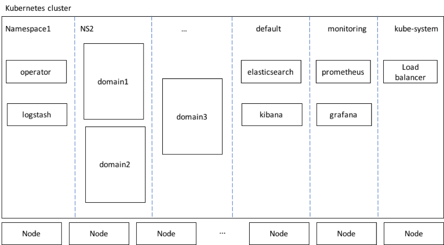
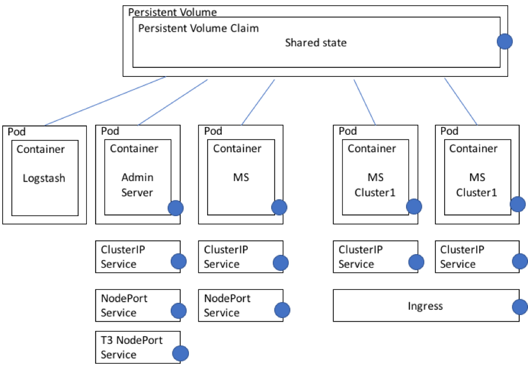
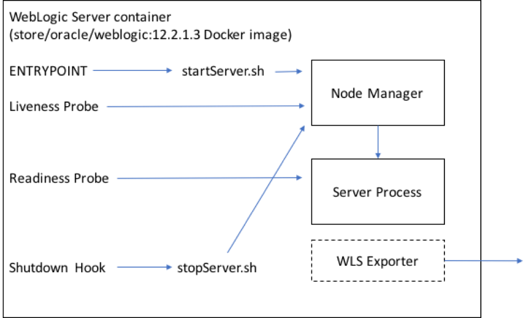

> **WARNING** This documentation is for version 1.1 of the operator.  To view documenation for the current release, [please click here](/site).

# Architectural overview

The operator consists of the following two main parts:

*	The operator itself, a process that runs in a Docker container deployed into a Kubernetes pod and which performs the actual management tasks.
*	A Kubernetes job which can be used to create a WebLogic domain.

The operator is packaged in a Docker image `container-registry.oracle.com/middleware/weblogic-operator:latest`.  This image can be deployed to a Kubernetes cluster.  It is recommended that the operator be deployed in its own namespace.  Only one operator is permitted in a namespace; however, multiple operators may be deployed in a Kubernetes cluster provided they are each in their own namespace and the list of namespaces they manage do not overlap.

Scripts are provided to deploy the operator to a Kubernetes cluster.  These scripts also provide options to install and configure a load balancer and Elastic Stack integration.

The operator registers a Kubernetes custom resource definition called `domain.weblogic.oracle` (shortname `domain`, plural `domains`).

The diagram below shows the general layout of high-level components, including optional components, in a Kubernetes cluster that is hosting WebLogic domains and the operator:

The Kubernetes cluster has several namespaces.  Components may be deployed into namespaces as follows:

*	The operator is deployed into its own namespace.  If the Elastic Stack integration option is configured, then a logstash pod will also be deployed in the operator’s namespace.
*	WebLogic domains will be deployed into various namespaces.  There can be more than one domain in a namespace if desired.  There is no limit on the number of domains or namespaces that an operator can manage.  Note that there can be more than one operator in a Kubernetes cluster, but each operator is configured with a list of the specific namespaces that it is responsible for.  The operator will not take any action on any domain that is not in one of the namespaces the operator is configured to manage.
*	If the Elastic Stack integration option is configured, Elasticsearch and Kibana will be deployed in the `default` namespace.
*	If a load balancer is configured, it will be deployed in the `kube-system` namespace.

## Domain architecture

The diagram below shows how the various parts of a WebLogic domain are manifest in Kubernetes by the operator.

This diagram shows the following details:

*	A persistent volume is created using one of the available providers.  The chosen provider must support “Read Write Many” access mode.  A persistent volume claim is created to claim space in that persistent volume.  Both the persistent volume and the persistent volume claim are labeled with `weblogic.domainUID` and these labels allow the operator to find the correct volume for a particular domain.  There must be a different persistent volume for each domain.  The shared state on the persistent volume include the “domain” directory, the “applications” directory, a directory for storing logs and a directory for any file-based persistence stores.

*	A pod is created for the WebLogic Administration Server.  This pod is labeled with `weblogic.domainUID`, `weblogic.serverName` and `weblogic.domainName`.  One container runs in this pod.  WebLogic Node Manager and Administration Server processes are run inside this container.  The Node Manager process is used as an internal implementation detail for the liveness probe, for patching, and to provide monitoring and control capabilities to the Administration Console.  It is not intended to be used for other purposes, and it may be removed in some future release.
*	A `ClusterIP` type service is created for the Administration Server pod.  This service provides a stable, well-known network (DNS) name for the Administration Server.  This name is derived from the `domainUID` and the Administration Server name, and it is known before starting up any pod.  The Administration Server `ListenAddress` is set to this well-known name.  `ClusterIP` type services are only visible inside the Kubernetes cluster.  They are used to provide the well-known names that all of the servers in a domain use to communicate with each other.  This service is labeled with `weblogic.domainUID` and `weblogic.domainName`.
*	A `NodePort` type service is created for the Administration Server pod.  This service provides HTTP access to the Administration Server to clients that are outside the Kubernetes cluster.  This service is intended to be used to access the WebLogic Server Administration Console only.  This service is labeled with `weblogic.domainUID` and `weblogic.domainName`.
* If requested when configuring the domain, a second `NodePort` type service is created for the Administration Server pod.  This second service is used to expose a WebLogic channel for the T3 protocol.  This service provides T3 access to the Administration Server to clients that are outside the Kubernetes cluster.  This service is intended to be used for WLST connections to the Administration Server.  This service is labeled with `weblogic.domainUID` and `weblogic.domainName`.
*	A pod is created for each WebLogic Managed Server.  These pods are labeled with `weblogic.domainUID`, `weblogic.serverName`, and `weblogic.domainName`.  One container runs in each pod.  WebLogic Node Manager and Managed Server processes are run inside each of these containers.  The Node Manager process is used as an internal implementation detail for the liveness probe.  It is not intended to be used for other purposes, and it may be removed in some future release.
*	A `NodePort` type service is created for each Managed Server pod that contains a Managed Server that is not part of a WebLogic cluster.  These services provide HTTP access to the Managed Servers to clients that are outside the Kubernetes cluster.  These services are intended to be used to access applications running on the Managed Servers.  These services are labeled with `weblogic.domainUID` and `weblogic.domainName`.
*	An Ingress is created for each WebLogic cluster.  This Ingress provides load balanced HTTP access to all Managed Servers in that WebLogic cluster.  The operator updates the Ingress every time a Managed Server in the WebLogic cluster becomes “ready” or ceases to be able to service requests, such that the Ingress always points to just those Managed Servers that are able to handle user requests.  The Ingress is labeled with `weblogic.domainUID`, `weblogic.clusterName`, and `weblogic.domainName`.  The Ingress is also annotated with a class which is used to match Ingresses to the correct instances of the load balancer.  In this release, there is one instance of the load balancer running for each WebLogic cluster, and the load balancers are configured with the root URL path (“/”).  More flexible load balancer configuration is planned for a future release.
*	If the Elastic Stack integration was requested when configuring the operator, there will also be another pod that runs logstash in a container.  This pod will publish the logs from all WebLogic Server instances in the domain into Elasticsearch.  There is one logstash per domain, but only one Elasticsearch and one Kibana for the entire Kubernetes cluster.

The diagram below shows the components inside the containers running WebLogic Server instances:

All containers running WebLogic Server use the same Docker image, `store/oracle/weblogic:12.2.1.3`, which is the standard binary image from the Docker store, unchanged.

Within the container, the following aspects are configured by the operator:

*	The `ENTRYPOINT` is configured to a script that starts up a Node Manager process, and then uses WLST to request that Node Manager start the server.  Node Manager is used to start servers so that the socket connection to the server will be available to obtain server status even when the server is unresponsive.  This is used by the liveness probe.
* The liveness probe is configured to check that the server is alive by querying the Node Manager process.  The liveness probe is configured to check liveness every 15 seconds, and to timeout after five seconds.  If a pod fails the liveness probe, Kubernetes will restart that container, and possibly the pod.
*	The readiness probe is configured to use the WebLogic Server ReadyApp.  The readiness probe is used to determine if the server is ready to accept user requests.  The readiness is used to determine when a server should be included in a load balancer Ingress, when a restarted server is fully started in the case of a rolling restart, and for various other purposes.
*	A shutdown hook is configured that will execute a script that performs a graceful shutdown of the server.  This ensures that servers have an opportunity to shut down cleanly before they are killed.

## Domain state stored outside Docker images
The operator expects (and requires) that all state be stored outside of the Docker images that are used to run the domain.  This means either in a persistent file system, or in a database.  The WebLogic configuration, that is, the domain directory, the applications directory, file-based persistent stores, and such, are stored on a persistent volume.  You could also use a database to host persistent stores.  All of the containers that are participating in the WebLogic domain use the exact same image, and take on their personality; that is, which server they execute, at startup time.  Each container mounts the same shared storage and has access to the state information that it needs to fulfill its role in the domain.

It is worth providing some background information on why this approach was adopted, in addition to the fact that this separation is consistent with other existing operators (for other products) and the Kubernetes “cattle, not pets” philosophy when it comes to containers.

The external state approach allows the operator to treat the Docker images as essentially immutable, read-only, binary images.  This means that the image needs to be pulled only once, and that many domains can share the same image.  This helps to minimize the amount of bandwidth and storage needed for WebLogic Server Docker images.

This approach also eliminates the need to manage any state created in a running container, because all of the state that needs to be preserved is written into either the persistent volume or a database back end. The containers and pods are completely throwaway and can be replaced with new containers and pods as necessary.  This makes handling failures and rolling restarts much simpler because there is no need to preserve any state inside a running container.

When users wish to apply a binary patch to WebLogic Server, it is necessary to create only a single new, patched Docker image.  If desired, any domains that are running may be updated to this new patched image with a rolling restart, because there is no state in the containers.

It is envisaged that in some future release of the operator, it will be desirable to be able to “move” or “copy” domains in order to support scenarios like Kubernetes federation, high availability, and disaster recovery.  Separating the state from the running containers is seen as a way to greatly simplify this feature, and to minimize the amount of data that would need to be moved over the network, because the configuration is generally much smaller than the size of WebLogic Server Docker images.

The team developing the operator felt that these considerations provided adequate justification for adopting the external state approach.

## Network name predictability

The operator uses services to provide stable, well-known DNS names for each server.  These names are known in advance of starting up a pod to run a server, and are used in the `ListenAddress` fields in the WebLogic Server configuration to ensure that servers will always be able to find each other.  This also eliminates the need for pod names or the actual WebLogic Server instance names to be the same as the DNS addresses.
