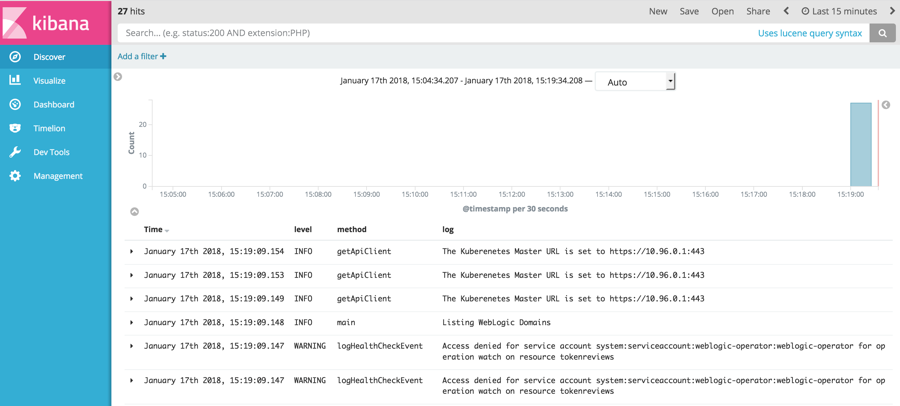

> **WARNING** This documentation is for version 1.1 of the operator.  To view documenation for the current release, [please click here](/site).

# Elastic Stack integration

**PLEASE NOTE**: This page is a work in progress. We have some rough notes in here and are working on writing better documentation for how to set up this integration.

## Turn on Logstash in the operator

In `weblogic-operator.yaml`, add `ENABLE_LOGSTASH` in the `env` section:

`name: ENABLE_LOGSTASH value: "true"`

## Create the PV and PVC for the operator logs

`kubectl create -f elk-pv.yaml`

Verify that the PV and PVC are created:

`kubectl get pv -n weblogic-operator kubectl get pvc -n weblogic-operator`

## Deploy the Elastic Stack

The Elastic Stack consists of Elasticsearch, Logstash, and Kibana. Logstash is configured to pickup logs from the operator and push them to Elasticsearch. Kibana connects to Elasticsearch to read the logs and displays them on the dashboard.

### Deploy Elasticsearch

`kubectl create -f elasticsearch.yaml`

### Deploy Kibana

`kubectl create -f kibana.yaml`

### Deploy Logstash

`kubectl create -f logstash.yaml`

Verify that the Elastic Stack pods are created and running:

`kubectl get pods -n weblogic-operator kubectl get pods`

## Access the Kibana dashboard

Get the `NodePort` from the Kibana services:

`kubectl describe service kibana`

Access the Kibana dashboard using the `NodePort` from the kubctl command output and the hostname, `http://hostname:NodePort` (for example, `http://slcac571:30211`).

Select **Management** to configure an index pattern. You will see `logstash-*` prepopulated. 

Select the time filter, then click **Create**.

To see the logs, select **Discover**.

