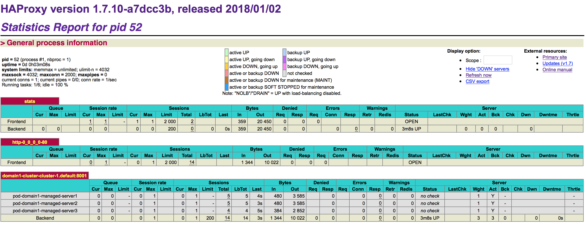

# Load balancing with Voyager/HAProxy

This document explains how to set up Voyager to use HAProxy as load balancer to WebLogic domain(s) running in Kubernetes.

Voyager is a HAProxy backed ingress controller for Kubernetes. More information about Voyager ingress controller can be found at: https://appscode.com/products/voyager/6.0.0/concepts/.

## Set up Voyager/HAProxy automatically
To set up Voyager/HAProxy automatically you can run the create-weblogic-domain.sh script to create a WebLogic domain in Kubernetes. You need to change the domain inputs YAML file first. There are three related properties. 

```
...
# Load balancer to deploy.  Supported values are: APACHE, TRAEFIK, VOYAGER, NONE
loadBalancer: VOYAGER
...
# Load balancer web port
loadBalancerWebPort: 30305

# Load balancer dashboard port
loadBalancerDashboardPort: 30315
```

* The `loadBalancer` property needs to be changed to `VOYAGER`. 
* The `loadBalancerWebPort` property is to specify the `NodePort` number to access the HAProxy load balancer itself.
* The `loadBalancerDashboardPort` property is to specify the `NodePort` number to access the HAPRoxy stats webpage.

Then after running create-weblogic-domain.sh script, the WebLogic domain is created and the Voyager/HAProxy is also installed and configured properly.
You can access the HAProxy stats webpage via `http://<hostIP>:30315/` and you'll get a webpage like below.



After you deploy some application to the WebLogic cluster, you can send requests to the application via `http://<hostIP>:30305/<ctx>/`. The requests are sent to the HAProxy load balancer and the HAProxy will distribute the requests to managed servers of the WebLogic cluster.

### What happens underground?
#### 1. Install the Voyager operator
The Voyager operator is installed in `voyager` namespace if it hasn't been done before.

You should have a voyager-operator-*** pod running in the `voyager` namespace.
```
$ kubectl get pod -n voyager
NAME                                READY     STATUS    RESTARTS   AGE
voyager-operator-86bcd6f656-jj2t6   1/1       Running   1          8d
```
And new CRD groups are registered by the Voyager operator.
```
$ kubectl get crd -l app=voyager
NAME                                AGE
certificates.voyager.appscode.com   8d
ingresses.voyager.appscode.com      8d
```
Now the Voyager operator watches Ingress resources in any namespace. 

#### 2. Create an Voyager Ingress resource
An Ingress resource is generated based on the WebLogic domain configuration and deployed to Kubernetes. Here is an example of what the Voyager Ingress resource might look like for a WebLogic cluster named `cluster-1`, in a domain named `base_domain` with domainUID `domain1`.

```yaml
apiVersion: voyager.appscode.com/v1beta1
kind: Ingress
metadata:
  name: domain1-voyager
  namespace: default
  labels:
    weblogic.domainUID: domain1
    weblogic.domainName: base_domain
  annotations:
    ingress.appscode.com/type: 'NodePort'
    ingress.appscode.com/stats: 'true'
spec:
  rules:
  - host: domain1.cluster-1
    http:
      nodePort: '30305'
      paths:
      - backend:
          serviceName: domain1-cluster-cluster-1
          servicePort: '8001'
```

The Kubernetes service named `domain1-cluster-cluster-1` referred by the Ingress resource is also created by create-weblogic-domain.sh which dynamically includes all the managed servers in the cluster.

```bash
$ kubectl get endpoints domain1-cluster-cluster-1 
NAME                        ENDPOINTS                                               AGE
domain1-cluster-cluster-1   10.244.0.170:8001,10.244.0.171:8001,10.244.0.172:8001   2d
```
When the Ingress resource is deployed, following Kubernetes resources are created by the Voyager operator:
```bash
$ kubectl get deploy,pod,svc | awk '/voyager/ || /NAME/'
NAME                             DESIRED   CURRENT   UP-TO-DATE   AVAILABLE   AGE
deploy/voyager-domain1-voyager   1         1         1            1           1d

NAME                                         READY     STATUS    RESTARTS   AGE
po/voyager-domain1-voyager-577bcfb4b-kbnhp   1/1       Running   0          1d

NAME                                            TYPE        CLUSTER-IP       EXTERNAL-IP   PORT(S)           AGE
svc/voyager-domain1-voyager                     NodePort    10.109.137.41    <none>        80:30305/TCP      1d
svc/voyager-domain1-voyager-stats               ClusterIP   10.105.160.124   <none>        56789/TCP         1d
```
#### 3. Create a NodePort service                                         
A NodePort service is created to expose the HAProxy stats. Following are the example yaml file for the service.                                                                  
```yaml                                                                
apiVersion: v1                                                         
kind: Service                                                          
metadata:                                                              
  name: domain1-voyager-stats                                          
  namespace: default                                                   
  labels:                                                              
    app: domain1-voyager-stats                                         
    weblogic.domainUID: domain1                                        
    weblogic.domainName: base_domain                                   
spec:                                                                  
  type: NodePort                                                       
  ports:                                                               
    - name: client                                                     
      protocol: TCP                                                    
      port: 56789                                                      
      targetPort: 56789                                                
      nodePort: 30315                                                  
  selector:                                                            
    origin: voyager                                                    
    origin-name: domain1-voyager                                       
```                                                                    
                                                                       
## Set up Voyager manually to WebLogic domain running in Kubernetes
You may want to manually set up Voyager to WebLogic domain running in Kubernetes, in cases when some of the default settings of the automatic steps don't meet your requirements, or your WebLogic domain is not created by the WebLogic Operator.
You need to refer to Voyager documents to do the setup: https://appscode.com/products/voyager/6.0.0/setup/.
### 1. Install the Voyager operator
Refer to install guide of Voyager here: install guide: https://appscode.com/products/voyager/6.0.0/setup/install/.
### 2. Create an Voyager Ingress resource
Refer to the detail here: https://appscode.com/products/voyager/6.0.0/concepts/overview/. You can choose different types for your Ingress: LoadBalancer, NodePort, HostPort and Internal.

