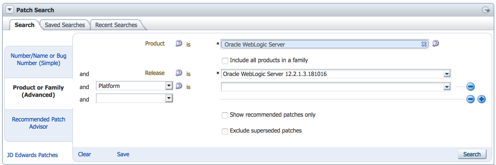

# Creating or obtaining WebLogic Docker images

You will need Docker images to run your WebLogic domains in Kubernetes.
There are two main options available:

* Use a Docker image which contains the WebLogic Server binaries but
  not the domain, or
* Use a Docker image which contains both the WebLogic Server binaries
  and the domain directory.

If you want to use the first option, you will need to obtain the standard
WebLogic Server image from the Docker Store, [see here](#obtaining-standard-images-from-the-docker-store),
this image already contains the mandatory patches applied as described in [this section](#creating-a-custom-image-with-patches-applied).
If you want to use additional patches, you can customize that process to include additional patches.

If you want to use the second option, which includes the domain directory
inside the Docker image, then you will need to build your own Docker images
as described in [this section](#creating-a-custom-image-with-your-domain-inside-the-image).

## Setting up secrets to access the Docker Store

**Note**: This version of the operator requires WebLogic Server 12.2.1.3.0 plus patch 29135930, and the standard image `store/oracle/weblogic:12.2.1.3` already includes this patch pre-applied.  

In order for Kubernetes to obtain the WebLogic Server Docker image from the Docker Store, which requires authentication, a Kubernetes secret containing the registry credentials must be created. To create a secret with Docker Store credentials, issue the following command:

```
$ kubectl create secret docker-registry SECRET_NAME
  -n NAMESPACE
  --docker-server=index.docker.io/v1/
  --docker-username=YOUR_USERNAME
  --docker-password=YOUR_PASSWORD
  --docker-email=YOUR_EMAIL
```

In this command, replace the uppercase items with the appropriate values. The `SECRET_NAME` will be needed in later parameter files.  The `NAMESPACE` must match the namespace where the first domain will be deployed, otherwise Kubernetes will not be able to find it.  

It may be preferable to manually pull the image in advance, on each Kubernetes worker node, as described in the next section.
If you choose this approach, you do not require the Kubernetes secret.

## Obtaining standard images from the Docker store

Oracle provides a [WebLogic Server 12.2.1.3.0 Docker image](https://store.docker.com/_/oracle-weblogic-server-12c) in the
[Docker Store](https://store.docker.com) which already has the necessary patches applied.  To obtain that image, you
must have a Docker Store account, log on to the Docker Store, navigate
to that image and click on the "Proceed to Checkout" button which will
prompt you to read and accept the license agreement for the image.
After you have accepted the license agreement, you will be able to
pull the image using your Docker store credentials.

First, you will need to log in to the Docker Store:

```
$ docker login
```

Then, you can pull the image with this command:

```
$ docker pull store/oracle/weblogic:12.2.1.3
```

Additional information about using this image is available on the
Docker Store.

## Creating a custom image with patches applied

The Oracle WebLogic Server Kubernetes Operator requires patch 29135930.
This patch does have some prerequisite patches that will also need to be applied. The standard image `store/oracle/weblogic:12.2.1.3` already has all of these patches applied. 

[This sample](https://github.com/oracle/docker-images/blob/master/OracleWebLogic/samples/12213-patch-wls-for-k8s/README.md) in
the Oracle GitHub Docker images repository demonstrates how to create an image with arbitrary patches, starting from an unpatched WebLogic Server 12.2.1.3 image (not the standard `store/oracle/weblogic:12.2.1.3` pre-patched image).  You can customize that sample to apply a different set of patches, if you require additional patches or PSUs.

When using that sample, you will need to download the required patch and also
some prerequisite patches.  To find the correct version of the patch, you should
use the "Product or Family (Advanced)" option, then choose "Oracle WebLogic Server"
as the product, and set the release to "Oracle WebLogic Server 12.2.1.3.181016" as
shown in the image below:




The `Dockerfile` in that sample lists the base image as follows:

```
FROM oracle/weblogic:12.2.1.3-developer
```

You can change this to use the standard WebLogic Server image you
downloaded from the Docker Store by updating the `FROM` statement
as follows:

```
FROM store/oracle/weblogic:12.2.1.3
```

After running `docker build` as described in the sample, you
will have created a Docker image with the necessary patches to
run WebLogic 12.2.1.3 in Kubernetes using the operator.

## Creating a custom image with your domain inside the image

You can also create a Docker image with the WebLogic domain inside the image.
[Samples](/kubernetes/samples/scripts/create-weblogic-domain/domain-home-in-image/README.md)
are provided that demonstrate how to create the image using:

* WLST to define the domain, or
* [WebLogic Deploy Tooling](https://github.com/oracle/weblogic-deploy-tooling)
  to define the domain.

In these samples you will see a reference to a "base" or `FROM` image.  You should use an image
with the mandatory patches installed as this base image.  This image could be either 
the standard `store/oracle/weblogic:12.2.1.3` pre-patched image or an image you created using the instructions above.

**Note**: Oracle recommends that Docker images containing WebLogic domains
be kept in a private repository.
